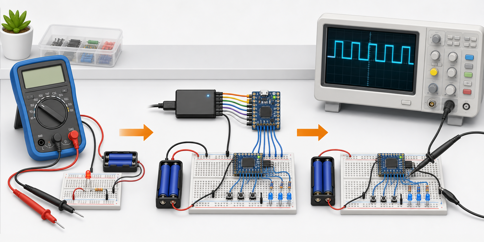
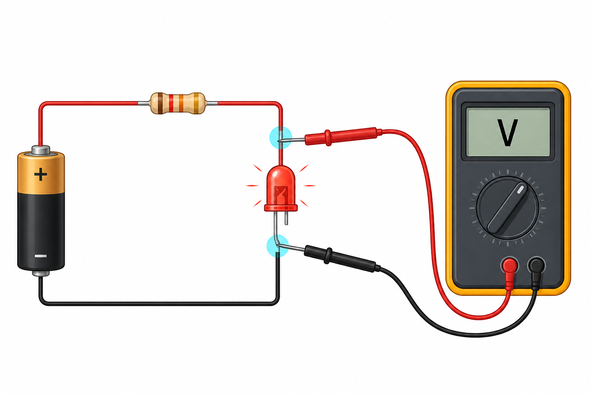
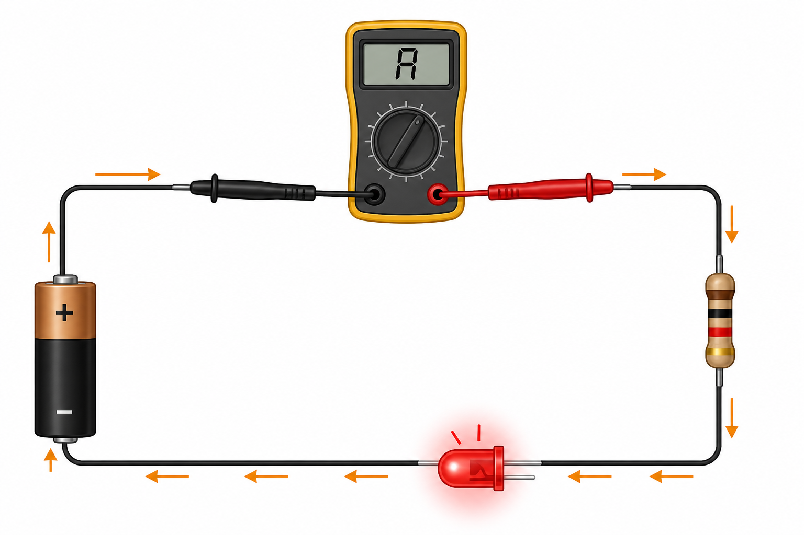
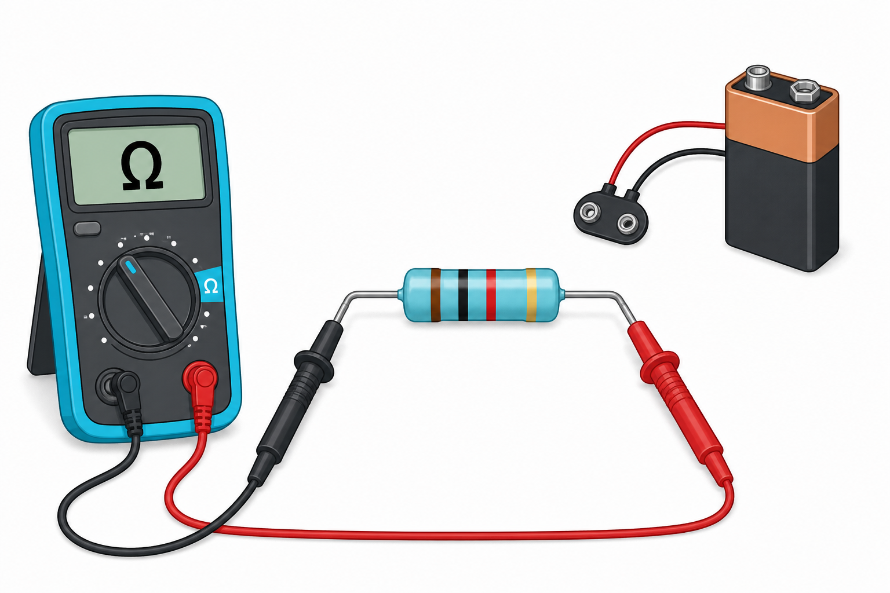
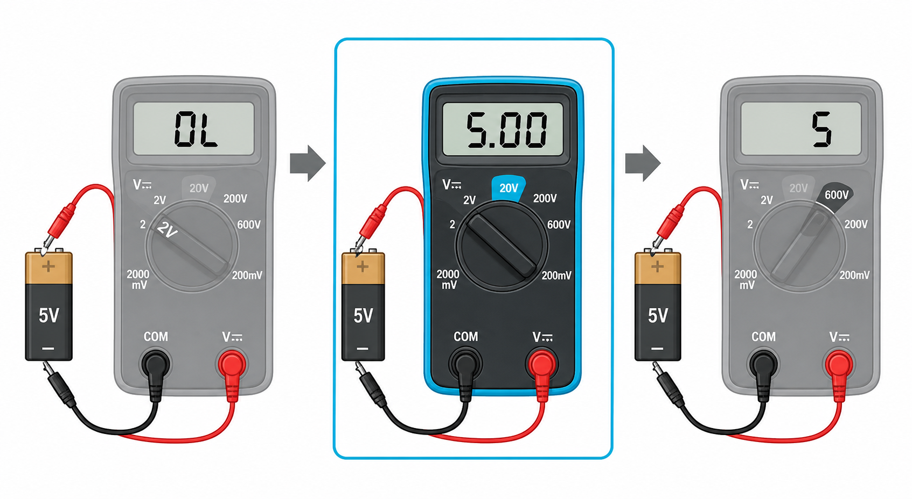
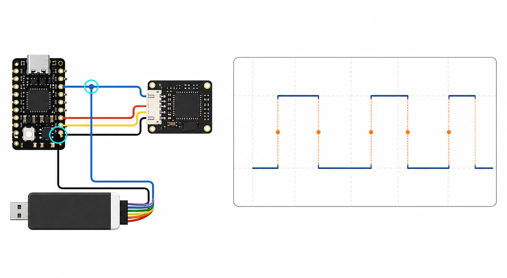
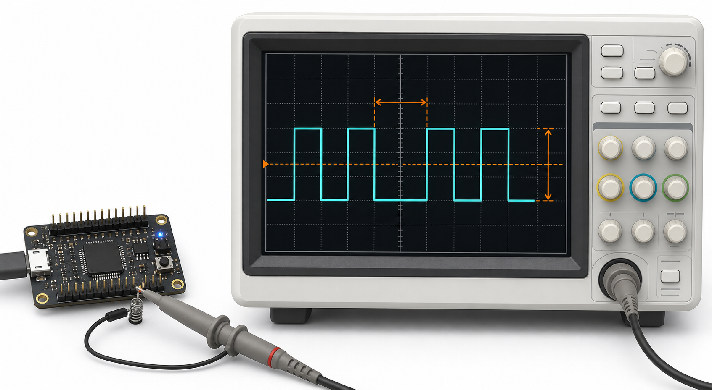
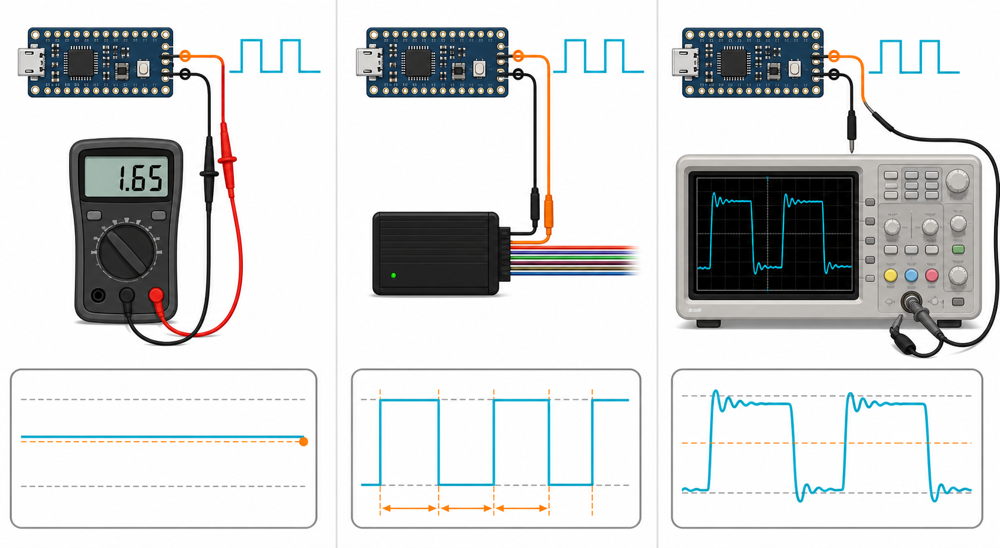

# Umgang mit Messmitteln

Diese Lesefassung erklärt die Projektidee in einfacher Sprache. Die strukturierte Planung steht in [measurement-tools-basics.yaml](measurement-tools-basics.yaml).



## Was du in diesem Projekt lernst

Wenn eine Schaltung nicht so funktioniert wie erwartet, reicht Raten nicht aus. Mit einem Messgerät kannst du Schritt für Schritt herausfinden, was tatsächlich passiert.

Du beginnst mit dem Multimeter. Damit misst du einzelne Werte wie Spannung, Strom oder Widerstand. Danach lernst du den Logikanalysator kennen. Er zeigt dir, wann ein digitales Signal HIGH oder LOW ist. Zum Schluss verwendest du ein Oszilloskop. Es zeigt dir den wirklichen Spannungsverlauf über die Zeit – einschließlich langsamer Flanken, Überschwingen und Störungen.

Nach dem Projekt kannst du vor einer Messung vier Fragen beantworten:

1. Welche elektrische Größe möchte ich messen?
2. Welchen Wert erwarte ich ungefähr?
3. Wie muss ich das Messgerät anschließen?
4. Ist das angezeigte Ergebnis plausibel?

Das Projekt besteht deshalb nicht nur aus Texten. Jede neue Messgröße wird in einem Versuch erlebt. Du sagst zuerst voraus, was passieren wird, baust dann die Messung auf, veränderst genau einen Parameter und erklärst anschließend den Unterschied.

## Sicherheit zuerst

Alle Übungen verwenden ausschließlich Batterien, USB oder andere berührsichere Kleinspannungen. Netzspannung und geöffnete Netzgeräte gehören nicht zu diesem Einsteigerprojekt.

Besonders wichtig:

- Für eine Strommessung wird die Schaltung zuerst ausgeschaltet und dann an einer Stelle geöffnet.
- Ein Multimeter im Strommessbereich darf niemals direkt parallel an eine Batterie oder Spannungsquelle angeschlossen werden.
- Widerstand wird nur an einer ausgeschalteten, spannungsfreien Schaltung gemessen.
- Vor einer Oszilloskopmessung muss klar sein, womit die Masseklemme des Tastkopfs elektrisch verbunden ist.
- Die Bedienungs- und Sicherheitshinweise des konkret verwendeten Messgeräts bleiben verbindlich.

## So wird aus Wissen ein Experiment

Jeder Versuch folgt demselben Ablauf:

| Schritt | Deine Aufgabe |
| --- | --- |
| Vorhersagen | Schreibe auf, welchen Wert oder Verlauf du erwartest. |
| Aufbauen | Stelle das Signal ein und schließe das Messgerät sicher an. |
| Messen | Notiere Wert, Einheit, Messbereich und sichtbare Schwankungen. |
| Verändern | Ändere genau einen Parameter, zum Beispiel nur die Frequenz. |
| Erklären | Vergleiche Beobachtung und Vorhersage. Benenne auch, was das Messgerät nicht zeigen konnte. |

Ein einfaches Versuchsprotokoll hat deshalb immer diese Spalten:

| Einstellung | Vorhersage | Messwert oder Beobachtung | Erklärung |
| --- | --- | --- | --- |
|  |  |  |  |

## 1. Das Multimeter

Ein Multimeter ist das erste Werkzeug für viele elektrische Prüfungen. Vor jeder Messung kontrollierst du:

- schwarze Leitung in `COM`,
- rote Leitung in der zur Messart passenden Buchse,
- Drehschalter auf der richtigen Messgröße,
- Messbereich groß genug für den erwarteten Wert.

### Spannung messen

Spannung ist der elektrische Unterschied zwischen zwei Punkten. Deshalb berührst du mit den beiden Prüfspitzen zwei Messpunkte. Der Stromkreis bleibt dabei geschlossen. Das Multimeter wird parallel zum Bauteil angeschlossen.



Die Leitfrage lautet: **Wie groß ist der Spannungsunterschied zwischen diesen beiden Punkten?**

Eine erste Übung:

1. Miss die Batterie ohne angeschlossene Schaltung.
2. Schließe eine LED mit passendem Vorwiderstand an.
3. Miss die Spannung an der Batterie und danach an der LED.
4. Vergleiche die Werte und erkläre den Unterschied.

### Strom messen

Strom beschreibt, wie viel elektrische Ladung durch einen Strompfad fließt. Damit der gesamte Strom durch das Multimeter fließt, musst du die Schaltung an einer Stelle öffnen und das Messgerät in diese Lücke einsetzen. Das nennt man eine Messung in Reihe.



Die Leitfrage lautet: **Wie viel Strom fließt durch dieses Bauteil?**

Vor dem Einschalten prüfst du noch einmal Buchse, Messbereich und Anschluss. Beginne bei unbekanntem Strom mit dem höchsten geeigneten Strombereich des Geräts.

### Widerstand und Durchgang prüfen

Für eine Widerstandsmessung muss die Schaltung ausgeschaltet sein. Am deutlichsten wird die Messung, wenn das Bauteil wenigstens an einer Seite von der übrigen Schaltung getrennt ist. Sonst können weitere Strompfade das Ergebnis verändern.



Die Leitfrage lautet: **Ist die Verbindung unterbrochen und passt der Widerstand ungefähr zum erwarteten Wert?**

Die Durchgangsprüfung beantwortet nur eine schnelle Ja/Nein-Frage: Gibt es zwischen den beiden Messpunkten einen ausreichend niederohmigen Weg? Sie ersetzt keine genaue Widerstandsmessung.

### Den passenden Messbereich wählen

Der Messbereich bestimmt den größten Wert, den das Gerät in dieser Einstellung anzeigen kann.



- Ist der Bereich zu klein, zeigt das Gerät meist `OL` oder eine andere Überlaufanzeige.
- Ist der Bereich passend, siehst du genügend Stellen für eine sinnvolle Aussage.
- Ist der Bereich unnötig groß, gehen kleine Unterschiede in der groben Anzeige verloren.

Bei einem Gerät mit automatischer Bereichswahl – oft `Autorange` genannt – übernimmt das Multimeter diese Auswahl. Du musst trotzdem prüfen, ob Einheit und Größenordnung sinnvoll sind.

## PWM als durchgehender Experimentierfaden

PWM bedeutet Pulsweitenmodulation. Der Ausgang erzeugt keine beliebige Zwischen­spannung, sondern schaltet immer wieder zwischen LOW und HIGH. Das Tastverhältnis gibt an, wie viel Prozent einer Periode das Signal HIGH ist.

```text
25 %:  HIGH ┌─┐       ┌─┐       ┌─┐
            │ │       │ │       │ │
       LOW ─┘ └───────┘ └───────┘ └──────

50 %:  HIGH ┌────┐    ┌────┐    ┌────┐
            │    │    │    │    │    │
       LOW ─┘    └────┘    └────┘    └────

75 %:  HIGH ┌──────┐  ┌──────┐  ┌──────┐
            │      │  │      │  │      │
       LOW ─┘      └──┘      └──┘      └──
```

Als Signalquelle dient ein Mikrocontroller oder Funktionsgenerator mit ungefähr 0 bis 3,3 Volt oder 0 bis 5 Volt. Frequenz und Tastverhältnis müssen getrennt einstellbar sein.

### Experiment 1: LOW und HIGH zuerst wirklich messen

Bevor du Mittelwerte berechnest, bestimmst du die tatsächlichen Endwerte deines Ausgangs:

1. Stelle den Ausgang dauerhaft auf LOW und miss gegen Masse. Notiere den Wert als `U_LOW`.
2. Stelle den Ausgang dauerhaft auf HIGH und miss erneut. Notiere den Wert als `U_HIGH`.
3. Verwende diese beiden Messwerte für deine folgenden Vorhersagen.

Damit prüfst du eine wichtige Annahme: HIGH ist nicht automatisch exakt 3,3 oder 5 Volt und LOW nicht unter allen Bedingungen exakt 0 Volt.

### Experiment 2: Langsame und schnelle PWM am Multimeter

Stelle das Tastverhältnis fest auf 50 Prozent. Ändere anschließend nur die Frequenz:

| Frequenz | Vorhersage für die Anzeige | Was du protokollierst |
| ---: | --- | --- |
| 0,5 Hz | Anzeige kann deutlich zwischen LOW, HIGH und Zwischenwerten wechseln. | Minimum, Maximum und Geschwindigkeit der Änderung |
| 2 Hz | Anzeige ist wahrscheinlich noch unruhig. | typische Werte und Schwankung |
| 20 Hz | Je nach Multimeter wird die Anzeige bereits ruhiger. | Übergang von springend zu stabil |
| 200 Hz | Viele Multimeter zeigen einen recht stabilen Mittelwert. | typischer Gleichspannungswert |
| 1 kHz | Anzeige liegt häufig stabil nahe dem Mittelwert. | Wert und Abweichung zur Rechnung |

Bei einem idealen 0-bis-`U_HIGH`-Signal mit 50 Prozent Tastverhältnis ist der zeitliche Mittelwert:

```text
U_DC ≈ 0,5 × U_HIGH
```

Wichtig: Der ideale Mittelwert ändert sich durch die Frequenz nicht. Wenn die Anzeige bei langsamer PWM springt oder bei unterschiedlichen Frequenzen leicht abweicht, beobachtest du das Abtast-, Mittelungs- und Aktualisierungsverhalten des Multimeters. Genau dieser Übergang ist Teil des Experiments und kann bei zwei Multimetern verschieden sein.

### Experiment 3: Tastverhältnis gegen angezeigte Spannung

Wähle nun eine Frequenz, bei der dein Multimeter stabil anzeigt, zum Beispiel 500 Hz. Ändere ausschließlich das Tastverhältnis.

Die Vorhersage lautet:

```text
U_erwartet = U_LOW + D × (U_HIGH - U_LOW)
```

`D` ist das Tastverhältnis als Zahl zwischen 0 und 1.

| Tastverhältnis | Erwartung bei 3,3 V HIGH | Erwartung bei 5 V HIGH |
| ---: | ---: | ---: |
| 0 % | 0 V | 0 V |
| 25 % | ca. 0,83 V | ca. 1,25 V |
| 50 % | ca. 1,65 V | ca. 2,50 V |
| 75 % | ca. 2,48 V | ca. 3,75 V |
| 100 % | ca. 3,30 V | ca. 5,00 V |

Berechne zuerst mit deinem wirklich gemessenen `U_LOW` und `U_HIGH`. Miss danach. Trage vorhergesagte und gemessene Werte in ein Diagramm ein.

Die zentrale Erkenntnis lautet: Eine Anzeige von beispielsweise 1,65 Volt bedeutet bei 50-Prozent-PWM nicht, dass der Pin dauerhaft 1,65 Volt ausgibt. Das Multimeter zeigt einen zeitlich gemittelten Wert; tatsächlich wechselt der Pin weiterhin zwischen LOW und HIGH.

### Optional: PWM im Wechselspannungsbereich

Dieses Experiment wird nur durchgeführt, wenn das Handbuch des Multimeters vorliegt und Frequenzbereich sowie True-RMS-Eigenschaft bekannt sind.

Miss dasselbe PWM-Signal einmal im Gleichspannungs- und einmal im Wechselspannungsbereich. Die Werte dürfen unterschiedlich sein: Der Wechselspannungsbereich kann nur den wechselnden Anteil betrachten. Ein nicht True-RMS-fähiges Multimeter oder ein Gerät außerhalb seines angegebenen Frequenzbereichs kann bei PWM deutlich falsch anzeigen. Ohne Kenntnis des Messverfahrens ist die AC-Anzeige kein verlässlicher Gesamt-Effektivwert.

## 2. Der Logikanalysator

Ein Logikanalysator betrachtet digitale Signale. Er entscheidet für jeden Messzeitpunkt, ob die Spannung als LOW oder HIGH gilt. Die genaue analoge Form dazwischen zeigt er nicht.

Für die erste Messung brauchst du normalerweise:

- eine Signalleitung,
- eine gemeinsame Masse zwischen Schaltung und Logikanalysator,
- einen Messkanal,
- eine Abtastrate, die deutlich schneller ist als das untersuchte Signal.



Die Abtastrate sagt, wie oft das Gerät pro Sekunde auf den Eingang schaut. Ist sie zu niedrig, können schnelle Wechsel fehlen. Die Aufzeichnung sieht dann plausibel aus, kann aber falsch sein.

Eine gute Lernreihenfolge ist:

1. einen Taster beobachten,
2. ein PWM-Signal mit Pulsbreite und Tastverhältnis untersuchen,
3. eine einfache UART-Übertragung aufzeichnen,
4. absichtlich eine falsche Baudrate einstellen und das Fehlerbild vergleichen.

### Experiment: Zu selten hingeschaut

Zeichne dasselbe PWM-Signal zuerst mit einer deutlich höheren Abtastrate als der PWM-Frequenz auf. Verringere danach nur die Abtastrate.

Beobachte, wann Flanken verschoben erscheinen, einzelne Pulse verschwinden oder eine falsche Frequenz trotzdem glaubwürdig aussieht. So lernst du: Eine saubere digitale Linie beweist noch nicht, dass oft genug abgetastet wurde.

## 3. Das Oszilloskop

Das Oszilloskop zeigt Spannung über der Zeit. Anders als der Logikanalysator zeigt es nicht nur HIGH und LOW, sondern auch die Form der Flanken, Störungen und Überschwingen.



Für ein gut lesbares Bild stellst du drei Dinge ein:

- **Volt pro Kästchen:** Wie viel Spannung ein senkrechtes Rasterfeld darstellt.
- **Zeit pro Kästchen:** Wie viel Zeit ein waagerechtes Rasterfeld darstellt.
- **Trigger:** An welchem wiederkehrenden Signalpunkt das Bild ausgerichtet wird, damit es ruhig steht.

Danach beschreibst du das Signal mit einfachen Fragen:

- Wie hoch ist es vom niedrigsten bis zum höchsten Punkt?
- Wie lange dauert eine vollständige Wiederholung?
- Wie oft wiederholt es sich pro Sekunde?
- Sind die Flanken sauber oder gibt es Störungen und Überschwingen?

### Experiment: Vom wandernden Bild zur einzelnen Flanke

Verwende etwa 1 kHz PWM mit 50 Prozent Tastverhältnis:

1. Beobachte das zunächst wandernde Signal ohne passend eingestellten Trigger.
2. Wähle den Messkanal als Triggerquelle und eine steigende Flanke.
3. Setze den Triggerpegel zwischen LOW und HIGH, bis das Bild stabil steht.
4. Stelle die Zeitbasis zuerst so ein, dass mehrere Perioden sichtbar sind.
5. Zoome anschließend in eine einzelne Flanke hinein und suche nach langsamer Anstiegszeit, Überschwingen oder Störungen.

Das Signal wurde nicht verändert. Nur die Darstellung wurde so eingestellt, dass eine andere Frage beantwortet werden kann.

## Welches Messgerät passt zu meiner Frage?



| Deine Frage | Passendes Messgerät |
| --- | --- |
| Welche Spannung, welcher Strom oder welcher Widerstand liegt ungefähr vor? | Multimeter |
| Wann ist ein digitales Signal HIGH oder LOW und welche Bits werden übertragen? | Logikanalysator |
| Wie sieht die wirkliche Signalform aus und gibt es Störungen? | Oszilloskop |

Oft ist die beste Fehlersuche eine Kombination: Zuerst prüfst du mit dem Multimeter Versorgung und Grundwerte. Danach beobachtest du mit dem Logikanalysator den digitalen Ablauf. Wenn Pegel, Flanken oder Störungen unklar bleiben, verwendest du das Oszilloskop.

### Experiment: Dasselbe PWM-Signal mit allen drei Geräten

Erzeuge 500 Hz PWM und wiederhole die Messung bei 25, 50 und 75 Prozent Tastverhältnis.

| Messgerät | Was du messen sollst | Was verborgen bleibt |
| --- | --- | --- |
| Multimeter | angezeigter Gleichspannungsmittelwert | Frequenz, einzelne Pulse und Flankenform |
| Logikanalysator | Frequenz, HIGH-Zeit, LOW-Zeit und Tastverhältnis | genaue Spannung und analoge Störungen |
| Oszilloskop | LOW-/HIGH-Spannung, Periodendauer und Flankenform | die fachliche Bedeutung des Signals |

Schreibe nach jeder Messung genau zwei Sätze: „Das sehe ich.“ und „Das sehe ich nicht.“ Damit wird aus dem Gerätevergleich eine begründete Messmittelauswahl.

## Abschlussaufgabe

In eine sichere Kleinspannungsschaltung wird absichtlich ein Fehler eingebaut, zum Beispiel eine fehlende Masseverbindung, ein falscher Widerstand oder eine ungeeignete UART-Einstellung.

Du sollst:

1. eine überprüfbare Vorhersage formulieren,
2. mindestens zwei passende Messmittel auswählen,
3. die Messstellen und erwarteten Werte notieren,
4. immer nur einen Parameter verändern,
5. den Fehler mit Messwerten eingrenzen,
6. erklären, was jedes Messgerät gezeigt hat und welche Information ihm verborgen blieb.

Damit ist das Lernziel erreicht: Du bedienst Messgeräte nicht nur, sondern setzt sie gezielt zur verständlichen Fehlersuche ein.
