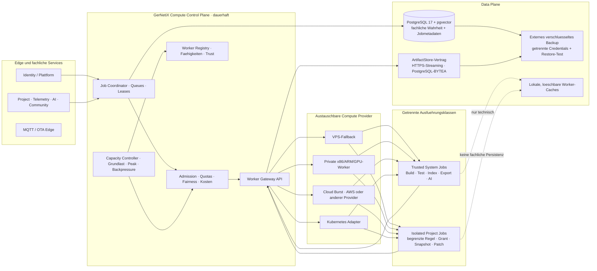

# Elastische Worker- und Kapazitaetsarchitektur

## Ziel und Status

**Zielarchitektur mit lokal implementiertem Control-Plane-Kern.** GerNetiX soll mit einem einzelnen
VPS beginnen, zeitweise private Rechner hinzunehmen und Lastspitzen spaeter bei
einem beliebigen Cloud-Anbieter oder in Kubernetes abarbeiten koennen. Die
fachlichen APIs und Jobvertraege duerfen sich dabei nicht aendern.

Die Plattform trennt deshalb einen kleinen, dauerhaften Control Plane von
austauschbarer Compute-Kapazitaet. Kubernetes, AWS, ein ARM-VPS und ein morgens
eingeschalteter Ryzen-Rechner sind Ausfuehrungsoptionen, keine fachlichen
Abhaengigkeiten.

Seit 2026-08-02 ist der erste ausfuehrbare Schnitt umgesetzt: Der Dienst
`services/compute-control-plane` besitzt In-Memory- und PostgreSQL-Repositories,
eine interne Job-API, ein token-geschuetztes Worker Gateway, atomare Pull-Leases
mit Fencing, Heartbeat und Drain, Mandantenfairness und -Parallelitaetsgrenze,
payload-freie Usage-Ereignisse sowie aggregierte Operations- und
Capacity-Empfehlungen. Die VPS-Compose-Datei bindet Port `5700` standardmaessig
nur an Loopback; eine private WireGuard-Adresse muss bewusst konfiguriert werden.
Deployment und produktive Lastabnahme sind damit nicht erfolgt.



## Vier Ebenen

| Ebene | Dauerhaft | Verantwortung |
|---|---:|---|
| Edge | ja | HTTPS, Anmeldung, MQTT, Downloads, Rate Limits und fruehe Abweisung ungueltiger Auftraege. |
| Compute Control Plane | ja | Jobannahme, Prioritaet, Quoten, Leases, Fairness, Worker-Auswahl, Nutzungsmessung, Backpressure und Capacity-Provider. |
| Compute Plane | nein | Zustandslose, wiederholbare Ausfuehrung auf VPS, privaten Rechnern, Cloud oder Kubernetes. |
| Data Plane | ja | PostgreSQL als fachliche Wahrheit, Artefaktvertrag, technische Caches und deployment-unabhaengiges Backup. |

Der dauerhafte VPS kann alle vier Ebenen in kleiner Auspraegung tragen. Die
Trennung ist eine Schnittstellengrenze und verlangt nicht sofort vier Cluster
oder getrennte Server.

## Gemeinsamer Jobvertrag

Jeder rechenintensive Auftrag wird als typisierter Job beschrieben. Der Vertrag
ist unabhaengig davon, wer den Worker startet.

```json
{
  "job_id": "opaque",
  "job_type": "firmware_build",
  "execution_class": "trusted_system",
  "tenant": { "account_id": "opaque", "project_id": "opaque" },
  "priority_class": "interactive",
  "input_revision": "sha256:...",
  "requirements": {
    "cpu_arch": ["amd64", "arm64"],
    "cpu_millis": 2000,
    "memory_bytes": 4294967296,
    "accelerator": null,
    "toolchains": ["platformio-6.1.18"],
    "network_policy": "artifact_api_only"
  },
  "limits": {
    "deadline_at": "2026-08-02T12:10:00Z",
    "max_runtime_ms": 600000,
    "max_output_bytes": 33554432,
    "max_attempts": 2
  }
}
```

Der Coordinator persistiert Zustand und Versuchshistorie. Ein Worker erhaelt
eine Lease, erneuert sie waehrend der Arbeit und bestaetigt das Ergebnis nur
ueber die Worker Gateway API. Ein abgelaufener Worker darf ein spaeter
zurueckgegebenes Ergebnis nicht mehr als gueltig markieren.

## Ausfuehrungsklassen

| Klasse | Beispiele | Datenzugriff | Netz und Secrets | Ausfuehrungsgrenze |
|---|---|---|---|---|
| `trusted_system` | Firmware-Build, Test, Symbolisierung, Release | versionierte Eingaben und ArtifactStore | nur explizit benoetigte interne Ziele; keine OTA-Schluessel auf externen Build-Workern | eigener Container/Prozess mit festem Image |
| `trusted_ai` | Embeddings, RAG-Index, lokale Inferenz | AI-Context-Grant und erlaubte Modelle | Providerzugriff nur per Policy und AI-Usage-Preflight | accelerator-faehiger Worker-Pool |
| `isolated_project_rule` | kundenkonfigurierte Projekt-Automation | kurzlebiger Project-Runtime-Grant, Snapshot und validierter Patch | kein freies Netzwerk, keine Datenbank, keine Shell, keine Kundensecrets | begrenzter AST-Interpreter oder gleichwertige starke Sandbox |
| `operator_maintenance` | Export, Retention, Restore-Pruefung | expliziter interner Betriebsvertrag | operatorgebunden und auditiert | nie aus Kundenprojekten startbar |

Die Klassen teilen Queues, Metriken und Capacity-Provider, aber weder
Credentials noch Images, Datenpfade oder Vertrauensniveau. Kundenskripte werden
nicht auf einem vertrauenswuerdigen System-Worker mit dessen Rechten ausgefuehrt.

## Worker-Registrierung und Scheduling

Ein Worker meldet mindestens:

- stabile Worker-ID und kurzlebige Instanz-ID,
- Provider und Region, jedoch keine fachliche Sonderbehandlung des Providers,
- CPU-Architektur, Kerne, RAM und lokales Cache-Budget,
- GPU/NPU-Runtime und verfuegbaren Beschleunigerspeicher,
- Toolchain-, Image- und Modellversionen,
- erlaubte Ausfuehrungsklassen,
- Trust-Zone `vps`, `private`, `cloud` oder `kubernetes`,
- aktuelle Slots, Heartbeat und Drain-Status,
- Kostenklasse und optionalen Preis je Laufzeiteinheit.

Der Scheduler beruecksichtigt harte Faehigkeitsanforderungen zuerst. Danach
entscheidet er anhand von Prioritaet, Fairness, Cache-Lokalitaet, Wartezeit,
Kosten und freier Kapazitaet. `amd64`, `arm64`, GPU und NPU sind damit
Faehigkeiten und keine getrennten fachlichen Worker-Systeme.

## Grundlast, Spitzen und Messmodell

Grundlast ist nicht die Anzahl registrierter Nutzer, sondern die ueber laengere
Fenster tatsaechlich angebotene und ausgefuehrte Arbeit. Die Plattform erfasst
je `job_type`, Ausfuehrungsklasse, Tarif und Provider ausschliesslich notwendige
technische Metadaten:

- angenommene Jobs pro Minute,
- Laufzeit und CPU-, RAM-, GPU- beziehungsweise NPU-Zeit,
- Queue-Tiefe, aeltestes Jobalter und p50/p95/p99-Wartezeit,
- aktive, freie und angeforderte Slots,
- Erfolgs-, Fehler-, Retry-, Lease-Verlust- und Abbruchrate,
- Input-, Output-, Cache- und Netzwerkbytes,
- PostgreSQL-Verbindungs-, I/O- und Speichergrenzen,
- geschaetzte und bestaetigte Providerkosten.

Kapazitaetsbedarf kann als erste Naeherung aus Ankunftsrate und mittlerer
Laufzeit abgeleitet werden:

```text
benoetigte Parallelitaet ≈ Jobs pro Sekunde × mittlere Laufzeit in Sekunden
```

Eine Million Pruefungen pro Tag entsprechen im Tagesmittel rund 11,6 Jobs pro
Sekunde. Bei 100 Millisekunden CPU-Zeit sind das etwa 1,2 dauerhaft beschaeftigte
Kerne, bei einer Sekunde rund 12 und bei zehn Sekunden rund 116. Fuer die
Dimensionierung werden zusaetzlich Tagesprofile und p95-Spitzen verwendet.

Der Betrieb unterscheidet:

- **Grundlast:** rollierende p50-/p95-Nachfrage in Wochen- und Tagesfenstern;
  sie soll durch guenstige, dauerhaft verfuegbare Kapazitaet getragen werden.
- **Burst:** kurzfristige Abweichung oberhalb des Grundlastbandes; sie darf
  private oder Cloud-Kapazitaet hinzunehmen.
- **Ueberlast:** Nachfrage oberhalb von Quoten, Kostenlimit oder maximaler
  Kapazitaet; sie fuehrt zu Backpressure, nicht zu unbegrenztem Hochskalieren.

## Faire Mandantenverteilung und Backpressure

Tausend Projekte duerfen nicht tausend unabhängige Cron-Schleifen erzeugen. Der
Coordinator verwendet eine zentrale Zeitplanung mit Jitter und erzeugt erst
kurz vor Faelligkeit ausfuehrbare Jobs.

Verbindliche Regeln:

1. System- und Sicherheitsjobs behalten eine reservierte Mindestkapazitaet.
2. Interaktive Builds besitzen ein eigenes Wartezeitziel, duerfen aber
   Sicherheits- und OTA-Steuerung nicht verdraengen.
3. Kunden-Background-Jobs werden account- und projektbezogen fair verteilt;
   ein einzelner Tenant kann den Pool nicht vollstaendig belegen.
4. Limits gelten fuer Frequenz, parallele Jobs, Laufzeit, CPU-/Accelerator-Zeit,
   Speicher, Artefaktgroesse, Traffic und monatliches Budget.
5. Ueberschrittene Quoten werden vor Joberzeugung oder Ausfuehrung mit stabilem
   Grund abgewiesen beziehungsweise aufgeschoben.
6. Retry-Stuerme werden durch begrenzte Versuche, exponentielles Backoff,
   Jitter und Dead-Letter-Status unterbrochen.

## Autoscaling ohne Anbieterbindung

Der Capacity Controller entscheidet ueber benoetigte Slots; ein
Capacity-Provider setzt diese Entscheidung um. Vorgesehene Adapter:

| Adapter | Einsatz |
|---|---|
| `static_vps` | immer verfuegbarer Rueckfall und kleine Grundlast |
| `private_worker` | manuell oder zeitgesteuert eingeschaltete Heim-/Buero-Rechner ueber privaten Zugang |
| `cloud_burst` | kurzlebige Instanzen, Spot- oder On-Demand-Kapazitaet bei freigegebenem Kostenbudget |
| `kubernetes` | Replica-/Job-Skalierung in einem vorhandenen Cluster; Kubernetes bleibt austauschbare Laufzeit |

Skalierung reagiert primaer auf aeltestes Jobalter, erwartete Arbeit und freie
passende Slots, nicht allein auf CPU-Prozent. Scale-down setzt Worker zuerst auf
`draining`; laufende Leases werden beendet oder laufen kontrolliert aus.

Cloud-Burst benoetigt einen globalen Kill-Switch, Provider- und Tagesbudget,
maximale Instanzzahl, erlaubte Jobklassen und ein hartes Ablaufdatum. Ohne
gueltige Policy wird keine kostenpflichtige Kapazitaet gestartet.

## Netzwerk- und Datenbankgrenze

Der Zielvertrag fuer neue Worker ist Pull ueber eine authentifizierte HTTPS-API:

1. Worker registriert sich mit kurzlebiger Identitaet.
2. Worker fordert einen passenden Job an.
3. Gateway vergibt Lease und zeitlich begrenzte Input-Referenzen.
4. Worker laedt Eingaben, arbeitet lokal und laedt Ergebnis hoch.
5. Nur Control- oder Domain-Service schreibt fachlichen Zustand in PostgreSQL.

Private Bestands-Build-Worker duerfen waehrend der Migration weiterhin den
eingeschraenkten PostgreSQL-Vertrag ueber WireGuard verwenden. Neue kurzlebige
Cloud- und Kunden-Worker erhalten keinen direkten Datenbankzugang. OTA, USB,
FlashBox, MQTT-Publisher und Signierschluessel bleiben ausserhalb des elastischen
Compute-Pools.

## Speicher und Backup

PostgreSQL bleibt die fachliche Wahrheit. Ein interner `ArtifactStore`-Vertrag
trennt Services und Worker von der physischen Ablage. Externe Build-Worker
streamen komprimierte Artefakte authentifiziert zum zentralen Build-Service;
dieser prueft Hash und Groesse und publiziert den vollstaendigen Satz atomar in
der aktuellen PostgreSQL-BYTEA-Implementierung. Ein spaeterer S3-kompatibler Primaerstore
waere eine eigene Architektur- und Migrationsentscheidung und wird durch dieses
Dokument nicht stillschweigend eingefuehrt.

Worker-Caches, Toolchains, Modelle und Workspaces sind loeschbar. Sie werden
weder gesichert noch als fachliche Quelle verwendet.

Backups sind eine eigene Betriebsstrecke. Sie umfassen PostgreSQL und alle nicht
reproduzierbaren Artefakte, liegen verschluesselt ausserhalb des VPS und besitzen
andere Credentials als Deployment und Worker. Ein Capacity-Provider darf keine
Backup-Retention aendern. RPO, RTO und Restore-Proben bleiben im
[Sicherungs- und Wiederherstellungskonzept](customer-data-backup-and-recovery.md)
verbindlich.

## Betriebsansicht und Alarme

Das Admin Tool erhaelt eine aggregierte Compute-Sicht ohne Projektpayloads:

- Grundlastband und aktueller Burst je Jobklasse,
- Queue-Wartezeit, aeltestes Jobalter und Backpressure,
- Worker nach Provider, Architektur, Trust-Zone und Drain-Status,
- Kapazitaet, Nutzung, Fehler und verlorene Leases,
- Quotenablehnungen und dominante, pseudonymisierte Tenant-Anteile,
- Cloud-Kosten, Budgetnaehe und aktiver Kill-Switch,
- PostgreSQL-, Artefakt- und Backup-Kapazitaetsindikatoren.

Alarmiert werden mindestens: keine Kapazitaet fuer eine faellige Jobklasse,
p95-Wartezeitziel verletzt, Retry- oder Lease-Verlust-Spitze, Datenbank- oder
Speicherschwelle, Cloudbudget erreicht, fehlgeschlagenes Backup und ueberfaelliger
Restore-Nachweis.

## Einfuehrungsreihenfolge

1. Gemeinsame Job-, Worker-, Lease-, Usage- und Policy-Vertraege festlegen.
2. Build-Pool als ersten `trusted_system`-Adapter hinter das Worker Gateway
   fuehren, ohne OTA-/Flash-Rechte auszuweiten.
3. Operations-Metriken, Grundlastband, Queue-SLOs, Quoten und Backpressure
   implementieren.
4. Projekt-Background-Worker als getrennte `isolated_project_rule`-Runtime
   einschalten.
5. Private Worker dynamisch registrieren und drainbar machen.
6. Einen kostenbegrenzten Cloud-Burst-Adapter implementieren und mit synthetischer
   Last pruefen.
7. Kubernetes nur als weiteren Capacity-Provider anbinden, wenn ein Cluster
   betrieblich sinnvoll ist.
8. Nach gemessener Datenmenge bewusst entscheiden, ob PostgreSQL-BYTEA als
   ArtifactStore ausreicht oder ein S3-kompatibler Primaerstore erforderlich ist.

Kein Schritt setzt eine Produktionsfreigabe des naechsten voraus. Der VPS bleibt
in jeder Stufe ein funktionsfaehiger Rueckfallpfad.

## Ausfuehrbarer Vertragskern

Die providerunabhaengigen Invarianten sind bereits als gemeinsamer Quellcode in
`services/shared/elastic-compute-contract.js` implementiert. Der Kern definiert
und validiert:

- allowlist-basierten `ComputeJob` und `WorkerRegistration`,
- Ausfuehrungsklassen, Prioritaeten, Trust-Zonen und Netzwerkpolicy,
- Ablehnung von Datenbankadresse, Shell, Environment, Token und Secrets,
- Matching von `amd64`/`arm64`, RAM, Toolchain, GPU/NPU und freien Slots,
- Slotbedarf aus Jobrate und mittlerer Laufzeit,
- Scale-up, harte Capacity-Grenze, Kosten-Backpressure und Drain,
- priorisierte und tenantfaire Jobordnung,
- deterministischen Schedule-Jitter,
- payload-freie Usage-Dimensionen.

Der Shared-Kern selbst persistiert nichts, startet keine Instanz und kennt keinen
Cloud-Anbieter. Der neue Compute-Control-Plane-Dienst verwendet ihn fuer
Jobannahme und Worker-Registrierung. Cloud- und Kubernetes-Adapter erzeugen
bewusst nur pruefbare deklarative Plaene; eine externe Provisionierung ist noch
nicht freigegeben.

## Arbeitspakete

| Reihenfolge | Arbeitspaket | Status | Abnahme |
|---:|---|---|---|
| 1 | Gemeinsamer Compute-Vertragskern | umgesetzt | Shared-Code und zwoelf Unit-/Contract-Tests bestehen. |
| 2 | Compute-Koordination in PostgreSQL | lokal umgesetzt | Tabellen, atomare `SKIP LOCKED`-Vergabe, Fencing, Ablaufwiederaufnahme, Tenant-Parallelitaet, Policy und Usage sind implementiert; echter PostgreSQL-Lasttest steht aus. |
| 3 | Worker Gateway API | lokal umgesetzt | Getrennte interne, Bootstrap- und kurzlebig signierte Worker-Credentials; Registrierung, Pull-Lease, Renew, Complete, Fail, Heartbeat und Drain sind contract-getestet. Input-/Output-Inhalte bleiben bewusst bei Domaenen-APIs. |
| 4 | Build-Pool-Migration | Integrationspfad lokal umgesetzt | Der bestehende Build-Dienst besitzt einen optionalen Compute-Pool-Pfad. Ein End-to-End-Test durchlaeuft BuildJob, ComputeJob, ARM-Worker-Lease, Fencing und Rueckgabe; manipulierte Deploy-Ergebnisse werden abgewiesen. Produktive Umschaltung und Remote-Input/Artifact-Transport stehen aus. |
| 5 | Isolierte Project Rule Runtime | Runtime und API-Grenze umgesetzt | JSON-AST-Allowlist, Grant-gebundene Reads/Writes, Tiefen-, Knoten- und Zeitlimit, kurzlebig signierte tenant-/revisionsgebundene Grants sowie interne Grant- und Worker-Patch-Endpunkte bestehen Cross-Tenant-, Ablauf-, Pfad- und Groessenpruefungen. Der produktive Project-Server-Patch-Writer und Container-Ressourcenabnahme stehen aus. |
| 6 | Compute Usage und Capacity Dashboard | API und Alarme teilweise | PostgreSQL aggregiert Job-, Queue-, Worker-, Slot- und Usage-Zahlen ohne Payload; Policy, Scale-/Backpressure-Empfehlung und payload-freie Alarme fuer fehlende Kapazitaet, Queue-SLO, Budget, Kapazitaetsgrenze und Kill-Switch sind abrufbar. Admin-UI und Zeitreihen stehen aus. |
| 7 | Dynamische private Worker | Referenzlaufzeit und privater ARM-Bestandspfad nachgewiesen | Der Worker-Agent registriert Faehigkeiten, meldet Slots, pullt und erneuert Leases, fuehrt nur registrierte Handler aus und drainiert. Der bestehende direkte Build-Pool-Pfad wurde auf einem privaten Apple-Silicon-Worker kalt und warm real gebaut; Windows-Unterstuetzung und ergaenzende Registrierung sind lokal getestet. Die produktive Gateway-Migration und ein realer Zwei-Rechner-Test stehen aus. |
| 8 | Cloud-Burst-Provider | Planadapter umgesetzt | Region, Slotgrenze und Kosten-Guard werden in einem nicht mutierenden Plan abgebildet; AWS-/Provider-API, Tages-/Monatsledger und synthetischer Kostenlasttest stehen aus. |
| 9 | Kubernetes-Provider | Planadapter umgesetzt | Ein eingeschraenkter Deployment-Plan ohne automatisch gemounteten Service-Account und mit Secret-Referenz wird erzeugt; Clusteranwendung und Runtime-Abnahme stehen aus. |
| 10 | Streaming-ArtifactStore | Staging-abgenommen | BYTEA bleibt fuehrend. Externe Worker streamen `deployable`, `symbols` und `diagnostic` nach lokaler SHA-256-Berechnung wahlweise Gzip-komprimiert ueber einen Bearer-geschuetzten privaten HTTPS-Ingress. Der zentrale Dienst prueft komprimierte und originale Groesse sowie Hash, haelt Teiluploads unsichtbar und publiziert den exakten Satz in einer PostgreSQL-Transaktion. Downloads und Symbolisierung dekodieren transparent. Retention betraegt 90/30/14 Tage; abgelaufene Artefakte werden nicht ausgeliefert und beim Schreiben bereinigt. `BUILD_ARTIFACT_PERSISTENCE_BACKEND=postgres` bleibt der Rollback-Schalter. Der reale Staging-Job `flashbox-build-1785781612460` baute auf `mac-worker-01` in 32,224 Sekunden und publizierte fuenf Artefakte atomar. Gzip reduzierte 20.024.290 Originalbytes auf 8.418.175 gespeicherte Bytes; der erneute HTTPS-Download der Firmware bestand Groessen- und SHA-256-Pruefung. Contract-, Integritaets-, Auth-, Rollback- und Kompressionstests sind ebenfalls bestanden; Upload-Abbruch ueber das Netz und Backup/Restore stehen aus. |
| 11 | Lastprofil- und Chaos-Harness | lokal umgesetzt | Eine Million Jobs pro Tag bei 100 ms, 1 s und 10 s, Vierfach-Peak, Hot-Tenant, Tenant-Parallelitaet, Retry-Sturm bis Dead Letter sowie Worker-/Providerausfall mit Burst oder Backpressure sind reproduzierbar getestet. Reale verteilte Dauerlast steht aus. |

## Vorgesehene Abnahmetests

| Test | Schwerpunkt |
|---|---|
| Elastic Compute Contract | Allowlist, Isolation, Matching, Slotbedarf, Scaling, Fairness, Jitter und Usage; umgesetzt. |
| Gateway Lease und Fencing | Lease-Ablauf, Neuvergabe, Drain und verspaetetes Ergebnis lokal abgedeckt; PostgreSQL-Paralleltest steht aus. |
| Worker-Identitaet | Signatur, Ablauf, Instanzbindung und falsche Credentials lokal abgedeckt; explizite Widerrufsliste und Rotationstest stehen aus. |
| Cross-Tenant-Isolation | Tenant-Fairness und Grant-Pfade lokal abgedeckt; echte Project-Runtime-API und Cross-Tenant-PostgreSQL-Test stehen aus. |
| Sandbox Escape | Unbekannte Statements, fehlende Grants und Tiefenlimit lokal abgedeckt; Prozess-/Container-Ressourcenabnahme steht aus. |
| Fairness und Backpressure | Tenant-Fairness, paralleles Tenant-Limit, Queue-SLO und Capacity-Grenze im Kern; reservierte Systemslots und Lastprofil stehen aus. |
| Cloud-Kosten-Notbremse | Jobklasse, Region, Tages-/Monatsbudget, Slotlimit und Kill-Switch lokal abgedeckt; echte Providerfehler stehen ohne Cloud-Anbindung aus. |
| Provider-Portabilitaet | Identischer Job auf VPS, privatem amd64/arm64, Cloud und Kubernetes. |
| Worker-Verlust und Idempotenz | Lease-Verlust, Neuvergabe, spaetes Ergebnis, Retry-Grenze, Dead Letter und Chaosentscheidung lokal abgedeckt; verteilter Upload-Abbruch steht aus. |
| Eine Million Jobs pro Tag | 100 ms, 1 s und 10 s Laufzeit sowie Vierfach-Tagespeak lokal als deterministisches Kapazitaetsprofil abgedeckt; reale Dauerlast steht aus. |
| ArtifactStore Backup/Restore | Hash, Schutzklasse, Streaming, externes Backup und isolierter Restore. |
