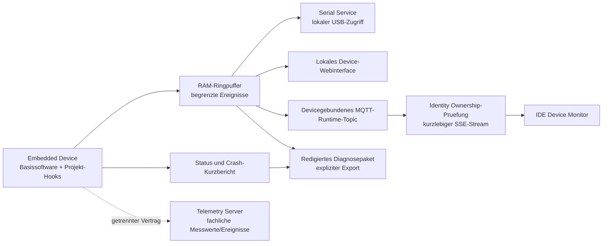

# Debug-Konzept fuer Embedded-IoT-Devices

## Ziel und Geltungsbereich

GerNetiX-Devices sollen vom ersten lokalen Lernprojekt bis zum gepairten IoT-Geraet nachvollziehbar diagnostizierbar sein, ohne Produktionsfirmware dauerhaft zu oeffnen, Secrets zu protokollieren oder fachliche Telemetrie mit technischen Debugdaten zu vermischen.

Das Konzept gilt fuer die geschuetzte Basissoftware und ihre freigegebenen Projekt-Hooks. ESP32 ist die erste Referenzplattform. ESP8266 und AVR verwenden denselben Ereignisvertrag, soweit Speicher, Netzwerk und Hardwaredebugger dies erlauben.

Es baut auf den bereits vorhandenen ESP32-Funktionen auf:

- UART/Serial-Ausgabe
- fluechtiger Feedback-Ringpuffer und lokaler Endpunkt `/logs`
- lokaler Laufzeitstatus unter `/status`
- GerNetiX Serial Service fuer den kontrollierten USB-Zugriff
- account-, projekt- und devicegebundener Runtime-Monitor
- getrennte fachliche Telemetrie- und Ereignis-Infrastruktur

Dieses Dokument beschreibt das Zielbild. Es schaltet keinen Debugzugang frei und fuehrt keinen neuen Serverprozess ein.

## Leitentscheidungen

1. **Diagnose ist standardmaessig vorhanden, Debugzugriff nicht.** Produktionsfirmware liefert begrenzte Zustandsdaten, Fehlercodes und Resetursachen. Schreibende Debugkommandos, Shells und beliebige Speicherzugriffe sind nicht Bestandteil der Produktionsschnittstelle.
2. **Lokal vor remote.** USB/Serial und das lokale Device-Webinterface sind der erste Diagnoseweg. Remote-Live-Diagnose wird nur fuer ein gepairtes, autorisiertes Device und eine aktive Nutzersitzung verwendet.
3. **Debugdaten sind keine Telemetrie.** Technische Laufzeitzeilen gehen nicht in `TelemetryMeasurement` oder `TelemetryEvent`. Fachliche Messwerte und Alarme bleiben im Telemetry Server; kurzlebige Debugzeilen bleiben im Runtime-Monitor.
4. **Kein automatischer Support-Upload.** Ein Diagnosepaket wird nur nach sichtbarer Aktion und expliziter Zustimmung erzeugt und uebertragen. Standardmaessig bleibt es lokal.
5. **Exakte Build-Zuordnung.** Crash-Adressen werden nur gegen das exakt passende ELF-/Map-Artefakt derselben Build-ID symbolisiert. Firmware-Version allein ist dafuer nicht eindeutig genug.
6. **Basissoftware behaelt die Kontrolle.** Projektcode darf strukturierte Ereignisse und Metriken publizieren, aber keine eigenen Debugports, HTTP-Diagnoserouten, MQTT-Debugtopics oder JTAG-Freigaben registrieren.
7. **Fehlerdiagnose darf das Geraet nicht destabilisieren.** Logging ist begrenzt, nicht blockierend und besitzt feste Speicher-, Frequenz- und Transportbudgets.

## Diagnosepfade und Vertrauensgrenzen

Die drei Ausgabepfade zeigen denselben normalisierten Ereignisstrom, jedoch mit unterschiedlichem Umfang:

| Pfad | Zweck | Speicherung | Zugriff |
| --- | --- | --- | --- |
| USB/Serial | Entwicklung, Recovery, Board am Arbeitsplatz | nur Clientansicht; optionaler bewusster lokaler Export | physischer Zugriff plus origin-gebundene Serial-Service-Sitzung |
| Lokales Web | Inbetriebnahme und Diagnose im lokalen Geraetenetz | RAM-Ringpuffer auf dem Device | lokales Netz; keine oeffentliche Weiterleitung |
| Runtime-Monitor | kurze Live-Beobachtung eines gepairten Devices | fluechtiger Stream, keine Telemetrie-Persistenz | aktive Account-Sitzung, Project- und Device-Ownership |
| Diagnosepaket | reproduzierbarer Supportfall | lokal erzeugt; serverseitig nur nach Zustimmung und mit Retention | Nutzerfreigabe, Zweckbindung und Audit |

## Die vier Debugmodi

### 1. Produktionsmodus: Basisdiagnose

Dieser Modus ist in jedem freigegebenen Build aktiv. Er enthaelt nur lesende, ressourcenbegrenzte Diagnose:

- Severity `INFO`, `WARN`, `ERROR` und `FATAL`; `DEBUG` und `TRACE` sind deaktiviert.
- strukturierter RAM-Ringpuffer mit den letzten relevanten Ereignissen
- Boot-ID, Build-ID, Basissoftwareversion, Projektfirmwareversion und Hardwareprofil
- Uptime, Resetursache, Bootzaehler der aktuellen Fehlerfolge und aktiver Partitionsslot
- WLAN-/MQTT-/OTA-Zustand als normalisierte Statuscodes
- freier Heap, minimal beobachteter Heap, Task-/Stack-Wasserzeichen und Watchdog-Kurzinfo, soweit die Plattform dies liefert
- Rate-Limit und Zusammenfassung wiederholter identischer Ereignisse

Es gibt keine Remote-Shell, keinen generischen Speicherleser, keine Laufzeitaktivierung beliebiger Logkategorien und keine Ausgabe von Credentials oder Payload-Rohdaten.

### 2. Lokaler Entwicklungsmodus

Der Nutzer startet diesen Modus bewusst aus der IDE fuer ein physisch verbundenes Board oder ueber das lokale Device-Webinterface. Zusaetzlich erlaubt sind:

- `DEBUG`-Ereignisse fuer ausgewaehlte Subsysteme
- Live-Anzeige, Pause, Filter und lokaler Export
- kontrollierte Diagnoseaktionen aus einer festen Allowlist, zum Beispiel WLAN-Neuverbindung, MQTT-Reconnect oder Selbsttest eines Sensors
- Markierung eines reproduzierten Zeitfensters mit einer lokalen Korrelations-ID

Der Modus endet beim Neustart oder nach einem kurzen Inaktivitaets-Timeout. Seine Aktivierung wird nicht dauerhaft in das Projektprofil geschrieben. Projektcode kann keine Diagnoseaktion selbst registrieren; neue Aktionen benoetigen einen Basissoftware-Vertrag und Tests.

### 3. Zeitlich begrenzte Support-Sitzung

Eine Support-Sitzung ist fuer gepairte Devices vorgesehen, wenn lokale Diagnose nicht ausreicht. Sie setzt voraus:

- sichtbare Zustimmung des Account-Inhabers mit Device, Projekt, Zweck, Umfang und Ablaufzeit
- kurzlebige, Device- und Account-gebundene Berechtigung
- unveraenderliche Allowlist der freigegebenen Kategorien und Statusfelder
- sichtbare Anzeige, solange die Sitzung aktiv ist, und jederzeitigen Abbruch durch den Nutzer
- Audit von Freigabe, Start, Ende und Export, jedoch ohne Rohlogs oder Secrets im Auditdatensatz

Der Standardumfang ist ein Live-Stream. Eine persistente Supportkopie wird nur als separates, redigiertes Diagnosepaket mit definierter Retention angelegt. Unbeaufsichtigtes Einschalten oder ein globaler Betreiberzugriff auf alle Devices ist ausgeschlossen.

### 4. Labor- und Hardwaredebugging

JTAG/GDB, Breakpoints, Core-Dumps mit Speicherinhalten, Boundary-Scan und detailliertes Tracing sind ausschliesslich fuer Laborbuilds auf kontrollierter Hardware vorgesehen.

- eigener, sichtbar gekennzeichneter Buildtyp und getrennte Signier-/Release-Policy
- keine Auslieferung als normales Kunden- oder OTA-Release
- physischer Laborzugriff; keine JTAG-over-Network-Bruecke
- Debug-/Secure-Boot-/Flash-Encryption-Fuses werden boardspezifisch im Hardwareprofil behandelt
- vor Produktfreigabe wird nachgewiesen, dass Produktionsimages keine Laborendpunkte oder Debugzertifikate enthalten

Ein Produktionsfehler wird bevorzugt mit dem Kurzbericht und dem exakt passenden ELF symbolisiert. Ein roher Core-Dump ist die letzte Eskalationsstufe, weil er Secrets und Nutzdaten enthalten kann.

## Strukturierter Ereignisvertrag

Freie Textlogs bleiben fuer lokale Entwicklung moeglich, sind aber nicht der stabile Maschinenvertrag. Jedes auswertbare Ereignis besitzt mindestens:

| Feld | Bedeutung |
| --- | --- |
| `schema_version` | Version des Ereignisvertrags |
| `boot_id` | zufaellige Kennung des aktuellen Starts |
| `sequence` | monotoner Zaehler innerhalb des Boots |
| `uptime_ms` | monotone Zeit seit Start; funktioniert ohne NTP |
| `severity` | `info`, `warn`, `error` oder `fatal` |
| `subsystem` | feste Kategorie, z. B. `wifi`, `mqtt`, `ota`, `power`, `sensor`, `project` |
| `event_code` | stabiler, sprachunabhaengiger Code |
| `parameters` | typisierte, ereignisspezifisch erlaubte Werte |
| `build_id` | eindeutiger Build und Bezug auf ELF/Map |
| `correlation_id` | optionaler Bezug auf Deploy, OTA, Diagnosefenster oder Projektaktion |

Regeln fuer Parameter:

- Allowlist pro `event_code`; unbekannte Felder werden verworfen.
- Keine Passwoerter, Tokens, privaten Schluessel, Zertifikate, Authorization-Header oder vollstaendigen Netzwerkpayloads.
- SSIDs, IP-Adressen, MAC-Adressen, Device-ID und freie Projektexte werden je Ausgabepfad entfernt, gekuerzt oder pseudonymisiert.
- Sensorwerte werden nur geloggt, wenn sie fuer einen konkreten technischen Fehler notwendig sind; regulaere Messreihen gehoeren in die Telemetrie.
- Wiederholungen werden als `repeat_count` zusammengefasst, damit ein Fehlersturm weder CPU noch Netzwerk ueberlastet.

## Crash-, Watchdog- und Bootloop-Diagnose

Beim naechsten erfolgreichen Start erzeugt die Basissoftware einen kleinen Crash-Kurzbericht:

- Reset- und Wake-up-Ursache
- Build-ID, Basissoftwarevariante, Hardwareprofil und Partitionsslot
- Uptime vor dem Fehler, sofern verfuegbar
- Exception-/Watchdog-Code, betroffener Task und rohe Programmzaehler-/Backtrace-Adressen
- Minimum-Heap und relevante Stack-Wasserzeichen
- letzte begrenzte `WARN`-, `ERROR`- und `FATAL`-Ereignisse
- Zaehler fuer aufeinanderfolgende Starts ohne erreichten Health-Meilenstein

Der Kurzbericht ist ein begrenztes technisches Runtime-Artefakt und keine fachliche Quelle der Wahrheit. Er wird nach erfolgreichem Export oder nach einer festen Zahl gesunder Boots geloescht. Schreibvorgaenge werden zusammengefasst und verschleissbegrenzt.

Symbolisierung erfolgt ausserhalb des Devices mit dem BuildResult des Project Servers:

1. Kurzbericht enthaelt Build-ID und rohe Adressen.
2. Project Server prueft Account-, Projekt-, Build- und Device-Zuordnung.
3. Nur das ELF/Map derselben Build-ID wird verwendet.
4. Die Nutzeransicht zeigt Funktionsname, Quelldatei und Zeile, soweit das Artefakt dies erlaubt.
5. Build-Artefakt fehlt oder passt nicht: keine geratenen Symbole, sondern ein sichtbarer `build_artifact_mismatch`-Status.

Bei einem Bootloop startet die Basissoftware nach einer definierten Zahl fehlender Health-Meilensteine im vorhandenen Recoverypfad. Das Debugkonzept ersetzt weder A/B-Rollback noch MEDIUM-Bootstrap oder USB-Recovery.

## Diagnosepaket

Der Export ist ein versioniertes Archiv mit maschinenlesbarem Manifest. Es enthaelt standardmaessig:

- redigierten Status und Crash-Kurzbericht
- begrenzte strukturierte Ereignisse aus dem ausgewaehlten Zeitfenster
- Firmware-, Basissoftware-, Build- und Hardwareprofil-Referenzen
- lokale Diagnoseergebnisse und vom Nutzer eingegebene Problembeschreibung als getrennte Datei
- Redaktionsbericht: entfernte Felder, Regeln und Warnungen
- Integritaetspruefsummen der enthaltenen Dateien

Nicht enthalten sind WLAN-Passwoerter, MQTT-Credentials, private Device-Schluessel, Zertifikatsinhalte, Sitzungsdaten, unredigierte Payloads und komplette Flashabbilder. Vor einem Upload zeigt die UI eine Zusammenfassung und bietet den lokalen Download zur Pruefung an.

## Ressourcenbudgets

Die konkreten Grenzwerte werden je Hardwareklasse im Hardware Catalog festgelegt. Verbindlich sind jedoch folgende Prinzipien:

- fester RAM-Ringpuffer; bei Ueberlauf wird das aelteste Ereignis ersetzt und ein Drop-Zaehler erhoeht
- keine Heap-Allokation im kritischen Fehlerpfad, soweit die Plattform dies erlaubt
- asynchrone beziehungsweise nicht blockierende Ausgabe; Serial- oder Netzstau darf die Runtime nicht anhalten
- getrennte Rate-Limits pro Severity und Subsystem
- Remote-Debugbandbreite deutlich unter der regulaeren Projektkommunikation
- `FATAL` darf einen letzten Kurzbericht sichern, aber keinen unkontrollierten Netzwerk- oder Flash-Schreibsturm ausloesen

Als Startwerte fuer ESP32 werden im ersten Spike 128 Ereignisse, maximal 256 Byte pro normalisiertem Ereignis und hoechstens 10 Remote-Ereignisse pro Sekunde vermessen. Diese Werte sind keine Freigabe, sondern muessen durch Heap-, Last- und Fehlersturmtests bestaetigt oder angepasst werden.

## Bedienablauf in der IDE

1. Nutzer waehlt Projekt und konkretes Device.
2. IDE zeigt Verbindungsweg: USB, lokales Netz oder gepairter Runtime-Monitor.
3. Vor dem Start zeigt sie Modus, Datenumfang, Laufzeit und Speicherverhalten.
4. Live-Sicht gruppiert nach Severity und Subsystem; Wiederholungen werden zusammengefasst.
5. Nutzer setzt eine Reproduktionsmarke und fuehrt den Fehler aus.
6. IDE korreliert Boot, Build, Deploy und Device, symbolisiert bekannte Crash-Adressen und bietet naechste sichere Schritte an.
7. Nutzer beendet die Sitzung oder exportiert bewusst ein redigiertes Diagnosepaket.

Die IDE darf keine gruenen Pauschalaussagen wie "Device gesund" aus einzelnen Logs ableiten. Sie zeigt beobachtete Fakten und den Zeitraum, zum Beispiel "seit Boot vor 4 Minuten kein Watchdog-Ereignis".

## Umsetzungsplan

### Phase 1: Einheitlicher lokaler Diagnosekern

- Ereignisschema, Severity, Subsysteme, Ringpuffer und Drop-Zaehler festlegen
- bestehende UART- und `/logs`-Ausgabe auf denselben Ereignisstrom fuehren
- `/status` um Build-ID, Resetursache, Heap-/Stack-Werte und Health-Meilenstein erweitern
- Secret-/PII-Redaktion zentral in der Basissoftware testen
- IDE-/Serial-Service-Liveansicht mit Filter, Pause und lokalem Export anbinden

### Phase 2: Crash-Kurzbericht und Symbolisierung

- verschleissbegrenzten Crash-/Bootloop-Kurzbericht fuer ESP32 implementieren
- BuildResult um eindeutig referenzierbares ELF/Map und Build-ID-Vertrag ergaenzen
- lokale beziehungsweise accountautorisierte Symbolisierung umsetzen
- Panic-, Task-Watchdog-, Brownout-, Heap- und falsches-ELF-Szenarien testen

### Phase 3: Autorisierter Runtime-Monitor

- bestehendes devicegebundenes MQTT-Runtime-Topic in der Basissoftware anbinden
- End-to-End-Rate-Limits, Backpressure und Drop-Zaehler implementieren
- Ownership-Pruefung und kurzlebigen Identity-SSE-Stream in der IDE abnehmen
- sicherstellen, dass Runtime-Zeilen weder Telemetry Server noch allgemeine Operations-Logs fuellen

### Phase 4: Supportpaket und Laborprofil

- versioniertes, redigiertes Diagnosepaket mit Vorschau und Zustimmung
- serverseitige Retention, Loeschung und Audit fuer freiwillig hochgeladene Pakete
- getrenntes Laborbuildprofil fuer JTAG/GDB und Produktions-Negativtests
- reale Hardware-Abnahme je freigegebener Boardklasse

## Abnahmekriterien

Das Konzept gilt erst als umgesetzt, wenn mindestens folgende Nachweise vorliegen:

- Normalbetrieb, Fehlersturm und voller Ringpuffer blockieren die Projekt-Runtime nicht.
- Secrets aus Provisioning, WLAN, MQTT, OTA und HTTP erscheinen in keinem Ausgabepfad und keinem Diagnosepaket.
- Zwei Accounts beziehungsweise Projekte koennen weder Live-Logs noch Diagnosepakete des jeweils anderen lesen.
- Ein getrenntes oder abgelaufenes Supportrecht beendet den Stream und verhindert erneuten Zugriff.
- Crash-Adressen werden nur mit exakt passender Build-ID symbolisiert.
- Fehlendes Netz verhindert lokale USB-/Webdiagnose nicht; fehlender Server verhindert den normalen Device-Start nicht.
- Runtime-Debugdaten landen nicht in fachlichen Telemetrietabellen.
- Produktionsimages enthalten keine Laborendpunkte, Debugzertifikate oder aktivierbare Remote-Shell.
- Watchdog, Panic, Brownout, Bootloop, OTA-Rollback und Recovery wurden auf echter Hardware nachvollzogen.
- RAM-, Flash-, CPU- und Netzwerkbudgets sind fuer jede freigegebene Hardwareklasse dokumentiert.

## Noch zu entscheidende Detailfragen

- Welche ESP32-Speicherklasse erhaelt nur den Kurzbericht und welche zusaetzlich eine dedizierte, verschluesselte Core-Dump-Partition?
- Wie lange duerfen freiwillig hochgeladene Diagnosepakete je Supporttarif aufbewahrt werden?
- Erfolgt Symbolisierung ausschliesslich serverseitig oder kann die lokale IDE das accountautorisierte ELF temporaer verarbeiten?
- Welche Boardklassen erlauben JTAG im Laborprofil, ohne Produktionsschutz wie Secure Boot und Flash Encryption zu schwaechen?
- Welche exakten RAM-, Frequenz- und Bandbreitenbudgets gelten fuer ESP32, ESP8266 und AVR?
