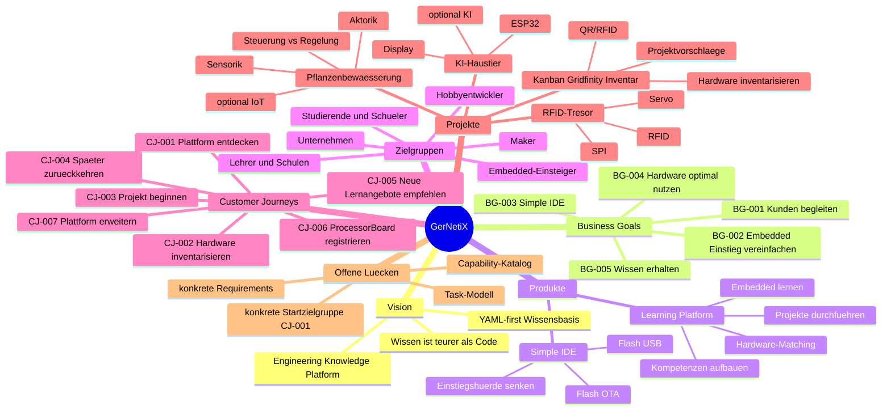

# Business Mindmap

Diese Datei visualisiert Business- und Produktlogik.
YAML bleibt die Source of Truth.

```mermaid
mindmap
  root((GerNetiX))
    Vision
      Engineering Knowledge Platform
      Wissen ist teurer als Code
      YAML-first Wissensbasis
    Business Goals
      BG-001 Kunden begleiten
      BG-002 Embedded Einstieg vereinfachen
      BG-003 Simple IDE
      BG-004 Hardware optimal nutzen
      BG-005 Wissen erhalten
    Produkte
      Learning Platform
        Embedded lernen
        Projekte durchfuehren
        Kompetenzen aufbauen
        Hardware-Matching
      Simple IDE
        Einstiegshuerde senken
        Flash USB
        Flash OTA
    Zielgruppen
      Maker
      Hobbyentwickler
      Studierende und Schueler
      Lehrer und Schulen
      Embedded-Einsteiger
      Unternehmen
    Customer Journeys
      CJ-001 Plattform entdecken
      CJ-002 Hardware inventarisieren
      CJ-003 Projekt beginnen
      CJ-004 Spaeter zurueckkehren
      CJ-005 Neue Lernangebote empfehlen
      CJ-006 ProcessorBoard registrieren
      CJ-007 Plattform erweitern
    Projekte
      KI-Haustier
        Display
        ESP32
        optional KI
      Pflanzenbewaesserung
        Steuerung vs Regelung
        Sensorik
        Aktorik
        optional IoT
      RFID-Tresor
        RFID
        SPI
        Servo
      Kanban Gridfinity Inventar
        Hardware inventarisieren
        QR/RFID
        Projektvorschlaege
    Offene Luecken
      konkrete Requirements
      Capability-Katalog
      Task-Modell
      konkrete Startzielgruppe CJ-001
```
