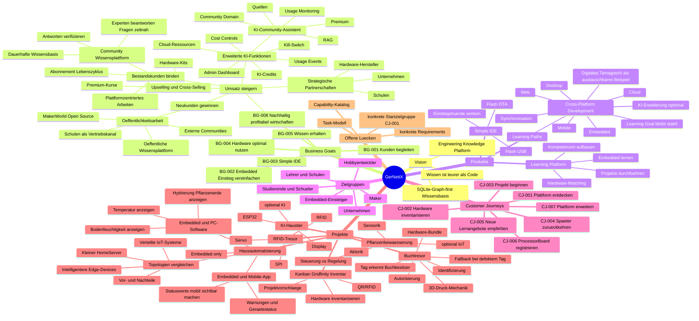

# Business Mindmap

Diese Datei visualisiert Business- und Produktlogik.
Der validierte SQLite-Graph ist die kanonische Struktur.

```mermaid
mindmap
  root((GerNetiX))
    Vision
      Engineering Knowledge Platform
      Wissen ist teurer als Code
      SQLite-Graph-first Wissensbasis
    Business Goals
      BG-001 Kunden begleiten
      BG-002 Embedded Einstieg vereinfachen
      BG-003 Simple IDE
      BG-004 Hardware optimal nutzen
      BG-005 Wissen erhalten
      BG-008 Nachhaltig profitabel wirtschaften
        Umsatz steigern
          Neukunden gewinnen
            Oeffentlichkeitsarbeit
              Oeffentliche Wissensplattform
              Externe Communities
              MakerWorld Open Source
              Schulen als Vertriebskanal
          Bestandskunden binden
            Community Wissensplattform
              Experten beantworten Fragen zeitnah
              Antworten verifizieren
              Dauerhafte Wissensbasis
            Plattformzentriertes Arbeiten
            Abonnement Lebenszyklus
          Upselling und Cross-Selling
            Premium-Kurse
            Hardware-Kits
          Erweiterte KI-Funktionen
            KI-Credits
            Usage Events
            Admin Dashboard
            Cost Controls
            Kill-Switch
            KI-Community-Assistent
              Community Domain
              Premium
              RAG
              Quellen
              Usage Monitoring
            Cloud-Ressourcen
          Strategische Partnerschaften
            Schulen
            Unternehmen
            Hardware-Hersteller
    Produkte
      Learning Platform
        Embedded lernen
        Projekte durchfuehren
        Kompetenzen aufbauen
        Hardware-Matching
      Simple IDE
        Einstiegshuerde senken
        Flash USB
        Flash OTA
      Learning Paths
        Cross-Platform Development
          Learning Goal bleibt stabil
          Digitales Tamagotchi als austauschbares Beispiel
          Embedded
          Desktop
          Mobile
          Web
          Cloud
          Synchronisation
          KI-Erweiterung optional
    Zielgruppen
      Maker
      Hobbyentwickler
      Studierende und Schueler
      Lehrer und Schulen
      Embedded-Einsteiger
      Unternehmen
    Customer Journeys
      CJ-001 Plattform entdecken
      CJ-002 Hardware inventarisieren
      CJ-003 Projekt beginnen
      CJ-004 Spaeter zurueckkehren
      CJ-005 Neue Lernangebote empfehlen
      CJ-006 ProcessorBoard registrieren
      CJ-007 Plattform erweitern
    Projekte
      KI-Haustier
        Display
        ESP32
        optional KI
      Pflanzenbewaesserung
        Steuerung vs Regelung
        Sensorik
        Aktorik
        optional IoT
      RFID-Tresor
        RFID
        SPI
        Servo
      Buchtresor
        Tag erkennt Buchbesitzer
        Identifizierung
        Autorisierung
        Fallback bei defektem Tag
        3D-Druck-Mechanik
        Hardware-Bundle
      Kanban Gridfinity Inventar
        Hardware inventarisieren
        QR/RFID
        Projektvorschlaege
      Hausautomatisierung
        Embedded only
        Embedded und PC-Software
          Temperatur anzeigen
          Bodenfeuchtigkeit anzeigen
          Hydrierung Pflanzenerde anzeigen
        Embedded und Mobile-App
          Statuswerte mobil sichtbar machen
          Warnungen und Geraetestatus
        Topologien vergleichen
          Kleiner HomeServer
          Verteilte IoT-Systeme
          Intelligentere Edge-Devices
          Vor- und Nachteile
    Offene Luecken
      konkrete Requirements
      Capability-Katalog
      Task-Modell
      konkrete Startzielgruppe CJ-001
```
