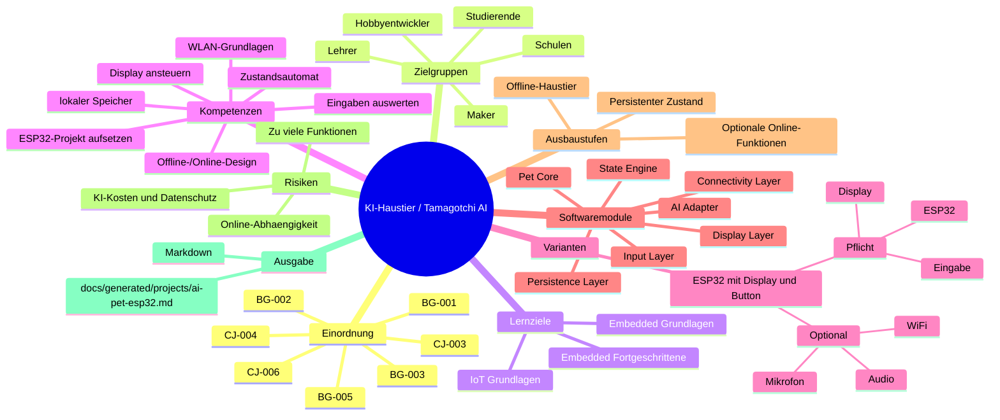

# Mindmap - KI-Haustier / Tamagotchi AI

Quelle:

- `data/learning/projects/ai-pet-esp32.yaml`

```mermaid
mindmap
  root((KI-Haustier / Tamagotchi AI))
    Einordnung
      BG-001
      BG-002
      BG-003
      BG-005
      CJ-003
      CJ-004
      CJ-006
    Zielgruppen
      Maker
      Hobbyentwickler
      Studierende
      Lehrer
      Schulen
    Lernziele
      Embedded Grundlagen
      IoT Grundlagen
      Embedded Fortgeschrittene
    Kompetenzen
      ESP32-Projekt aufsetzen
      Display ansteuern
      Eingaben auswerten
      Zustandsautomat
      lokaler Speicher
      WLAN-Grundlagen
      Offline-/Online-Design
    Varianten
      ESP32 mit Display und Button
        Pflicht
          ESP32
          Display
          Eingabe
        Optional
          WiFi
          Audio
          Mikrofon
    Softwaremodule
      Pet Core
      State Engine
      Display Layer
      Input Layer
      Persistence Layer
      Connectivity Layer
      AI Adapter
    Ausbaustufen
      Offline-Haustier
      Persistenter Zustand
      Optionale Online-Funktionen
    Risiken
      Zu viele Funktionen
      Online-Abhaengigkeit
      KI-Kosten und Datenschutz
    Ausgabe
      Markdown
      docs/generated/projects/ai-pet-esp32.md
```
