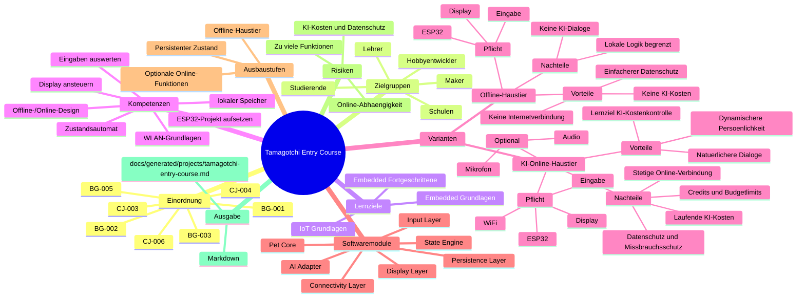

# Mindmap - Tamagotchi Entry Course

Quelle:

- `data/learning/projects/tamagotchi-entry-course.yaml`

```mermaid
mindmap
  root((Tamagotchi Entry Course))
    Einordnung
      BG-001
      BG-002
      BG-003
      BG-005
      CJ-003
      CJ-004
      CJ-006
    Zielgruppen
      Maker
      Hobbyentwickler
      Studierende
      Lehrer
      Schulen
    Lernziele
      Embedded Grundlagen
      IoT Grundlagen
      Embedded Fortgeschrittene
    Kompetenzen
      ESP32-Projekt aufsetzen
      Display ansteuern
      Eingaben auswerten
      Zustandsautomat
      lokaler Speicher
      WLAN-Grundlagen
      Offline-/Online-Design
    Varianten
      Offline-Haustier
        Pflicht
          ESP32
          Display
          Eingabe
        Vorteile
          Keine Internetverbindung
          Keine KI-Kosten
          Einfacherer Datenschutz
        Nachteile
          Keine KI-Dialoge
          Lokale Logik begrenzt
      KI-Online-Haustier
        Pflicht
          ESP32
          Display
          Eingabe
          WiFi
        Optional
          Audio
          Mikrofon
        Vorteile
          Natuerlichere Dialoge
          Dynamischere Persoenlichkeit
          Lernziel KI-Kostenkontrolle
        Nachteile
          Stetige Online-Verbindung
          Laufende KI-Kosten
          Credits und Budgetlimits
          Datenschutz und Missbrauchsschutz
    Softwaremodule
      Pet Core
      State Engine
      Display Layer
      Input Layer
      Persistence Layer
      Connectivity Layer
      AI Adapter
    Ausbaustufen
      Offline-Haustier
      Persistenter Zustand
      Optionale Online-Funktionen
    Risiken
      Zu viele Funktionen
      Online-Abhaengigkeit
      KI-Kosten und Datenschutz
    Ausgabe
      Markdown
      docs/generated/projects/tamagotchi-entry-course.md
```
