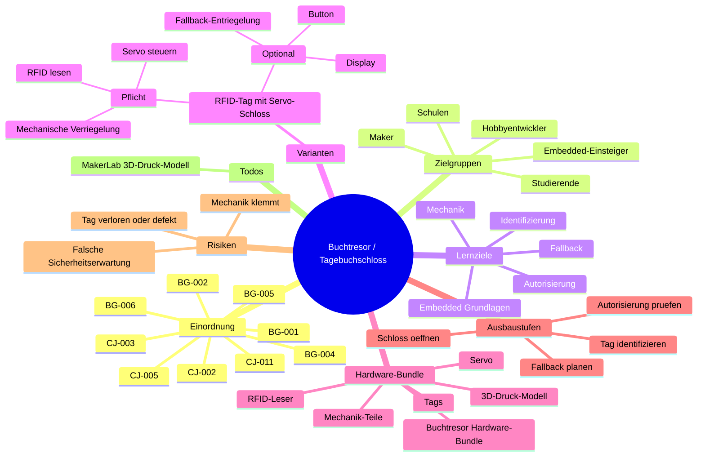

# Mindmap - Buchtresor / Tagebuchschloss

Quelle:

- `data/learning/projects/book-vault.yaml`

```mermaid
mindmap
  root((Buchtresor / Tagebuchschloss))
    Einordnung
      BG-001
      BG-002
      BG-004
      BG-005
      BG-006
      CJ-002
      CJ-003
      CJ-005
      CJ-011
    Zielgruppen
      Maker
      Hobbyentwickler
      Embedded-Einsteiger
      Studierende
      Schulen
    Lernziele
      Embedded Grundlagen
      Identifizierung
      Autorisierung
      Fallback
      Mechanik
    Varianten
      RFID-Tag mit Servo-Schloss
        Pflicht
          RFID lesen
          Servo steuern
          Mechanische Verriegelung
        Optional
          Display
          Button
          Fallback-Entriegelung
    Hardware-Bundle
      Buchtresor Hardware-Bundle
      Tags
      RFID-Leser
      Servo
      Mechanik-Teile
      3D-Druck-Modell
    Ausbaustufen
      Tag identifizieren
      Autorisierung pruefen
      Schloss oeffnen
      Fallback planen
    Risiken
      Falsche Sicherheitserwartung
      Tag verloren oder defekt
      Mechanik klemmt
    Todos
      MakerLab 3D-Druck-Modell
```
