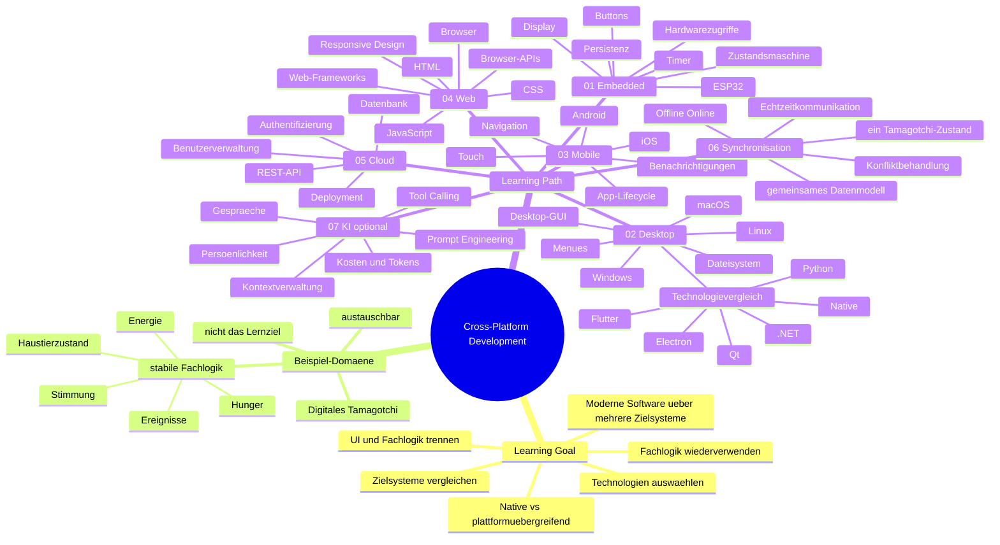

# Cross-Platform Development Mindmap

Diese Datei ist eine generierte Lesesicht.
Der validierte SQLite-Graph ist die kanonische Struktur.

```mermaid
mindmap
  root((Cross-Platform Development))
    Learning Goal
      Zielsysteme vergleichen
      Technologien auswaehlen
      Native vs plattformuebergreifend
      Fachlogik wiederverwenden
      UI und Fachlogik trennen
      Moderne Software ueber mehrere Zielsysteme
    Beispiel-Domaene
      Digitales Tamagotchi
      austauschbar
      nicht das Lernziel
      stabile Fachlogik
        Haustierzustand
        Hunger
        Energie
        Stimmung
        Ereignisse
    Learning Path
      01 Embedded
        ESP32
        Display
        Buttons
        Zustandsmaschine
        Timer
        Persistenz
        Hardwarezugriffe
      02 Desktop
        Windows
        macOS
        Linux
        Desktop-GUI
        Menues
        Dateisystem
        Technologievergleich
          Native
          .NET
          Qt
          Flutter
          Electron
          Python
      03 Mobile
        Android
        iOS
        Touch
        Navigation
        App-Lifecycle
        Benachrichtigungen
      04 Web
        Browser
        HTML
        CSS
        JavaScript
        Responsive Design
        Browser-APIs
        Web-Frameworks
      05 Cloud
        REST-API
        Datenbank
        Benutzerverwaltung
        Authentifizierung
        Deployment
      06 Synchronisation
        gemeinsames Datenmodell
        ein Tamagotchi-Zustand
        Offline Online
        Konfliktbehandlung
        Echtzeitkommunikation
      07 KI optional
        Persoenlichkeit
        Gespraeche
        Prompt Engineering
        Tool Calling
        Kontextverwaltung
        Kosten und Tokens
```
