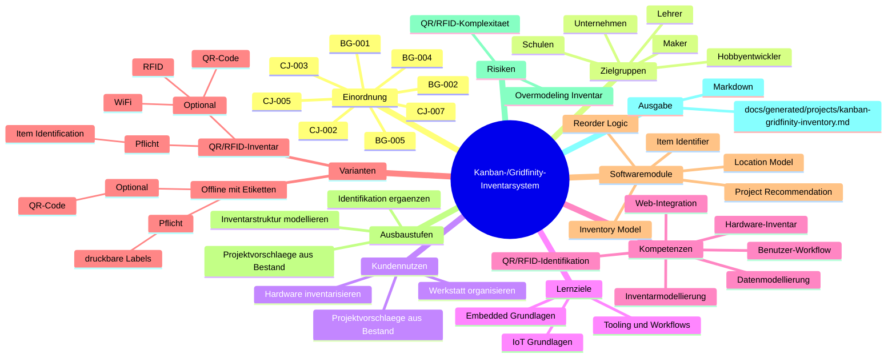

# Mindmap - Kanban-/Gridfinity-Inventarsystem

Quelle:

- `data/learning/projects/kanban-gridfinity-inventory.yaml`

```mermaid
mindmap
  root((Kanban-/Gridfinity-Inventarsystem))
    Einordnung
      BG-001
      BG-002
      BG-004
      BG-005
      CJ-002
      CJ-003
      CJ-005
      CJ-007
    Zielgruppen
      Maker
      Hobbyentwickler
      Schulen
      Lehrer
      Unternehmen
    Kundennutzen
      Hardware inventarisieren
      Werkstatt organisieren
      Projektvorschlaege aus Bestand
    Lernziele
      Embedded Grundlagen
      IoT Grundlagen
      Tooling und Workflows
    Kompetenzen
      Inventarmodellierung
      QR/RFID-Identifikation
      Datenmodellierung
      Benutzer-Workflow
      Hardware-Inventar
      Web-Integration
    Varianten
      Offline mit Etiketten
        Pflicht
          druckbare Labels
        Optional
          QR-Code
      QR/RFID-Inventar
        Pflicht
          Item Identification
        Optional
          RFID
          QR-Code
          WiFi
    Softwaremodule
      Inventory Model
      Item Identifier
      Location Model
      Reorder Logic
      Project Recommendation
    Ausbaustufen
      Inventarstruktur modellieren
      Identifikation ergaenzen
      Projektvorschlaege aus Bestand
    Risiken
      Overmodeling Inventar
      QR/RFID-Komplexitaet
    Ausgabe
      Markdown
      docs/generated/projects/kanban-gridfinity-inventory.md
```
