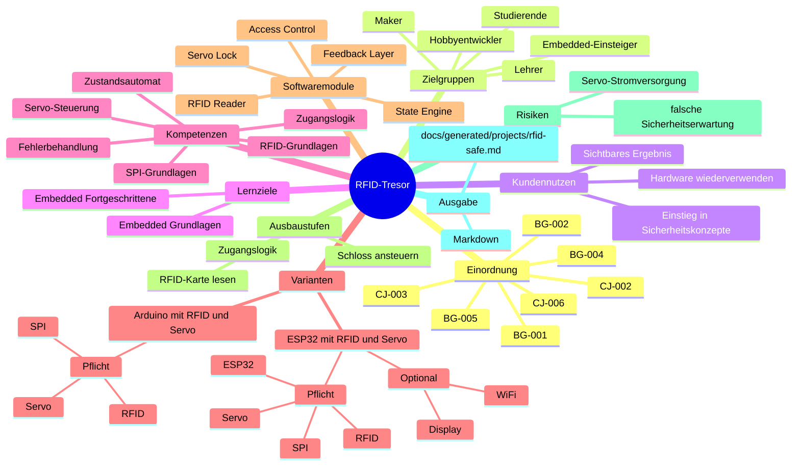

# Mindmap - RFID-Tresor

Quelle:

- `data/learning/projects/rfid-safe.yaml`

```mermaid
mindmap
  root((RFID-Tresor))
    Einordnung
      BG-001
      BG-002
      BG-004
      BG-005
      CJ-002
      CJ-003
      CJ-006
    Zielgruppen
      Maker
      Hobbyentwickler
      Embedded-Einsteiger
      Studierende
      Lehrer
    Kundennutzen
      Sichtbares Ergebnis
      Einstieg in Sicherheitskonzepte
      Hardware wiederverwenden
    Lernziele
      Embedded Grundlagen
      Embedded Fortgeschrittene
    Kompetenzen
      SPI-Grundlagen
      RFID-Grundlagen
      Servo-Steuerung
      Zustandsautomat
      Zugangslogik
      Fehlerbehandlung
    Varianten
      ESP32 mit RFID und Servo
        Pflicht
          ESP32
          SPI
          RFID
          Servo
        Optional
          Display
          WiFi
      Arduino mit RFID und Servo
        Pflicht
          SPI
          RFID
          Servo
    Softwaremodule
      RFID Reader
      Access Control
      Servo Lock
      State Engine
      Feedback Layer
    Ausbaustufen
      RFID-Karte lesen
      Schloss ansteuern
      Zugangslogik
    Risiken
      falsche Sicherheitserwartung
      Servo-Stromversorgung
    Ausgabe
      Markdown
      docs/generated/projects/rfid-safe.md
```
