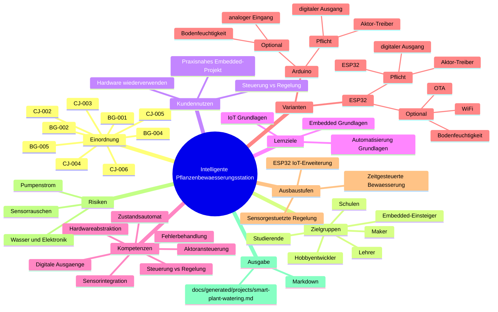

# Mindmap - Intelligente Pflanzenbewaesserungsstation

Quelle:

- `data/learning/projects/smart-plant-watering.yaml`

```mermaid
mindmap
  root((Intelligente Pflanzenbewaesserungsstation))
    Einordnung
      BG-001
      BG-002
      BG-004
      BG-005
      CJ-002
      CJ-003
      CJ-004
      CJ-005
      CJ-006
    Zielgruppen
      Maker
      Hobbyentwickler
      Studierende
      Embedded-Einsteiger
      Lehrer
      Schulen
    Kundennutzen
      Praxisnahes Embedded-Projekt
      Steuerung vs Regelung
      Hardware wiederverwenden
    Lernziele
      Embedded Grundlagen
      IoT Grundlagen
      Automatisierung Grundlagen
    Kompetenzen
      Digitale Ausgaenge
      Sensorintegration
      Aktoransteuerung
      Steuerung vs Regelung
      Zustandsautomat
      Fehlerbehandlung
      Hardwareabstraktion
    Varianten
      Arduino
        Pflicht
          digitaler Ausgang
          Aktor-Treiber
        Optional
          analoger Eingang
          Bodenfeuchtigkeit
      ESP32
        Pflicht
          ESP32
          digitaler Ausgang
          Aktor-Treiber
        Optional
          Bodenfeuchtigkeit
          WiFi
          OTA
    Ausbaustufen
      Zeitgesteuerte Bewaesserung
      Sensorgestuetzte Regelung
      ESP32 IoT-Erweiterung
    Risiken
      Wasser und Elektronik
      Sensorrauschen
      Pumpenstrom
    Ausgabe
      Markdown
      docs/generated/projects/smart-plant-watering.md
```
