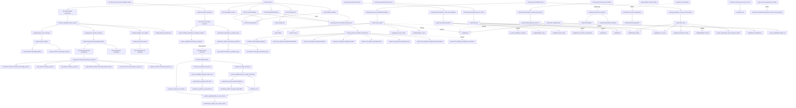

# Traceability Graph

Diese Datei visualisiert zentrale Beziehungen.
Der validierte SQLite-Graph ist die kanonische Struktur.

```mermaid
graph TD
  V[vision.gernetix] --> BG1[BG-001 Kunden begleiten]
  V --> BG2[BG-002 Embedded Einstieg]
  V --> BG3[BG-003 Simple IDE]
  V --> BG4[BG-004 Hardware nutzen]
  V --> BG5[BG-005 Wissen erhalten]
  V --> BG8[BG-008 Profitabel wirtschaften]

  BG8 --> BS_REV[business_strategy.increase_revenue]
  BS_REV --> STR_NEW[strategy.acquire_new_customers]
  BS_REV --> STR_RET[strategy.retain_existing_customers]
  BS_REV --> STR_UP[strategy.upselling_cross_selling]
  BS_REV --> STR_PART[strategy.strategic_partnerships]

  STR_NEW --> M_PR[measure.public_relations]
  M_PR --> M_KNOW[measure.public_knowledge_platform]
  M_PR --> M_EXT[measure.external_community_presence]
  STR_RET --> M_COMM[measure.community_knowledge_platform]
  STR_UP --> M_PREM[measure.premium_courses]

  M_COMM --> BC15[BC-015 Fragen zeitnah beantworten]
  M_COMM --> BC16[BC-016 Antworten verifizieren]
  M_PREM --> BC1[BC-001 Bundling und Upselling]
  BC15 --> REQ_TRIAGE[requirement.community_question_triage_time]
  REQ_TRIAGE --> ARCH_COMM[architecture_artifact.community_knowledge_platform]
  REQ_TRIAGE --> DM_Q[data_model.community_question]
  REQ_TRIAGE --> API_Q[api_artifact.community_questions]
  REQ_TRIAGE --> IMPL_Q[implementation_artifact.community_question_triage]
  REQ_TRIAGE --> TEST_Q[test_artifact.community_question_triage_time]
  REQ_TRIAGE --> VAL_Q[validation_artifact.community_response_sla]

  BR_AI[BR-006 KI-Kosten schuetzen] --> BC_COST[BC-041 Kostenkontrolle]
  BC_COST --> M_AI_PREF[measure.ai_prepaid_credit_check]
  BC_COST --> M_AI_DASH[measure.ai_usage_monitoring]
  BC_COST --> M_AI_CTRL[measure.ai_admin_cost_controls]
  M_AI_PREF --> SYS_AI_PREF[system_capability.ai_prepaid_credit_check]
  M_AI_DASH --> SYS_AI_MON[system_capability.admin_ai_usage_monitoring]
  M_AI_CTRL --> SYS_AI_CTRL[system_capability.admin_ai_cost_controls]
  SYS_AI_PREF --> REQ_AI_PREF[requirement.ai_prepaid_credit_check]
  SYS_AI_MON --> REQ_AI_DASH[requirement.ai_admin_usage_dashboard]
  SYS_AI_CTRL --> REQ_AI_CTRL[requirement.ai_admin_cost_control_actions]
  REQ_AI_PREF --> ARCH_AI_COST[architecture_artifact.ai_cost_protection]
  REQ_AI_DASH --> ARCH_AI_OBS[architecture_artifact.ai_usage_observability]
  REQ_AI_DASH --> ADMIN[app.admin_tool]
  ADMIN --> SYS_AI_MON
  ADMIN --> SYS_AI_CTRL

  LP_COMM[learning_path.community_knowledge_usage] --> BD_COMM[business_domain.community]
  BD_COMM --> BC_COMM_AI[BC-040 KI-Community-Assistent]
  BC_COMM_AI --> REQ_COMM_AI[requirement.community_ai_assistant_query]
  BC_COMM_AI --> OFFER_COMM_AI[product_offering.community_ai_assistant_premium]
  OFFER_COMM_AI --> SYS_COMM_AI[system_capability.community_ai_assistant]
  REQ_COMM_AI --> ARCH_COMM_AI[architecture_artifact.community_ai_assistant]
  ARCH_COMM_AI --> DM_COMM_AI[data_model.community_ai_assistant_query]
  ARCH_COMM_AI --> API_COMM_AI[api_artifact.community_ai_assistant_query]
  ARCH_COMM_AI -. cost protection .-> BR_AI

  BG1 --> LP[product.learning_platform]
  BG2 --> LP
  BG4 --> LP
  BG5 --> LP
  BG3 --> IDE[product.simple_ide]

  LG_EMB[learning_goal.embedded_basics] --> LP_PET[learning_path.ai_pet_embedded_interaction]
  LP_PET --> P1[project.ai_pet_esp32]
  P1 --> P1_OFF[variant offline]
  P1 --> P1_AI[variant KI online]

  BG1 --> LG_CP[learning_goal.cross_platform_development]
  BG2 --> LG_CP
  BG3 -. mittel .-> LG_CP
  BG5 --> LG_CP
  LG_CP --> LP_CP[learning_path.cross_platform_development]
  LP_CP --> EX_TAMA[example_domain.digital_tamagotchi]
  LP_CP --> CP_EMB[project.cross_platform_tamagotchi.embedded]
  LP_CP --> CP_DESK[project.cross_platform_tamagotchi.desktop]
  LP_CP --> CP_MOB[project.cross_platform_tamagotchi.mobile]
  LP_CP --> CP_WEB[project.cross_platform_tamagotchi.web]
  LP_CP --> CP_CLOUD[project.cross_platform_tamagotchi.cloud]
  LP_CP --> CP_SYNC[project.cross_platform_tamagotchi.synchronization]
  LP_CP -. optional .-> CP_AI[project.cross_platform_tamagotchi.ai_extension]

  LG_AUTO[learning_goal.automation_basics] --> LP_AUTO[learning_path.automation_control_and_regulation]
  LP_AUTO --> P2[project.smart_plant_watering]

  LG_ADV[learning_goal.embedded_advanced] --> LP_ACCESS[learning_path.embedded_access_control]
  LP_ACCESS --> P3[project.rfid_safe]

  LG_EMB --> LP_MAKER[learning_path.maker_access_and_mechanics]
  LP_MAKER --> PB[project.book_vault]

  LG_TOOL[learning_goal.tooling_and_workflows] --> LP_INV[learning_path.workshop_inventory_and_tooling]
  LP_INV --> P4[project.kanban_gridfinity_inventory]

  P1 --> C_ESP32[capability.processor_esp32]
  P1 --> C_DISPLAY[capability.display_output]
  P1 -. optional .-> C_WIFI[capability.wifi]
  P1 -. optional .-> AI[system_capability.ai_assistant]

  P2 --> C_DO[capability.digital_output]
  P2 --> C_DRIVER[capability.actuator_driver]
  P2 -. optional .-> C_SOIL[capability.soil_moisture_measurement]
  P2 -. optional .-> C_WIFI
  P2 -. optional .-> C_OTA[capability.ota]

  P3 --> C_SPI[capability.spi]
  P3 --> C_RFID[capability.rfid_reading]
  P3 --> C_SERVO[capability.servo_control]
  PB --> C_RFID
  PB --> C_SERVO
  PB --> C_LOCK[capability.mechanical_locking]
  PB -. fallback .-> C_FALLBACK[capability.fallback_unlock]
  PB --> KIT_BOOK[product_offering.book_vault_hardware_bundle]

  P4 --> C_ITEM[capability.item_identification]
  P4 -. optional .-> C_RFID
  P4 -. optional .-> C_WIFI

  DEC_YAML[architecture.yaml_first_repository] --> DB[component.database]
  DEC_YAML --> MD[component.generated_markdown]
  DEC_TOP[architecture.top_down_development] --> MM[metamodel.learning_platform]
  DEC_CAP[architecture.capability_split] --> C_WIFI
  DEC_CAP --> SYS[system_capability.ide_flash_ota]
  DEC_BOARD[architecture.registered_processor_board] --> OTA[component.ota]

  GAP_REQ[gap.concrete_requirements_missing] -. blocks .-> REQ_RULE[requirement_model.decomposition_ends_at_work_package]
  GAP_CAP[gap.capability_catalog_missing] -. details open .-> DEC_YAML
  GAP_TASK[gap.task_model_missing] -. affects .-> DEC_TOP
```
