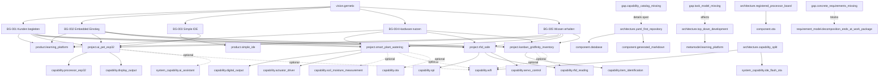

# Traceability Graph

Diese Datei visualisiert zentrale Beziehungen.
YAML bleibt die Source of Truth.

```mermaid
graph TD
  V[vision.gernetix] --> BG1[BG-001 Kunden begleiten]
  V --> BG2[BG-002 Embedded Einstieg]
  V --> BG3[BG-003 Simple IDE]
  V --> BG4[BG-004 Hardware nutzen]
  V --> BG5[BG-005 Wissen erhalten]

  BG1 --> LP[product.learning_platform]
  BG2 --> LP
  BG4 --> LP
  BG5 --> LP
  BG3 --> IDE[product.simple_ide]

  BG1 --> P1[project.ai_pet_esp32]
  BG2 --> P1
  BG3 --> P1
  BG5 --> P1

  BG1 --> P2[project.smart_plant_watering]
  BG2 --> P2
  BG4 --> P2
  BG5 --> P2

  BG1 --> P3[project.rfid_safe]
  BG2 --> P3
  BG4 --> P3
  BG5 --> P3

  BG1 --> P4[project.kanban_gridfinity_inventory]
  BG2 --> P4
  BG4 --> P4
  BG5 --> P4

  P1 --> C_ESP32[capability.processor_esp32]
  P1 --> C_DISPLAY[capability.display_output]
  P1 -. optional .-> C_WIFI[capability.wifi]
  P1 -. optional .-> AI[system_capability.ai_assistant]

  P2 --> C_DO[capability.digital_output]
  P2 --> C_DRIVER[capability.actuator_driver]
  P2 -. optional .-> C_SOIL[capability.soil_moisture_measurement]
  P2 -. optional .-> C_WIFI
  P2 -. optional .-> C_OTA[capability.ota]

  P3 --> C_SPI[capability.spi]
  P3 --> C_RFID[capability.rfid_reading]
  P3 --> C_SERVO[capability.servo_control]

  P4 --> C_ITEM[capability.item_identification]
  P4 -. optional .-> C_RFID
  P4 -. optional .-> C_WIFI

  DEC_YAML[architecture.yaml_first_repository] --> DB[component.database]
  DEC_YAML --> MD[component.generated_markdown]
  DEC_TOP[architecture.top_down_development] --> MM[metamodel.learning_platform]
  DEC_CAP[architecture.capability_split] --> C_WIFI
  DEC_CAP --> SYS[system_capability.ide_flash_ota]
  DEC_BOARD[architecture.registered_processor_board] --> OTA[component.ota]

  GAP_REQ[gap.concrete_requirements_missing] -. blocks .-> REQ_RULE[requirement_model.decomposition_ends_at_work_package]
  GAP_CAP[gap.capability_catalog_missing] -. details open .-> DEC_YAML
  GAP_TASK[gap.task_model_missing] -. affects .-> DEC_TOP
```
