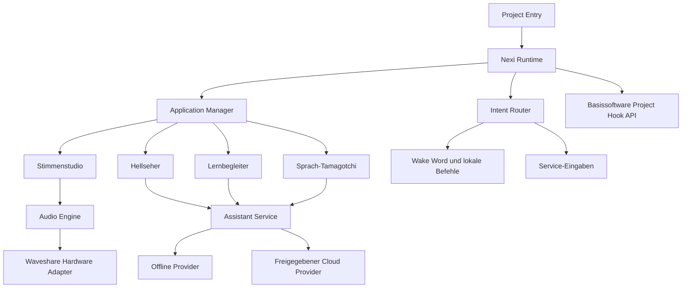
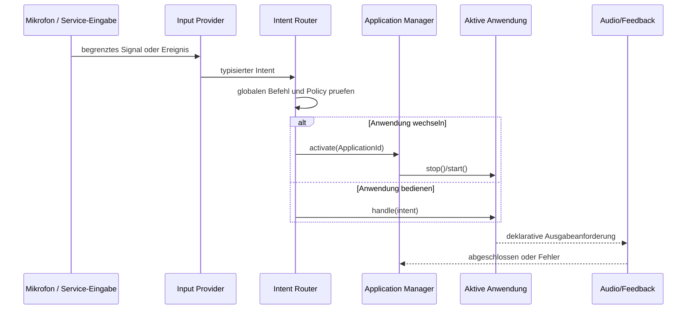
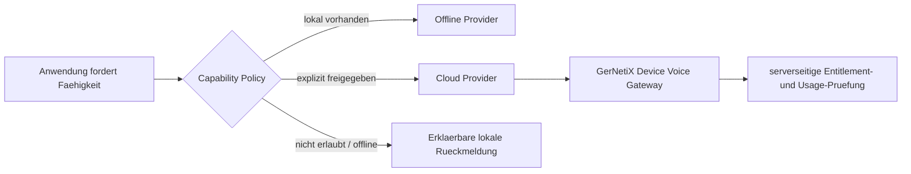

# Nexi-Firmwarearchitektur

## Ziel und Grenze

Nexi ist eine austauschbare Projektsoftware auf der eigenstaendig lauffaehigen
GerNetiX-ESP32-Basissoftware. Die Basissoftware startet und betreibt ein Geraet
auch ohne Nexi. Sie besitzt Provisioning, WLAN-/SSID-Setup, Geraeteidentitaet,
Diagnose, Recovery und den authentifizierten OTA-Kanal.

Nexi darf diese Funktionen nicht kopieren, ersetzen oder intern aufrufen. Der
einzige Einstieg ist der versionierte Projekt-Hook-Vertrag. Die
Abhaengigkeitsrichtung lautet immer:

```text
Nexi -> oeffentlicher Basissoftware-Vertrag
Basissoftware -/-> Nexi-Implementierung
```

Schwache leere Hook-Implementierungen halten die Basissoftware ohne ein
Projektmodul link- und lauffaehig. Nexi prueft die verwendete Hook-Version beim
Kompilieren.

## Nexi-Modulschichten



Die Schichten sind nicht nur eine Ordnerstruktur, sondern eine verbindliche
Abhaengigkeitsregel. Abhaengigkeiten zeigen ausschliesslich nach innen auf
kleine Verträge. Hardwareadapter, Eingabeprovider und Assistant Provider
implementieren diese Vertraege; Anwendungen kennen deren konkrete Klassen
nicht.

```text
project_entry -> runtime -> application contracts <- product applications
                         -> input contracts       <- voice/service inputs
                         -> audio contracts       <- Waveshare audio adapter
                         -> assistant contracts   <- offline/cloud provider
```

Ein Modul darf weder einen Treiber-Header noch eine Netzwerkbibliothek nur aus
Bequemlichkeit durch eine hoehere Schicht hindurchreichen. Die Runtime setzt
die Implementierungen zusammen und bleibt der einzige Composition Root.

### Projektadapter

`project_entry.cpp` ist der einzige Nexi-Baustein, der die C-Hooks der
Basissoftware implementiert. Er startet und taktet nur die Nexi Runtime und
enthaelt keine Board-, Audio- oder Produktlogik.

Der Vertrag der Basissoftware umfasst bewusst nur den Lebenszyklus:

- `onProjectInit()` initialisiert das Projekt genau einmal und darf den
  Basissoftware-Start nicht dauerhaft blockieren.
- `onProjectTick()` ist ein kurzer, nicht blockierender Kooperationspunkt. Er
  fuehrt weder Audio-I/O noch Netzwerkzugriffe synchron aus.
- Die schwachen Standard-Hooks der Basissoftware bleiben immer vorhanden.
  Ohne Projektquellen muss dasselbe Basissoftwareprofil weiterhin bauen,
  starten, provisionieren, diagnostizieren und aktualisieren koennen.
- Eine inkompatible Hook-API wird beim Kompilieren abgelehnt. Nexi verwendet
  keine internen Basissoftware-Header als Ersatz fuer eine fehlende
  oeffentliche Schnittstelle.

Die Basissoftware besitzt weiterhin WLAN/SSID, Device Identity, geschuetzten
OTA-Kanal, Recovery und allgemeine Diagnose. Nexi darf diese Dienste nicht
noch einmal implementieren. Ein spaeter benoetigter Dienst wird zuerst als
kleiner oeffentlicher Basissoftware-Vertrag entworfen und versioniert.

### Hardwareadapter

Der Waveshare-Adapter besitzt exklusiv I2C, I2S, ES7210, ES8311, TCA9555,
PCF85063 und WS2812. Hoehere Schichten kennen keine GPIOs oder Chipadressen.
Tasten bleiben eine optionale Service- und Recovery-Eingabe und bestimmen
nicht die Bedienlogik der Anwendungen.

Der Adapter bietet schmale, boardunabhaengige Ports an. Die konkreten Namen
koennen sich bei der Umsetzung aendern, die Verantwortungen nicht:

| Port | Verantwortung | Darf nicht |
| --- | --- | --- |
| `AudioInput` | PCM-Frames in vereinbartem Format liefern | Aufnahmen dauerhaft speichern |
| `AudioOutput` | PCM-Frames und sichere Lautstaerke ausgeben | Produktmodi kennen |
| `VisualFeedback` | Farben und Animationen darstellen | fachliche Zustaende entscheiden |
| `ServiceInput` | Recovery-/Diagnoseereignisse melden | normale Bedienung erzwingen |
| `Clock` | monotone Zeit und bei Verfuegbarkeit RTC-Zeit liefern | Kontozeit oder Lernlogik besitzen |

I2S und die Audiocodecs haben genau einen Besitzer. Ein Treiberfehler wird als
typisierter Status an die Runtime gemeldet; eine Anwendung darf keine
Treiber-Reinitialisierung auf eigene Faust ausloesen.

### Runtime und Spracheingabe

Die Runtime besitzt genau einen aktiven Anwendungskontext. Wake Word,
Sprachbefehle und optionale Service-Eingaben erzeugen typisierte Intents. Der
Intent Router uebergibt sie an den Application Manager. Eine Anwendung darf
nicht erkennen muessen, aus welcher Eingabequelle ein Intent stammt.

Der Audiopfad besitzt die Codec- und I2S-Ressourcen exklusiv. Einzelne
Anwendungen erhalten keine eigenen Audio-Tasks. Zeitkritische Audioarbeit,
Spracherkennung, Anwendungsereignisse und langsame Netzarbeit werden getrennt;
Anwendungen selbst bleiben Zustandsautomaten.

#### Modulvertraege

Die Runtime arbeitet mindestens mit diesen fachlichen Verträgen:

| Vertrag | Eingabe | Ausgabe / Wirkung |
| --- | --- | --- |
| `InputProvider` | Audiostream oder Serviceereignis | null oder mehr typisierte `Intent`s |
| `AudioFrameSource` | fluechtiges mono PCM16 mit 16 kHz | nicht besitzende 10-ms-Frames |
| `WakeWordDetector` | einzelner `AudioFrame` | lokaler Treffer mit Konfidenz oder kein Treffer |
| `WakeWordPipeline` | Audioframes, monotone Zeit und Abbruch-Intent | `WakeDetected`, begrenztes Befehlsfenster und Feedbackereignis |
| `IntentRouter` | `Intent` plus Sitzungszustand | Runtime-Aktion oder Weitergabe an aktive Anwendung |
| `Application` | Lifecycle und anwendungsspezifische Intents | deklarative Audio-/Feedback-Anforderungen |
| `AudioEngine` | Capture-/Playback-Anforderung | Abschluss-, Pegel- oder Fehlerereignis |
| `AssistantService` | begrenzter `AssistantRequest` | Antwort, Ablehnung oder erklaerbarer Fehler |
| `CapabilityPolicy` | angeforderte Faehigkeit | lokal, cloudfreigegeben oder abgelehnt |
| `SettingsStore` | versionierte kleine Werte | atomar gelesene/geschriebene Einstellungen |

Ein `Intent` enthaelt mindestens Typ, Quelle, Zeitpunkt, Konfidenz und eine
kleine typisierte Nutzlast. Rohes Transkript ist keine universelle
Steuerschnittstelle. Globale Intents wie `Stop`, `Leiser`, `Lauter`,
`AnwendungWaehlen` und `Hilfe` behandelt der Router vor einer Anwendung.
Anwendungsspezifische Intents werden nur an die aktive Anwendung weitergegeben.

#### Intentfluss



Sprachbefehle, ein spaeterer Touch-Sensor und Servicetasten sind daher nur
verschiedene `InputProvider`. Ein Sprachbefehl wie "Starte den Hellseher" und
ein Test-Intent aktivieren denselben Anwendungspfad. Im Verbraucherbetrieb
sind Tasten fuer den normalen Moduswechsel nicht erforderlich.

#### Task- und Ownership-Regeln

Nicht jede Anwendung erhaelt einen FreeRTOS-Task. Vorgesehen sind wenige,
dauerhafte Ausfuehrungskontexte:

| Ausfuehrungskontext | Exklusiver Besitz | Kommunikation |
| --- | --- | --- |
| Audio Task, hohe Prioritaet | I2S, Codec-Streams, PCM-Puffer | feste, begrenzte Frame-/Command-Queues |
| Speech/AFE Task | Wake Word, VAD, lokale Befehlserkennung | typisierte Intent-Queue |
| Runtime/Event Task | aktiver App-Zustand, Router, Sitzungen | Ereignis- und Ausgabekommandos |
| Connectivity Task, niedrige Prioritaet | Nexi-Cloudtransport und Konfigurationssync | begrenzte Request-/Result-Queues |

Die Basissoftware-Tasks bleiben ausserhalb dieser Ownership-Tabelle und
behalten ihre eigenen Ressourcen. Nexi startet oder stoppt sie nicht.

- Zwischen Tasks werden keine ungeschuetzten Zeiger auf veraenderliche
  Anwendungsspeicher uebergeben.
- Queues sind begrenzt; Ueberlast erzeugt einen messbaren Fehler statt
  ungebremsten Speicherverbrauch.
- Audio-Callbacks warten weder auf Anwendungscode noch auf Netzwerk.
- Anwendungen sind Zustandsautomaten im Runtime-Kontext. Sie duerfen keine
  versteckten Endlosschleifen oder eigenen I2S-Zugriffe besitzen.
- Shutdown, App-Wechsel und Fehlerpfade geben Aufnahme-, Wiedergabe- und
  Sitzungsressourcen deterministisch frei.

### Anwendungen

Stimmenstudio, Hellseher, Lernbegleiter und Sprach-Tamagotchi sind getrennte
Anwendungsmodule. Sie benutzen Audio, Feedback und Assistant Service nur ueber
Schnittstellen. Keine Anwendung ruft direkt Netzwerk-, Konto- oder
Basissoftware-Interna auf.

Jede Anwendung implementiert denselben Lebenszyklus:

```text
idle -> starting -> active -> stopping -> idle
                    |   ^
                    v   |
                   error
```

`start()` und `stop()` muessen idempotent sein. Zu jedem Zeitpunkt gibt es
hoechstens eine aktive Vordergrundanwendung. Gemeinsame Funktionen wie
Lautstaerke, Abbruch, Datenschutzanzeige und Fehlerfeedback bleiben in der
Runtime; sie werden nicht in Stimmenstudio, Hellseher, Lernbegleiter und
Sprach-Tamagotchi kopiert.

Das Stimmenstudio bleibt die erste Referenzanwendung. Es beweist lokale
Aufnahme, fluechtige Speicherung, Effektvorschau und Wiedergabe vollstaendig
ohne Konto und Cloud. Neue Anwendungen werden erst hinzugefuegt, wenn der
gemeinsame Lifecycle und der Wechsel zurueck ins Stimmenstudio getestet sind.

### Offline, Credits und Premium

Tarife erzeugen keine duplizierten Nexi-Anwendungen. Ein Assistant Service
waehlt anhand einer serverseitig bestimmten Capability-Policy zwischen lokalem
Offline Provider und freigegebenem Cloud Provider. Die Firmware erhaelt nur
eine begrenzte, versionierte Capability-Konfiguration und bleibt bei fehlendem
Konto oder ausgefallenem Dienst offline funktionsfaehig.

#### Offline-/Cloud-Grenze

Die Anwendung fragt nicht "Ist der Nutzer Premium?", sondern fordert eine
fachliche Faehigkeit an, etwa `freie_unterhaltung`, `lernerklaerung` oder
`personalisierte_fortsetzung`. Die `CapabilityPolicy` entscheidet anhand des
zuletzt gueltigen, signierten Capability-Snapshots:

1. Gibt es einen lokalen Provider, wird er bevorzugt fuer die lokale Funktion
   benutzt.
2. Cloud darf nur gewaehlt werden, wenn Geraet, Konto, Eltern-/Nutzerfreigabe
   und Credits beziehungsweise Tarif die konkrete Faehigkeit erlauben.
3. Fehlt eine Voraussetzung oder ist der Dienst nicht erreichbar, liefert der
   Vertrag eine erklaerbare Ablehnung und die Anwendung bleibt bedienbar.
4. Die Firmware berechnet weder Creditpreise noch Tarifregeln selbst. Usage,
   Ledger und Entitlements bleiben serverseitige Wahrheit.

Der Cloud Provider erhaelt ausschliesslich den fuer die aktuelle Sitzung
notwendigen, begrenzten Kontext. Er bekommt keine NVS-Gesamtkopie, keine
Basissoftware-Diagnose und keinen unaufgeforderten Audio-Dauerstream. Antworten
werden als typisierte Ergebnisse an die Anwendung zurueckgegeben. Netzwerk,
Authentifizierung, Retry und Timeout bleiben innerhalb der Integration und
duerfen die Runtime nicht blockieren.



## Datenschutz und Persistenz

- Das dauerhafte Mithoeren oder Speichern von Rohaufnahmen ist verboten.
- Ein Wake-Word-Ringpuffer bleibt fluechtig und streng begrenzt.
- Audio darf erst nach Aktivierung und ausdruecklich freigegebener Funktion das
  Geraet verlassen.
- Kleine Einstellungen und lokaler Fortschritt duerfen versioniert in NVS
  liegen; Konten, Credits und Entitlements bleiben Serverwahrheit.
- Persoenliche Wake- und Befehlsprofile duerfen ausschliesslich als
  versionierte, quantisierte Merkmalsfolgen in einem eigenen NVS-Namespace
  liegen. Roh-PCM bleibt fluechtig. Phrasenbindung und Pruefsumme verhindern,
  dass ein falsches oder beschaedigtes Profil aktiviert wird; KEY3 beim Start
  loescht alle Sprachprofile fuer die bewusste Neueinrichtung.
- Eine Aufnahme des Stimmenstudios bleibt nur fuer die laufende lokale Sitzung
  im PSRAM und wird danach sicher verworfen.
- Das Aktivierungswort darf einen kleinen fluechtigen Ringpuffer verwenden;
  vor Aktivierung werden keine Audiodaten an eine Cloud-Queue uebergeben.
- Ein sicht- oder hoerbarer Aufnahmezustand wird zentral durch die Runtime
  erzeugt und kann von Anwendungen nicht unterdrueckt werden.
- Fehlerlogs enthalten Zustaende und Fehlercodes, aber keine PCM-Daten,
  erkannten Saetze, Tokens oder Kontogeheimnisse.
- NVS-Schluessel gehoeren jeweils genau einem Modul und tragen eine
  Schemaversion. Eine fehlgeschlagene Migration faellt auf sichere Defaults
  zurueck, ohne die Basissoftware-Konfiguration zu loeschen.

## Schrittweise Umsetzung

Die Migration bleibt in jedem Schritt baubar und lokal nutzbar. Der bestehende
Voice-Lab-Ablauf wird erst entfernt, wenn sein Ersatz denselben Vertragstest
und einen echten Firmware-Build besteht.

Die fortschreibbare Reihenfolge der einzelnen Funktionsdurchstiche, ihr
Nachweisstatus und der jeweils genau eine naechste Arbeitsblock stehen in der
[Nexi Bottom-up-Test-Roadmap](nexi-bottom-up-test-roadmap.md).

Stand August 2026:

| Baustein | Status | Nachweis |
| --- | --- | --- |
| Projektgrenze und Hook-Version | umgesetzt | Basis-Hook-Vertrag und Firmware-Build |
| DSP, Boardadapter und Audio Engine | umgesetzt | modulare Contract-Tests und Firmware-Build |
| typisierte Intents und Application Manager | umgesetzt | hostseitiger Lifecycle-/Routing-Test |
| Service-Tasten als InputProvider | umgesetzt | gleiche Intent-Schnittstelle wie kuenftige Spracheingabe |
| Stimmenstudio als Anwendung | umgesetzt | Aufnahme, Effekte, Lautstaerke und fluechtiger PSRAM-Puffer |
| Reaktionsspiel als Anwendung | in Umsetzung | Hardwareunabhaengiger Tick-Zustandsautomat fuer zufaellige Wartezeit, KEY1/KEY2/KEY3-Ziele, Fehlstart, Treffer und Timeout. Ein getrennter Waveshare-Adapter erzeugt LED-Muster und kurze lokale I2S-Toene. Hosttests und Firmware-Build erfolgreich, Boardtest offen. |
| Klangquiz als Anwendung | in Umsetzung | `LocalQuizPack` fordert ID, Version, eindeutige Aufgaben und maximal zwoelf Eintraege; `LocalQuizCatalog` begrenzt auf vier eindeutige Pakete und 48 Aufgaben. Drei eingebaute v1-Pakete mit insgesamt 24 Aufgaben unterscheiden langsame, schnelle hohe und tiefere Tonfolgen. Der hardwareunabhaengige App-Kern bietet eine Tasten-Paketauswahl, begrenzt das Antwortfenster und haelt den Punktestand fluechtig. Ein Boardadapter nutzt den gemeinsamen lokalen Tongenerator und LEDs. Hosttests und Firmware-Build erfolgreich, Boardtest offen. |
| Lokale Geschichten als Anwendung | in Umsetzung | `LocalStoryPack` und `LocalStoryCatalog` begrenzen Inhalte auf vier Pakete, vier Geschichten je Paket, zwoelf Geschichten und 120 Sekunden insgesamt; eine einzelne Geschichte darf hoechstens 45 Sekunden dauern. Zwei v1-Pakete enthalten drei eigene deutsche Kurzgeschichten als insgesamt 228.785 PCM8-Samples im Firmware-Flash. Der reine App-Kern bietet umlaufende Tastenwahl; der Boardadapter wandelt blockweise von 8-kHz-Mono nach 16-kHz-Stereo. Kein Konto, Provider, Download oder Laufzeit-Persistenzpfad ist beteiligt. Hosttests und Firmware-Build erfolgreich, Boardtest offen; die Ausgabe blockiert Eingaben noch bis zum Ende der Geschichte. |
| Lokaler Begleiter als Anwendung | in Umsetzung | `VoiceCompanionApplication` fuehrt Energie, Freude, Vertrauen und Interaktionen hinter abstrakten Store- und Feedbackports. Das 16-Byte-v2-Format besitzt Kennung und Pruefsumme, liest das 13-Byte-v1-Format und schreibt migrierte Daten koalesziert in `nexi_friend/state`. Reset loescht nur diesen Schluessel. Der Kern importiert weder NVS, Treiber noch Netzwerk; ein Waveshare-Adapter erzeugt lokale LEDs und Toene. Hosttests und Firmware-Build erfolgreich, Boardtest offen. |
| Lokaler Timer als Anwendung | in Umsetzung | `LocalTimerApplication` kapselt Auswahl, Countdown, Pause, Verlaengerung, Abbruch, Wiederanlauf und Alarm hinter `MonotonicClock`, `RetainedClock`, `TimerStateStore`, `TimerPowerControl` und Feedback. Der ESP-Adapter verwendet `esp_timer_get_time()` fuer den laufenden Countdown, liest den PCF85063 ueber den exklusiv von `HardwarePlatform` besessenen I2C-Bus, speichert einen geprueften 28-Byte-v1-Datensatz unter `nexi_timer/state` und kann einen laufenden Timer nach langem KEY3 ueber den internen ESP32-RTC-Timer aus Deep Sleep wecken. Der Kern importiert weder Treiber, NVS noch Netzwerk. Hosttests und Firmware-Build erfolgreich; RTC-Batterie-, Neustart-, Deep-Sleep- und Alarmtest auf dem Board offen. |
| lokale Capability Policy und Privacy Gate | umgesetzt | Offline-/Freigabe-Contract-Test |
| Aktivierungsphrase | in Umsetzung | Der fruehere getrennte `Hey Nexi`-Boardpfad ist hardwarevalidiert. Der aktive Produktpfad bettet die Aktivierungsphrase nun in vollstaendige persoenliche Saetze ein, damit kein kuenstlicher Sprechstopp noetig ist. |
| lokale Sprachbefehle | in Umsetzung | `LocalVoiceEntry` bindet bis zu acht feste lokale Saetze ohne dynamische Allokation. Alle acht Plaetze erzeugen aktuell `SelectApplication(VoiceStudio/ReactionGame/LocalQuiz/LocalStories)`, `StopApplication`, `AdjustVolume(+1/-1)` und `NextEffect`. Profile liegen in der 256-KiB-NVS-Partition `nexivoice2`; die fruehere 60-KiB-Partition wird schluesselweise und erst nach erfolgreichem Schreiben migriert. OTA-App-Adressen und Standard-NVS bleiben unveraendert. Hosttests und Firmware-Build erfolgreich, Satz-Boardtest offen; waehrend blockierender Aufnahme/Wiedergabe pausiert die Erkennung noch. |
| Hellseher und Lernbegleiter | geplant | Architektur- und Produktanforderung, noch keine Runtime-App |
| Cloud Provider, Credits und Premium | geplant | ohne explizite Freigabe ist technisch kein Uploadpfad vorhanden |

Die aktuelle Tastenbedienung ist damit bewusst ein austauschbarer
Service-Input und nicht das spaetere Produkt-Bedienkonzept. Sie bleibt fuer den
Hardwareaufbau erhalten, bis Wake Word und lokale Befehle denselben
Intent-Vertrag nachweislich bedienen.

1. **Projektgrenze:** Hook-Version, `project_entry` und gemeinsame Typen
   trennen. Nachweis: Basissoftware baut mit und ohne Nexi-Projektquellen.
2. **Reine DSP-Funktionen:** Effektnamen, Pegelanalyse und Samplesynthese aus
   der Boarddatei herausloesen. Nachweis: hostseitig testbare Funktionen ohne
   Treiber- oder Netzwerkheader.
3. **Hardware und Audio:** Waveshare-Treiber kapseln; `AudioEngine` wird
   alleiniger Besitzer von I2S/Codec und PSRAM-Aufnahme. Nachweis: Aufnahme,
   Wiedergabe, Verwerfen und Fehlerpfad.
4. **Runtime:** Application Manager, globaler Intent Router, begrenzte Queues
   und zentraler Feedbackzustand. Nachweis: idempotenter Start, Wechsel,
   Abbruch und nur eine aktive Anwendung.
5. **Eingaben:** bestehende Tasten als optionalen `ServiceInput` anbinden,
   danach Wake Word und lokale Befehle als getrennten Provider. Nachweis:
   identischer Intent fuehrt unabhaengig von der Quelle zum selben Ergebnis.
6. **Stimmenstudio:** bisherigen lokalen Funktionsumfang vollstaendig auf die
   neue Anwendung migrieren. Erst danach wird die alte Ablaufsteuerung
   geloescht.
7. **Weitere Offline-Apps:** Hellseher, Lernbegleiter und Sprach-Tamagotchi
   einzeln mit lokalem Provider und Ressourcenbudget ergaenzen.
8. **Assistant Service:** Capability Policy, bewusst freigegebener
   Cloudtransport und serverseitige Usage-Pruefung integrieren. Offline-Tests
   und Provider-Ausfall bleiben verpflichtend.
9. **Haertung:** Queue-Ueberlast, Codec-Ausfall, verlorene Verbindung,
   ungueltiger Capability-Snapshot, App-Wechsel waehrend Aufnahme und Neustart
   pruefen. Rohaufnahme und Geheimnisse duerfen in keinem Log erscheinen.

## Architektur-Abnahmekriterien

Der modulare Umbau gilt erst als abgeschlossen, wenn:

- die Basissoftware ohne Projektmodul unveraendert eigenstaendig startet;
- `project_entry` ausschliesslich Runtime-Lifecycle delegiert;
- Hardware-/Treiberzugriffe auf den Adapter- und Audiobereich begrenzt sind;
- Apps weder Treiber- noch Netzwerkheader importieren;
- globale Intents unabhaengig von ihrer Eingabequelle funktionieren;
- hoechstens eine Vordergrundanwendung aktiv ist;
- lokales Stimmenstudio, Hellseher-Grundfunktion und Lerninhalte ohne Konto
  verwendbar bleiben;
- Cloudnutzung ohne serverseitige Freigabe technisch nicht begonnen wird;
- Aufnahme- und Cloudzustand klar signalisiert sowie fluechtiges Audio nach
  Ende oder Fehler verworfen wird;
- Contract-Tests nicht davon abhaengen, dass die gesamte Implementierung in
  einer einzelnen Quelldatei liegt.
