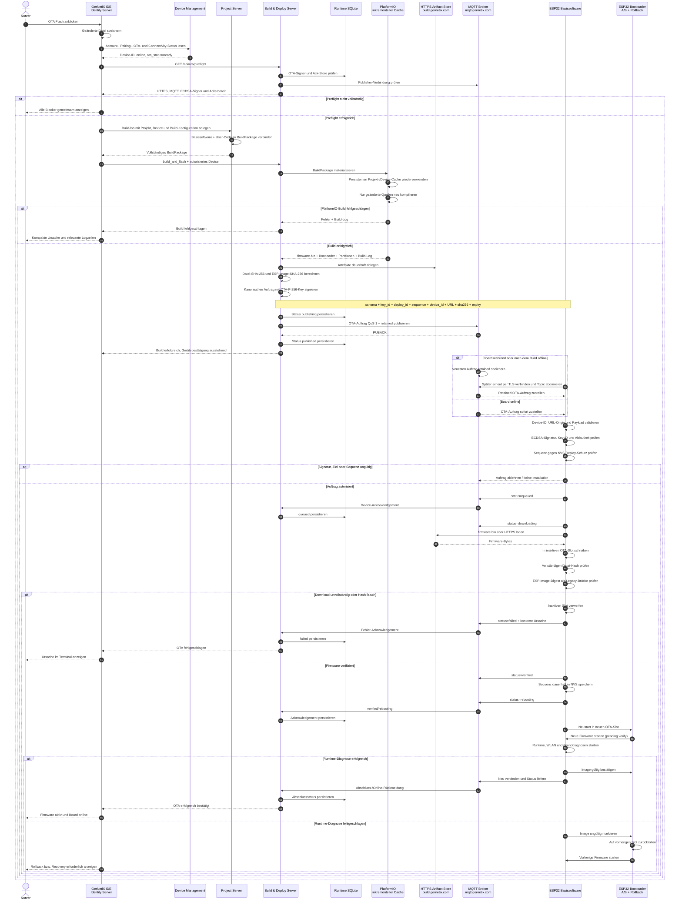

# OTA Build & Flash – vollständige Wirkkette

Dieses Sequence-Diagramm beschreibt den Weg vom Klick auf `OTA Flash` in der IDE bis zur bestätigten neuen Firmware auf dem ESP32. Es umfasst Preflight, inkrementellen Build, Signierung, Offline-Zustellung, Download, Integritätsprüfung, A/B-Aktivierung, Rückmeldung und Rollback.

In der lokalen Entwicklungsumgebung bleiben normale Builds und Web-Serial beim lokalen Build-&-Deploy-Service. `build_and_flash` wird über den separaten `OTA_BUILD_DEPLOY_BASE_URL` an die vollständig konfigurierte VPS-Instanz geroutet. Im VPS-Compose zeigen normaler Build- und OTA-Adapter beide auf den internen Build-&-Deploy-Container.

## Zuständigkeiten und Sicherheitsgrenzen

| Bereich | Verantwortlich | Persistenter Zustand |
| --- | --- | --- |
| Projekt und BuildPackage | Project Server | Runtime SQLite |
| Device-Zuordnung, Pairing und OTA-Bereitschaft | Device Management | Runtime SQLite |
| Build, Artefakte, ECDSA-Auftrag und Acknowledgements | Build & Deploy Server | Runtime SQLite, Build-/Artifact-Volume, OTA-Private-Key und inkrementeller Cache |
| Transport | Mosquitto | QoS-1-/Retain-Zustand im MQTT-Volume |
| OTA-Public-Key, Replay-Schutz und aktive Firmware | ESP32 | NVS und A/B-Partitionen |
| Erfolg für den Nutzer | IDE | Aus persistierten Server- und Device-Status abgeleitete Anzeige |

Der MQTT-Broker transportiert den Auftrag, entscheidet aber nicht über dessen Berechtigung. Das ESP32 akzeptiert ausschließlich einen zum eigenen Device passenden, nicht abgelaufenen ECDSA-P-256-signierten Auftrag mit neuer Sequenznummer und einem HTTPS-Artefakt vom provisionierten Build-Origin.
