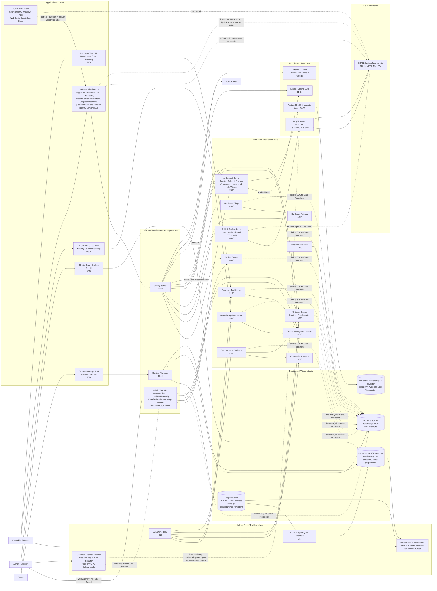

# GerNetiX Serverprozesse und Applikationen

Diese Sicht zeigt die aktuell erkennbaren lokalen Serverprozesse, Benutzer-Applikationen und Service-Abhaengigkeiten. Sie ist als UML-nahes Komponentendiagramm in Mermaid gepflegt.

Bildartefakt: [system-process-application-uml.svg](system-process-application-uml.svg)

Port-Uebersicht: [process-port-overview.svg](process-port-overview.svg)

VPS-Docker-Topologie: [vps-docker-topology.svg](vps-docker-topology.svg)

Vollständige OTA-Wirkkette: [ota-build-flash-sequence.md](ota-build-flash-sequence.md)

## Komponentendiagramm

## Serverprozesse

| Prozess | Port | Lokale URL / Zugriff | Rolle |
| --- | ---: | --- | --- |
| Identity Server | 4300 | `http://127.0.0.1:4300/app/dashboard/` | Login, Session, gemeinsame Plattform-UI, Adapter zu Domaenenservices |
| SQLite Graph Explorer | 4318 | `http://127.0.0.1:4318/` | Read-only Weboberflaeche auf den kanonischen Graphen |
| Build & Deploy Server | 4400 | `http://127.0.0.1:4400/` | Echte PlatformIO-Builds, Build-Pakete und Firmware-Artefakte; kein serverseitiger USB-Flash |
| Provisioning Tool Server | 4500 | `http://127.0.0.1:4500/` | eigenstaendige Factory-HMI, Provisioning-Sessions, USB-Factory-Flash, Device-Registrierung |
| Admin Tool API | 4600 | `http://127.0.0.1:4600/admin/` | Admin-/Support-Sichten, Account-Blatt, KI Usage, Consent-/Audit-nahe API und LLM-Routing |
| Device Management Server | 4700 | `http://127.0.0.1:4700/` | Devices, Ownership, Purchase Contexts, Support-Status |
| Project Server | 4800 | `http://127.0.0.1:4800/` | Projekte, Quellen, Build-Jobs, Learning Feedback |
| Hardware Shop | 4900 | `http://127.0.0.1:4900/` | Angebote, Warenkorb, Bestellung, Purchase Context; liest Hardwaredaten als Client des Hardware Catalog |
| Hardware Catalog | 4910 | `http://127.0.0.1:4910/` | Bekannte HardwareItems, ProcessorBoards und TechnicalCapabilities als SQLite-persistente Quelle |
| AI Usage Server | 5000 | `http://127.0.0.1:5000/` | Credits, Quellenrating je Account, Preflight, Usage Events, Cost Controls |
| Context Manager | 5050 | `http://127.0.0.1:5050/context-manager/` | Projektkontext, Vorschlaege, Context Packs |
| Recovery Tool Server | 5100 | `http://127.0.0.1:5100/` | eigenstaendige Nutzer-/Support-HMI, Recovery-Sessions, Credential-Erneuerung, Connectivity-Recovery |
| Community Platform | 5200 | `http://127.0.0.1:5200/` | Community-Fragen, Antworten, Verifikation |
| Community AI Assistant | 5300 | `http://127.0.0.1:5300/` | KI-gestuetzte Community-Antworten |
| Persistence Server | 5400 | `http://127.0.0.1:5400/` | HTTP-Zugriff auf generische SQLite-State-Dokumente |
| AI Context Server | 5500 | `http://127.0.0.1:5500/` | Kontext-Grants, Prompt-Grundlagen, Architektur-, Intent- und lokales Help-Wissen, Access Policy, Preflight und Audit fuer KI-Datenzugriff |
| MQTT Broker | 1883 / 8883 / 9001 | intern `mqtt://mqtt-broker:1883`, Device-Zugriff `mqtts://<broker>:8883` | Interne anonyme Listener bleiben im privaten Docker-Netz; externe ESP32-Devices nutzen mTLS, Zertifikats-CN, QoS 1 und geraetespezifische ACLs |
| Lokaler Ollama LLM | 11434 | `http://127.0.0.1:11434/` | lokaler LLM-Provider fuer Routen, die auf Ollama zeigen |

## Lokale Anwendungen ohne Serverprozess

| Anwendung | Einstieg | Rolle |
| --- | --- | --- |
| Architektur-Dokumentation | `tools/architecture-docs/dist/index.html` | Offline-Lesesicht auf Graphentscheidungen, gepflegte Dokumente, generierte Sichten, SVG-Diagramme und rekonstruierte Dokumentationsansaetze |

## Wichtige Abhaengigkeiten

| Quelle | Ziel | Grund |
| --- | --- | --- |
| GerNetiX Plattform UI / Identity Server | Project Server | Projekte, Quellen, agentische KI-Such-/Lesewerkzeuge statt pauschaler Dateiuebergabe, persistierte Project-Device-Allocation und Build-Jobs |
| GerNetiX Plattform UI / Identity Server | Build & Deploy Server | Build-Ausfuehrung und Ergebnisabholung |
| GerNetiX Plattform UI / Identity Server | Hardware Catalog | ProcessorBoard-Auswahl fuer Inventarisierung |
| GerNetiX Plattform UI / Identity Server | Hardware Shop | Angebote, Matching, Bestellungen |
| Hardware Shop | Hardware Catalog | Aufloesung von HardwareItem-IDs und Capabilities fuer Angebote |
| GerNetiX Plattform UI / Identity Server | Device Management Server | eigene Devices, Registrierung, Inventarauswahl fuer IDE-Allocation, OTA-Status und Purchase Context |
| GerNetiX Plattform UI / Identity Server | AI Usage Server | Credit-Anzeige, AI-Preflight, Abschluss-/Fehlerbuchung echter Chat-Aufrufe |
| GerNetiX Plattform UI / Identity Server | AI Context Server | Laedt zentrale KI-Prompt-Grundlagen und Architektur-Bausteine, sucht fuer GerNetiX Help ausschliesslich lokales Help-Wissen und prueft KI-Kontext-Preflights vor Zugriff auf Projekt-, Graph-, Device- oder Kundendaten |
| GerNetiX Plattform UI / Identity Server | Lokaler Ollama LLM | Dev-PoC fuer Architektur-Discovery, wenn Admin-Routing auf lokalen Provider zeigt |
| GerNetiX Plattform UI / Identity Server | IONOS Mail | Sendet Verifizierungs- und Passwort-Reset-E-Mails ueber SMTP/TLS; IONOS bleibt Mailserver und speichert keine GerNetiX-Anwendungsdaten |
| GerNetiX Plattform UI / Identity Server | Externe LLM API | Optionales OpenAI-kompatibles API-Routing fuer die Entwicklungsplattform |
| GerNetiX Plattform UI | ESP32 Basissoftware | Browser Web Serial fuer USB-Flash sowie lokalen WLAN-Scan und die ausschliesslich lokale Uebergabe von SSID und Passwort |
| Build & Deploy Server | MQTT Broker | Deploy-Auftraege fuer konkrete Devices veroeffentlichen und Statusmeldungen empfangen |
| ESP32 Basissoftware | MQTT Broker | Deploy-Auftraege, Heartbeats und Statusmeldungen austauschen |
| ESP32 Basissoftware | Build & Deploy Server | Firmware-Artefakte per HTTP/HTTPS laden |
| GerNetiX Prozess-Monitor | VPS-Host, Nginx und MQTT Broker | Liest feste Schutzregeln und ihren Nachweisstatus ueber den konfigurierten WireGuard-/SSH-Zugang; stellt keinen generischen Shellzugriff im Renderer bereit |
| Recovery Tool HMI | Recovery Tool Server | Nutzer-/Support-Flow zum Retten von ProcessorBoards |
| USB Serial Helper | GerNetiX Plattform UI | Native, lokal installierte Chromium-Shell fuer USB-Serial-Zugriff, insbesondere bei Safari; benoetigt keinen eigenen Serverprozess |
| Provisioning Tool HMI | Provisioning Tool Server | Factory-Provisioning per USB ohne IDE-/Plattform-Umweg |
| Admin Tool API | Device Management Server | Device-/Support-/Consent-Sichten |
| Admin Tool API | Project Server | Learning Feedback |
| Admin Tool API | AI Usage Server | Usage-Monitoring und Cost Controls |
| Admin Tool API | AI Context Server | Kontext-Grants, Prompt-Grundlagen, Policy, Audit und lokales Help-Wissen administrieren sowie priorisierte KI-Klaerfaelle bearbeiten und als Intent-Beispiele freigeben |
| Admin Tool API | GerNetiX Plattform UI / Identity Server | Pflegt verschluesselt gespeicherte SMTP-Zugangsdaten nur ueber einen token-geschuetzten internen Endpunkt; das Passwort wird nicht wieder ausgelesen |
| Provisioning Tool Server | Device Management Server | registriert verifizierte Devices |
| Provisioning Tool Server | Runtime SQLite / Firmware Artifact Repository | liest versionierte Basissoftware-Artefaktreferenz fuer Factory-Flash und speichert Provisioning-State |
| Recovery Tool Server | Device Management Server | registriert Recovery-/Community-Devices |
| Community AI Assistant | Community Platform | liest/schreibt Community-Kontext |
| Community AI Assistant | AI Usage Server | prueft und verbucht KI-Nutzung |
| Context Manager | Projektdateien, Git, SQLite Graph | erkennt Kontextvorschlaege und erzeugt Context Packs |

## Hinweise

- Der Persistence Server ist ein HTTP-Service fuer generische State-Dokumente. Mehrere Services nutzen aktuell zusaetzlich direkte SQLite-State-Persistenz ueber gemeinsame Repository-/Store-Bausteine.
- Der AI Context Server nutzt auf dem VPS eine eigene PostgreSQL-17-Datenbank mit pgvector. Kontext-Grants, Prompt-Grundlagen, Architektur-Bausteine samt Embeddings, globale Kontext-Policy und Audit-Events bleiben getrennt vom allgemeinen Runtime-State. Eine vorhandene AI-Context-SQLite wird einmalig automatisch importiert; lokal bleibt SQLite als Fallback moeglich.
- GerNetiX Help sucht vor jedem Modellaufruf ausschliesslich kuratiertes Help-Wissen im AI Context Server. Nur die passenden Artikel werden dem lokalen Ollama-Modell als Kontext gegeben; ohne Treffer antwortet Help ohne Modellaufruf. Das Admin Tool pflegt diese Agenten-Wissenseintraege getrennt von den sichtbaren Hilfeartikeln.
- Unsichere Architektur-Erweiterungen werden im AI Context Server zu deduplizierten, priorisierten Klaerfaellen zusammengefuehrt. Das Admin Tool kann sie bestaetigen, korrigieren, priorisieren, zurueckstellen oder ignorieren. Nur bestaetigte oder korrigierte Bedeutungen werden als globale oder accountisolierte Intent-Beispiele eingebettet und bei spaeteren Interpretationen gesucht; ein separates Ticketsystem ist dafuer nicht erforderlich.
- Dauerhafte Persistenz ist in GerNetiX ausschliesslich SQL (SQLite oder PostgreSQL). JSON-Dateien, YAML-Dateien, Prozessspeicher, Browser-State, Temp-Dateien, Caches und generierte Sichten sind nur Logic/Control/View, Import-/Export, Test-Hilfe oder Cache und duerfen keine fachliche Quelle der Wahrheit sein.
- Benannte Volumes sind keine Datensicherung. Fuer Accounts, Projekte, Hardware-Inventar und weitere Kundendaten gilt das [Sicherungs- und Wiederherstellungskonzept](customer-data-backup-and-recovery.md) mit deployment-unabhaengigen, verschluesselten Sicherungen und nachgewiesenen Restore-Proben. Da die Backup-Orchestrierung noch nicht als Runtime-Komponente implementiert ist, wird sie im aktuellen Prozessdiagramm noch nicht als bestehender Serverprozess dargestellt.
- Login UI, Dashboard, Lernplattform, Entwicklungsplattform, User IDE und Guided-Code-Lesson-Einstieg sind ein gemeinsames Plattform-Frontend-Artefakt am Identity Server, keine getrennten Anwendungen mit getrennten Logins. Im Projekt liegt dieses Artefakt gebuendelt unter `services/identity-server/public/app`.
- Die Entwicklungsplattform ist im PoC unter `/app/development-platform/` erreichbar und nutzt serverseitig `/api/platform/development-assistant/chat` als Proxy zum im Admin Tool konfigurierten LLM-Provider. Nach der statischen Architektur konkretisiert `/app/development-platform/hardware/` abstrakte IoT-Devices, Sensoren und Aktoren und persistiert Boards, Vorschaltungen und Pins projektgebunden ueber den Project Server. Lokal ist Ollama vorgesehen; optional kann ein OpenAI-kompatibler API-Endpunkt oder Claude/Anthropic konfiguriert werden. Prompt-Grundlagen und Architektur-Bausteine kommen fuehrend aus der AI-Context-Datenbank; die Bausteinsuche verwendet pgvector-Embeddings und einen lexikalischen Fallback. Fachliche Kontextdaten muessen per AI-Context-Grant freigegeben werden. Jeder echte Provider-Aufruf wird vorab ueber AI Usage freigegeben und danach als Erfolg oder Fehler gebucht.
- Der Code-Explorer folgt einem kontrollierten Coding-Agent-Ansatz mit OpenAI Responses Function Calling: Die IDE uebergibt beim Start nur Nutzeraufgabe und aktuellen Pfad; Folgefragen setzen dieselbe Responses-Konversation fort. Das Modell nutzt serverseitig `find_and_read_project_sources`, das Suche und Lesen fuer hoechstens drei relevante Treffer in einem Schritt verbindet. Nur dadurch gelesene Projektpfade duerfen als Aenderung vorgeschlagen werden. Eine feste Uebergabe der ersten 40, einer willkuerlichen Treffermenge oder aller Projektdateien ist nicht zulaessig; Schreibzugriffe bleiben bestaetigungspflichtig.
- Der eigenstaendige Desktop-Prozessmonitor zeigt persistierte Statistiken ausgehender Schnittstellenaufrufe. Instrumentierte Services schreiben Quelle, Ziel, Methode, Route, Status und Dauer in die gemeinsame Runtime-SQLite-Tabelle `gernetix_external_interface_calls`; der Monitor liest und aggregiert diese Daten, ohne selbst als Fachaufruf mitgezaehlt zu werden. Zusaetzlich liest er Warnungen und Fehler aus `admin_tool_system_events` sowie fehlgeschlagene Schnittstellenaufrufe und zeigt sie automatisch als Auffaelligkeiten der letzten 24 Stunden. Damit erscheint etwa ein nicht erreichbarer Hardware Catalog ohne manuellen Aufruf des Admin Tools in der Desktop-App. Produzenten sind der Identity Server einschliesslich seiner GerNetiX-Abhaengigkeiten und LLM-Provider sowie der Build-&-Deploy-Server fuer MQTT Publish, Subscribe und Receive. MQTT-Topics werden vor der Persistenz von Device-Kennungen bereinigt. Unter Windows zeigt und steuert der Monitor ausserdem ausschliesslich den fest konfigurierten WireGuard-Tunnel `gernetix-vps`. Eine eigene Schutzregelansicht vergleicht versionierte lokale Vorgaben mit festen read-only VPS-Nachweisen fuer nftables, OpenSSH, Fail2ban, Nginx, Mosquitto und Docker-Portbindungen. Jede Regel zeigt Ausfuehrungsort, Grenzwert, Status und empfohlene Massnahme; offene Backup-, Alarmierungs- und Log-Retention-Massnahmen bleiben sichtbar. Die Abfrage wird gecacht und nur bei geoeffneter Ansicht oder manueller Aktualisierung ausgefuehrt. Der Renderer erhaelt weder generischen Zugriff auf Windows-Dienste noch auf SSH oder eine Shell.
- Die fruehere allgemeine Chat-Funktion und ihr separater Proxy sind entfernt. KI-gestuetzte Architekturarbeit laeuft ueber den Architektur-Discovery-Dialog der Entwicklungsplattform.
- Die installierbare Plattform-PWA ist keine zweite Anwendung und kein eigener Serverprozess: Sie verwendet denselben Identity-/Plattform-Origin, registriert pro angemeldetem Account eine Web-Push-Subscription und empfaengt accountgebundene Meldungen. Ein Board liefert sein Ereignis nicht direkt an einen Push-Provider, sondern ueber einen mTLS-/MQTT-authentifizierten Adapter an die token-geschuetzte interne Identity-Route. Identity loest die Account-Owner im Device Management auf und sendet nur an deren PWA-Subscriptions. VPS-Sicherheitsalarme verwenden dieselbe Technik, aber ausschliesslich die explizit konfigurierte Sicherheitsalarm-Empfaengergruppe; ein globaler Broadcast ist nicht erlaubt.
- Plattform-PWA, Desktop-Prozessmonitor und private Admin Console folgen einer gemeinsamen Operator-Sprache mit den Bereichen Uebersicht, Betrieb und Sicherheit. Die gemeinsame Oberflaeche vereinheitlicht Orientierung und Bedienung, ersetzt aber keine Berechtigungsgrenze: Die PWA bleibt accountgebunden, der Desktop steuert nur lokal ueber isolierte IPC und die private Admin Console behaelt ihre serverseitig geprueften Verwaltungsrechte.
- Die Anwenderhilfe zeigt die aktiven ProcessorBoards direkt aus dem Hardware Catalog. Sie erklaert je Eintrag Fähigkeiten, Katalog-/Prüfstatus, den USB-Provisionierungsweg und optionale kuratierte Hersteller- oder Beschaffungslinks. Die Hilfe ist keine zweite Hardwarequelle; Bilder und Links werden nur verwendet, wenn sie am Katalogeintrag gepflegt und geprüft sind.
- Das eigenstaendige Admin Tool unter `http://127.0.0.1:4600/admin/` enthaelt im PoC die LLM-Konfiguration fuer Provider, Endpoint, lokales Modell, API-Modell und Verbindungstest. LLM-Routing-Konfiguration ist fachlicher Runtime-State und muss gemaess SQL-only-Persistenz in SQLite liegen; alte JSON-Dev-Konfigurationen sind nur Migrationsaltlasten.
- Administrative VPS-Zugaenge sind ausschliesslich ueber WireGuard erlaubt. Die Host-Firewall akzeptiert SSH nur am VPN-Interface; das Admin Tool bleibt am VPS-Loopback und wird per SSH-Tunnel innerhalb des VPN erreicht. Ein oeffentlicher SSH- oder Admin-Fallback ist nicht vorgesehen.
- Ein VPS-Systemd-Timer bewertet alle fuenf Minuten aggregierte Fail2ban-Sperren, fehlgeschlagene Systemd-Units und ungesunde GerNetiX-Container. Er uebergibt nur den Befund token-geschuetzt an das Loopback-Admin-Tool. Dieses persistiert die Auffaelligkeit und versendet kritische Befunde mit einem 30-Minuten-Cooldown ueber den internen Identity-/IONOS-SMTP-Kanal. Die spaetere mobile Administration bleibt WireGuard-geschuetzt; ein oeffentlicher Admin-Port wird nicht eingefuehrt.
- Das Device Management im Identity-Server-Frontend trennt drei Nutzerprozesse: `Inventar` zeigt ausschliesslich bereits mit dem Account verbundene Devices und erlaubt Unpairing; `Provisioning` beginnt ohne vorbelegten Transport mit einer exklusiven Wahl zwischen WLAN und USB. WLAN ist nur fuer bereits provisionierte, im gleichen lokalen Netzwerk erreichbare Boards zulaessig und zeigt diesen Hinweis vor der Suche; USB ist der Weg fuer neue, blanke, fremd geflashte oder nicht erreichbare Boards. Ein Wechsel verwirft Treffer und Zwischenzustand des vorherigen Wegs. Prozessorfamilie und IoT-Device werden vor der Suche nicht abgefragt. Der USB-Bootloader bestimmt nur das Prozessorprofil; danach entscheidet der Nutzer verpflichtend zwischen einem kompatiblen vorgefertigten Boardprofil aus dem Hardware Catalog und der manuellen Boardkonfiguration. Beim Katalogprofil wird gepruefte Boardausstattung zur Bestaetigung vorbelegt; im manuellen Weg wird sie anhand des Datenblatts erfasst. Erst nach dieser Entscheidung werden Board-Name und Uebernahme freigeschaltet; gespeichert wird die Ausstattung am Account-Device als Instanz-Konfiguration. Danach flasht Provisioning bei Bedarf Basissoftware, registriert die Device-Identitaet und pairt sie mit dem Account. `Recovery` rettet bereits bekannte Devices unter Erhalt vorhandener Device-ID, Credentials und Secrets, etwa bei defekter Firmware, Connectivity-Verlust oder fehlgeschlagenem Update. Die Views sind keine eigenen Backend-Services: Controller orchestrieren Hardware Catalog, Device Management, Provisioning-/Recovery-Vertraege, Firmware-Artefakte und lokale Browser-Schnittstellen wie Web Serial.
- Nach einem USB-Flash von FULL oder MEDIUM kann die Plattform das Board selbst sichtbare WLANs suchen lassen. SSID und Passwort verbleiben zwischen Browser und Board: Sie werden ausschliesslich per Web Serial uebergeben, weder an Identity Server noch an Device Management gesendet und nicht dauerhaft im Browser gespeichert. Ein gehashter, zehn Minuten gueltiger und nur einmal nutzbarer Account-Vorgang bindet den anschliessenden Abschluss; das Captive Portal bleibt als lokaler Alternativweg erhalten.
- Der erste IoT-Device-IDE-Durchstich beginnt mit einem logischen Template ohne vorweggenommene Boardrealisierung. Die vorbereitete Architektur darf ohne weitere KI-Fragen als bewusster Template-Startpunkt uebernommen werden. Erst der Hardware-Realisierungsschritt waehlt Prozessor und konkretes Board, beispielsweise einen ESP32, macht das Projekt buildfaehig und verknuepft das Board optional mit einem kompatiblen Account-Device aus dem Inventar. Die Zuordnung wird komponentenbezogen als `component_device_allocations` in der Build-Konfiguration persistiert. Das strukturierte `hardware-configuration`-Modell wird vollstaendig in `Architektur/verdrahtung/hardware.puml` projiziert: Prozessor, Board, Inventarzuordnung, Sensor- und Aktortypen, Eigenschaften, Vorschaltungen und Pins gehoeren in diese eine sichtbare Hardware-Architektur. Eine separate Verdrahtungs- oder Zuordnungsansicht ist unzulaessig. Nach der Uebernahme zeigt die IDE die Architektur als schreibgeschuetzte Baseline; sie bietet dafuer keine zweite Pflegeoberflaeche. Jede Architekturkomponente besitzt ihren eigenen Source-Bereich; fuer die logische Komponente zeigt und speichert die IDE ausschliesslich die account- und projektgebundene `Komponenten/IoT-Device 1/src/user_main.cpp`. Der Project Server erzeugt daraus mit der zum realen Board passenden, versionierten Basissoftware ein vollstaendiges BuildPackage. Build-&-Deploy fuehrt standardmaessig einen echten PlatformIO-Build aus und liefert Bootloader, Partitionstabelle und Firmware als Artefakte zurueck. Der VPS-Build-Dienst ist dafuer sowohl an das interne Backend-Netz als auch an das ausgehende Edge-Netz angebunden: interne Services und MQTT bleiben im Backend, waehrend PlatformIO fehlende, anschliessend persistent gecachte Toolchains laden kann. USB-Flash wird ausschliesslich im Browser mit `esptool-js` und Web Serial ausgefuehrt; der Server darf keinen lokalen USB-Upload starten und meldet erst das vom Browser zurueckgemeldete Ergebnis als Flash-Erfolg. OTA-Flash bleibt an Basissoftware, Partitionslayout und `ota_status=ready` gebunden. Project Server und Device Management bleiben fachliche Quellen der Wahrheit.
- Der ESP32-OTA-Firmwarepfad akzeptiert ausschliesslich zeitlich begrenzte ECDSA-P-256-signierte Deploy-Auftraege mit passender Key-ID und monotoner Sequenznummer. Das Artefakt wird per HTTPS geladen, im inaktiven A/B-Slot gegen den beauftragten SHA-256 geprueft und erst nach erfolgreicher Runtime-Initialisierung als gueltig bestaetigt.
- Jedes GerNetiX-Basissoftware-Artefakt besitzt verpflichtend eine nicht leere `basissoftwareVersion` und `basissoftwareVariant`. Diese Build-Metadaten werden im Device-Status veroeffentlicht und sind von der separat provisionierten Anwendungs-`firmwareVersion` unabhaengig. Die stabilen ESP32-Varianten heissen `full`, `medium` und `low`; der Project Server waehlt dazu passend eines der geprueften 4-, 8- oder 16-MB-Partitionslayouts.
- Provisioning speichert nach der Boardausstattung ein Update- und Speicherprofil an der Device-Instanz. `FULL` nutzt A/B-Rollback, `MEDIUM` einen vor der einzelnen grossen Hauptfirmware startenden Recovery-Bootstrap und `LOW` einen USB-only-Einzel-App-Slot. MEDIUM signalisiert beim Start ein fuenfsekundiges Recovery-Fenster per schneller LED, bleibt bei einem danach gedrueckten `BOOT`-Taster oder fehlender gueltiger Hauptfirmware im Bootstrap und startet eine vorhandene gueltige Hauptfirmware auch ohne erreichbaren Server. `BOOT` bereits waehrend Reset bleibt der ESP-ROM-/USB-Fallback. Die Oberflaeche erklaert Ausfallverhalten und typische 4/8/16-MB-Anwendungen, beruecksichtigt Display und Sound in der Empfehlung und weist darauf hin, dass SD-Karten nur Ressourcen auslagern. Ein spaeterer Profilwechsel bleibt erlaubt, setzt wegen der geaenderten Partitionstabelle aber einen einmaligen USB-Neu-Flash voraus.
- Der Project Server persistiert die Komponenteneigenschaften eines Entwicklungsprojekts. Die User IDE stellt Basissoftware-Funktionen als geschuetzte, nicht abwaehlbare Eigenschaften und Projekterweiterungen als konfigurierbare Eigenschaften dar. Der lokale Device-Webserver kann in der IDE eingebettet betrachtet werden; seine Netzwerkadresse bleibt lokaler Browserzustand und ist keine fachliche Persistenz.
- Das Provisioning Tool laesst pro ESP32 entweder den VPS-Broker (`mqtts://`, standardmaessig `mqtt.gernetix.com:8883`) oder einen lokalen privaten IPv4-Broker auswaehlen. Der ESP32 erzeugt seinen P-256-Privatschluessel selbst; das Tool zertifiziert nur den Public Key. Extern authentifiziert sich das Board per mTLS und abonniert `gernetix/devices/<device_id>/ota` mit QoS 1. MQTT transportiert nur den Deploy-Auftrag; ECDSA-Autorisierung, Ablaufzeit, Replay-Schutz, HTTPS-Download, Hash-Pruefung und Rollback bleiben im OTA-Modul. Der Gesamt-Preflight prueft HTTPS-Artefaktadresse, MQTT-Publisher, konfigurierten OTA-Signer und Device-Rueckmeldung. Der Build-&-Deploy-Server signiert kanonische Auftraege mit einem separaten OTA-Private-Key, publiziert intern mit QoS 1 und Retain und persistiert Acknowledgements. Plattform, Device Management und Broker speichern keinen privaten Device-Schluessel.
- Der Nutzer vergibt beim Onboarding einen kurzen Board-Namen. Daraus entsteht der `gernetix-*` Node-/SSID-/Hostname. Die Seriennummer wird vom System erzeugt und dauerhaft am Device/Inventory gespeichert; Spezialhardware und Verdrahtung werden als Instanz-Konfiguration am Account-Device gefuehrt.
- Das Recovery Tool ist ein eigenstaendiges Nutzer-/Support-Tool am Port 5100, mit dem ProcessorBoards per USB erkannt, repariert, neu registriert oder mit neuen Credentials versorgt werden koennen.
- TODO: Der bereits vorhandene Identity-Reiter `Device Management > Recovery` muss fuer bekannte MEDIUM-Devices eine boardspezifische Schrittfolge fuer LED-Fenster, `BOOT`-Tastendruck nach Bootstrap-Start, erneuten signierten Firmwaredownload und den ESP-ROM-/USB-Fallback bereitstellen. Die Rettung erhaelt Device-ID, Schluesselmaterial, Zertifikat und Account-Pairing.
- Der USB Serial Helper ist eine native macOS-/Windows-Anwendung ohne eigenen Serverport. Er oeffnet die bestehende Entwicklungsplattform in einer isolierten Chromium-Shell und erteilt USB-Serial ausschließlich dem konfigurierten GerNetiX-Plattform-Origin. Installationspakete werden im authentifizierten Download-Bereich der Plattform angeboten.
- Das eigenstaendige Provisioning Tool am Port 4500 bleibt die Factory-/Support-HMI. Der Nutzerbereich `Provisioning` im Plattform-Frontend bettet diese HMI nicht ein, sondern orchestriert den kundenbezogenen Ablauf Erkennen, Flashen, Registrieren und Pairen ueber die freigegebenen APIs und Browserfaehigkeiten.
- Das Provisioning Tool darf im Serverbetrieb nicht auf die Projektumgebung zugreifen. Die Basissoftware fuer Factory-Flash muss als versioniertes Firmware-Artefakt in SQLite/Artifact Store vorliegen; lokale Quellen sind nur ein expliziter Entwicklungs-Fallback.
- Die Provisioning-HMI darf keine Firmware-Dateien vom Bedienrechner hochladen. Firmware-Artefakte werden serverseitig aus SQLite/Artifact Store oder einem konfigurierten Server-Firmwarepfad bereitgestellt.
- Die lokale Dev-Infrastruktur fuer den MQTT Broker liegt unter `infra/dev/docker-compose.yml` und bleibt auf Loopback ohne TLS. Der VPS-Broker behaelt `1883` und `9001` ausschliesslich im internen Docker-Netz und veroeffentlicht fuer Devices `8883`: Server-TLS, verpflichtendes Device-Client-Zertifikat, Device-CA und `%u`-basierte ACL begrenzen jedes Device auf sein eigenes OTA-/Status-Topic.
- Der Context Manager ist kein Ersatz fuer die Graph-Dokumentation. Er liest Projektwissen, erstellt Vorschlaege und erzeugt bestaetigte Context Packs fuer Codex-Workflows.
- Das Hauptdiagramm bildet den aktuellen lokalen MVP-Zuschnitt ab. Der separate VPS-Bootstrap ergaenzt einen Reverse Proxy und Container-Netze; weitergehende produktive Infrastruktur wie Auth Gateway, Deployment-Orchestrierung oder externe LLM-/Payment-Provider ist noch nicht modelliert.
- Der VPS-Edge stellt die statischen Startseiten sprachspezifisch unter `.nl`, `.de` und `.com` bereit. HTTP dient der ACME-Validierung und leitet danach auf HTTPS um; Certbot verwaltet ein gemeinsames SAN-Zertifikat, dessen Erneuerungen der TLS-Nginx ohne Austausch persistenter Anwendungsdaten uebernimmt.
- Fuer den VPS-Bootstrap kapselt `compose.vps.yaml` die vorhandenen Node-Services, Mosquitto und Nginx in einem Compose-Projekt. Nginx bedient den HTTP-/Web-Edge; Mosquitto besitzt zusaetzlich den abgesicherten Device-Port `8883`. Identity und Domaenenservices bleiben im internen Docker-Netz. Das Admin Tool bindet ausschliesslich an den VPS-Loopback. Die konkrete Deployment-Sicht ist in [vps-docker-topology.svg](vps-docker-topology.svg) dokumentiert.
- Der HTTP-VPS-Bootstrap bleibt standardmaessig an `127.0.0.1:8080` gebunden. Mosquitto stellt `8883` nur mit mTLS und Topic-ACLs fuer zertifizierte ESP32-Devices bereit.
- Der VPS-Edge begrenzt Web-, Login- und Build-Anfragen in Nginx pro Quell-IP. Mosquitto begrenzt Verbindungen und Nachrichtenressourcen; eine versionierte nftables-Regel im Docker-Forward-Pfad verwirft uebermaessige neue MQTT-TLS-Verbindungsbursts pro IPv4-/IPv6-Quelle, ohne interne Broker-Healthchecks zu betreffen.
