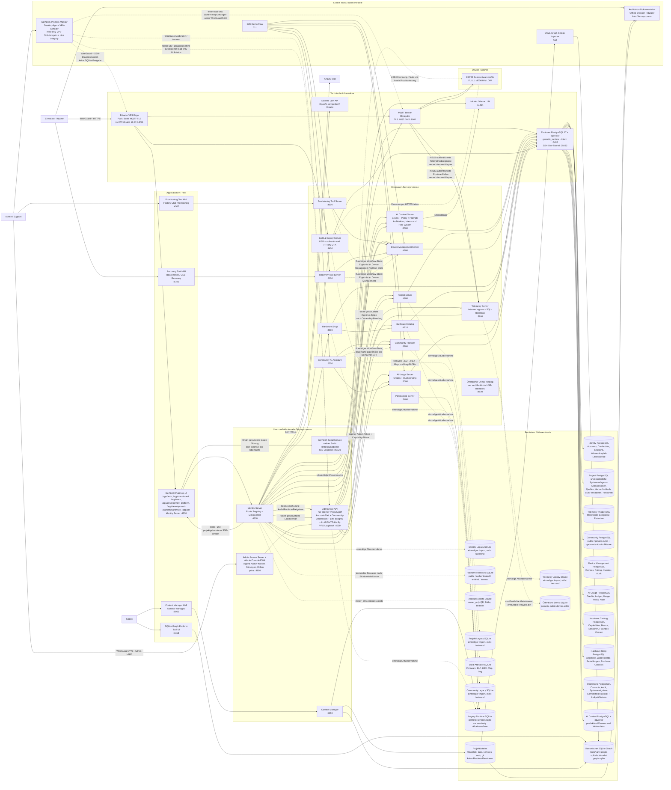

# GerNetiX Serverprozesse und Applikationen

## Zugriffsentscheidung fuer Premium-Funktionen

Der Identity Server ermittelt die Account-Entitlements fuer jede Plattform-Antwort. Die Entwicklungsplattform sperrt KI-Eingaben und nicht freigegebene Projekttemplates sichtbar. Unabhaengig davon prueft der Identity Server KI-Chat-Anfragen und die Anlage eines Templates erneut; die Client-Sperre ist damit keine alleinige Sicherheitsgrenze.

Diese Sicht zeigt die aktuell erkennbaren lokalen Serverprozesse, Benutzer-Applikationen und Service-Abhaengigkeiten. Sie ist als UML-nahes Komponentendiagramm in Mermaid gepflegt.

Bildartefakt: [system-process-application-uml.svg](system-process-application-uml.svg)

Port-Uebersicht: [process-port-overview.svg](process-port-overview.svg)

VPS-Docker-Topologie: [vps-docker-topology.svg](vps-docker-topology.svg)

Vollständige OTA-Wirkkette: [ota-build-flash-sequence.md](ota-build-flash-sequence.md)

## Komponentendiagramm

```mermaid
flowchart LR
  user["Entwickler / Nutzer"]
  admin["Admin / Support"]
  codex["Codex"]

  subgraph applications["Applikationen / HMI"]
    platformUi["GerNetiX Plattform UI<br/>/app/auth, /app/dashboard, /app/learn,<br/>/app/development-platform, /app/development-platform/hardware, /app/ide<br/>Identity Server :4300"]
    recoveryHmi["Recovery Tool HMI<br/>Board retten / USB Recovery<br/>:5100"]
    provisioningHmi["Provisioning Tool HMI<br/>Factory USB Provisioning<br/>:4500"]
    contextHmi["Context Manager HMI<br/>/context-manager/<br/>:5050"]
    sqliteExplorer["SQLite Graph Explorer<br/>Tool UI<br/>:4318"]
  end

  subgraph edgeServices["User- und Admin-nahe Serverprozesse"]
    identity["Identity Server<br/>Route Registry + Linkinventar<br/>:4300"]
    usbSerialHelper["GerNetiX Serial Service<br/>nativer Swift-Hintergrunddienst<br/>TLS-Loopback :43123"]
    adminAccess["Admin Access Server + Admin Console PWA<br/>eigene Admin-Konten, Sitzungen, Rollen<br/>privat :4610"]
    adminTool["Admin Tool API<br/>nur interner Proxyzugriff<br/>Account-Blatt + Community-Arbeitskorb + Link Integrity + LLM-/SMTP-Konfig<br/>VPS-Loopback :4600"]
    contextManager["Context Manager<br/>:5050"]
  end

  subgraph domainServices["Domaenen-Serverprozesse"]
    projectServer["Project Server<br/>:4800"]
    buildDeploy["Build & Deploy Server<br/>USB + authenticated HTTPS OTA<br/>:4400"]
    deviceManagement["Device Management Server<br/>:4700"]
    telemetryServer["Telemetry Server<br/>interner Ingress + SQL-Retention<br/>:5600"]
    provisioning["Provisioning Tool Server<br/>:4500"]
    recovery["Recovery Tool Server<br/>:5100"]
    hardwareCatalog["Hardware Catalog<br/>:4910"]
    publicDemo["Öffentlicher Demo-Katalog<br/>nur veröffentlichte USB-Releases<br/>:4920"]
    hardwareShop["Hardware Shop<br/>:4900"]
    aiUsage["AI Usage Server<br/>Credits + Quellenrating<br/>:5000"]
    aiContext["AI Context Server<br/>Grants + Policy + Prompts<br/>Architektur-, Intent- und Help-Wissen<br/>:5500"]
    communityPlatform["Community Platform<br/>:5200"]
    communityAi["Community AI Assistant<br/>:5300"]
    persistence["Persistence Server<br/>:5400"]
  end

  subgraph platformInfrastructure["Technische Infrastruktur"]
    privateVpsEdge["Privater VPS Edge<br/>PWA, Build, MQTT-TLS<br/>nur WireGuard 10.77.0.0/24"]
    mqttBroker["MQTT Broker<br/>Mosquitto<br/>TLS :8883 / WS :9001"]
    localOllama["Lokaler Ollama LLM<br/>:11434"]
    runtimePostgres["Zentrales PostgreSQL 17 + pgvector<br/>gernetix_runtime · intern :5432<br/>SSH-Dev-Tunnel :25432"]
    externalLlm["Externe LLM API<br/>OpenAI-kompatibel / Claude"]
  end

  subgraph deviceRuntime["Device Runtime"]
    esp32Basis["ESP32 Basissoftwareprofile<br/>FULL / MEDIUM / LOW"]
  end

  subgraph localTools["Lokale Tools / Build-Artefakte"]
    e2e["E2E Demo Flow<br/>CLI"]
    yamlGraph["YAML Graph SQLite Importer<br/>CLI"]
    processMonitor["GerNetiX Prozess-Monitor<br/>Desktop-App + VPN-Schalter<br/>read-only VPS-Schutzregeln + Link Integrity"]
    architectureDocs["Architektur-Dokumentation<br/>Offline Browser + Builder<br/>kein Serverprozess"]
  end

  subgraph storage["Persistenz / Wissensbasis"]
    identityDb[("Identity PostgreSQL<br/>Accounts, Credentials, Sessions,<br/>Wissenskapitel-Lesestaende")]
    identityLegacyDb[("Identity Legacy SQLite<br/>einmaliger Import, nicht fuehrend")]
    releaseDb[("Plattform-Releases SQLite<br/>public / authenticated / entitled / internal")]
    accountAssetDb[("Account-Assets SQLite<br/>owner_only QR, Bilder, Bildstile")]
    projectDb[("Project PostgreSQL<br/>unveränderliche Systemvorlagen + Accountkopien,<br/>Quellen, Herkunfts-Hash, Build-Metadaten, Fortschritt")]
    projectLegacyDb[("Projekt Legacy SQLite<br/>einmaliger Import, nicht fuehrend")]
    buildArtifactDb[("Build-Artefakte SQLite<br/>Firmware, ELF, HEX, Map, Log")]
    telemetryDb[("Telemetry PostgreSQL<br/>Messwerte, Ereignisse, Retention")]
    telemetryLegacyDb[("Telemetry Legacy SQLite<br/>einmaliger Import, nicht fuehrend")]
    communityDb[("Community PostgreSQL<br/>public / private Autor + getrennte Admin-Akteure")]
    deviceManagementDb[("Device Management PostgreSQL<br/>Devices, Pairing, Inventar, Audit")]
    aiUsageDb[("AI Usage PostgreSQL<br/>Credits, Ledger, Usage, Policy, Audit")]
    hardwareCatalogDb[("Hardware Catalog PostgreSQL<br/>Capabilities, Boards, Sensoren, Flashbox-Klassen")]
    hardwareShopDb[("Hardware Shop PostgreSQL<br/>Angebote, Warenkoerbe, Bestellungen, Purchase Contexts")]
    operationsDb[("Operations PostgreSQL<br/>Consents, Audit, Systemereignisse,<br/>Schnittstellenstatistik + Linkprüfhistorie")]
    communityLegacyDb[("Community Legacy SQLite<br/>einmaliger Import, nicht fuehrend")]
    publicDemoDb[("Öffentliche Demo SQLite<br/>gernetix-public-demos.sqlite")]
    runtimeDb[("Legacy Runtime SQLite<br/>gernetix-services.sqlite<br/>nur read-only Altuebernahme")]
    aiContextDb[("AI Context PostgreSQL + pgvector<br/>produktive Wissens- und Vektordaten")]
    graphDb[("Kanonischer SQLite Graph<br/>tools/yaml-graph-sqlite/out/model-graph.sqlite")]
    repoFiles[("Projektdateien<br/>README, data, services, tools, git<br/>keine Runtime-Persistenz")]
  end

  user -->|"WireGuard + HTTPS"| privateVpsEdge
  privateVpsEdge --> platformUi
  user --> recoveryHmi
  admin --> provisioningHmi
  admin -->|"WireGuard VPN + Admin-Login"| adminAccess
  codex --> contextHmi
  codex --> sqliteExplorer
  admin --> processMonitor
  processMonitor -. "WireGuard + SSH-Diagnosetunnel,<br/>keine SQLite-Freigabe" .-> privateVpsEdge
  user --> architectureDocs

  platformUi --> identity
  identity --> runtimePostgres
  runtimePostgres --> identityDb
  privateVpsEdge --> buildDeploy
  privateVpsEdge --> mqttBroker
  recoveryHmi --> recovery
  provisioningHmi --> provisioning
  contextHmi --> contextManager
  sqliteExplorer --> graphDb

  identity --> projectServer
  identity --> buildDeploy
    identity --> hardwareCatalog
    identity --> hardwareShop
    hardwareShop --> hardwareCatalog
  identity --> deviceManagement
  identity --> telemetryServer
  identity --> aiUsage
  identity --> aiContext
  aiContext -->|"Embeddings"| localOllama
  aiContext --> runtimePostgres
  runtimePostgres --> aiContextDb
  identity -->|"lokale Help-Wissenssuche"| aiContext
  identity --> localOllama
  identity -->|"SMTP/TLS"| ionosMail["IONOS Mail"]
  identity -->|"token-geschuetzte Auth-/Runtime-Ereignisse"| adminTool
  identity -->|"token-geschuetztes Linkinventar"| adminTool
  identity --> externalLlm
  platformUi -->|"Origin-gebundene lokale Sitzung<br/>kein Wechsel der Oberfläche"| usbSerialHelper
  usbSerialHelper -. "USB-Erkennung, Flash und lokale Provisionierung" .-> esp32Basis

  buildDeploy --> mqttBroker
  mqttBroker --> esp32Basis
  esp32Basis --> mqttBroker
  mqttBroker -->|"mTLS-authentifizierte Telemetrie/Ereignisse<br/>ueber internen Adapter"| telemetryServer
  mqttBroker -->|"mTLS-authentifizierte Runtime-Zeilen<br/>ueber internen Adapter"| telemetryServer
  telemetryServer -->|"token-geschuetzte Runtime-Zeilen<br/>nach Ownership-Pruefung"| identity
  identity -->|"konto- und projektgebundener SSE-Stream"| platformUi
  esp32Basis -. "Firmware per HTTPS laden" .-> buildDeploy

  adminAccess --> adminTool
  adminTool -->|"eigener Admin-Token + Capability-Akteur"| communityPlatform
  adminTool --> deviceManagement
  adminTool --> projectServer
  adminTool --> aiUsage
  adminTool --> aiContext

  provisioning --> deviceManagement
  recovery --> deviceManagement
  communityAi --> communityPlatform
  communityAi --> aiUsage

  contextManager --> repoFiles
  contextManager --> runtimeDb
  contextManager --> graphDb
  persistence --> runtimeDb

  identity -. "einmalige Altuebernahme" .-> identityLegacyDb
  identity -. "immutable Releases nach Sichtbarkeitsklasse" .-> releaseDb
  identity -. "owner_only Account-Assets" .-> accountAssetDb
  projectServer --> runtimePostgres
  runtimePostgres --> projectDb
  projectServer -. "einmalige Altuebernahme" .-> projectLegacyDb
  publicDemo -. "veröffentlichte Metadaten + immutable firmware.bin" .-> publicDemoDb
  buildDeploy -. "Firmware-, ELF-, HEX-, Map- und Log-BLOBs" .-> buildArtifactDb
  deviceManagement --> runtimePostgres
  runtimePostgres --> deviceManagementDb
  telemetryServer --> runtimePostgres
  runtimePostgres --> telemetryDb
  telemetryServer -. "einmalige Altuebernahme" .-> telemetryLegacyDb
  provisioning -. "fluechtiger Workflow-State;<br/>Ergebnis an Device Management / Artifact Store" .-> deviceManagement
  recovery -. "fluechtiger Workflow-State;<br/>Ergebnis an Device Management" .-> deviceManagement
  hardwareShop --> runtimePostgres
  runtimePostgres --> hardwareShopDb
  hardwareShop -. "einmalige Altuebernahme" .-> runtimeDb
  hardwareCatalog --> runtimePostgres
  runtimePostgres --> hardwareCatalogDb
  hardwareCatalog -. "einmalige Altuebernahme" .-> runtimeDb
  aiUsage --> runtimePostgres
  runtimePostgres --> aiUsageDb
  aiUsage -. "einmalige Altuebernahme" .-> runtimeDb
  communityPlatform --> runtimePostgres
  runtimePostgres --> communityDb
  communityPlatform -. "einmalige Altuebernahme" .-> communityLegacyDb
  communityAi -. "fluechtiger Workflow-State;<br/>dauerhafte Ergebnisse per Domaenen-API" .-> communityPlatform
  adminTool --> runtimePostgres
  runtimePostgres --> operationsDb
  adminTool -. "einmalige Altuebernahme" .-> runtimeDb

  e2e --> provisioning
  e2e --> recovery
  e2e --> deviceManagement
  e2e --> aiUsage
  e2e --> communityPlatform
  e2e --> communityAi

  yamlGraph --> graphDb
  repoFiles --> yamlGraph
  graphDb --> architectureDocs
  repoFiles --> architectureDocs
  processMonitor -. "WireGuard verbinden / trennen" .-> adminTool
  processMonitor -. "fester SSH-Diagnosebefehl:<br/>autorisierter read-only Linkstatus" .-> adminTool
  processMonitor -. "feste read-only Sicherheitspruefungen ueber WireGuard/SSH" .-> mqttBroker
```

## Serverprozesse

| Prozess | Port | Lokale URL / Zugriff | Rolle |
| --- | ---: | --- | --- |
| Identity Server | VPS-intern 4300 | `https://pwa.gernetix.com/app/dashboard/` | Login, Session, gemeinsame Plattform-UI, entitlement-gefilterte Wissenskapitel-Hinweise und Adapter zu Domaenenservices |
| SQLite Graph Explorer | 4318 | `http://127.0.0.1:4318/` | Read-only Weboberflaeche auf den kanonischen Graphen |
| Build & Deploy Server | 4400 | `http://127.0.0.1:4400/` | Echte PlatformIO-Builds, Build-Pakete und Firmware-Artefakte; kein serverseitiger USB-Flash |
| Provisioning Tool Server | 4500 | `http://127.0.0.1:4500/` | eigenstaendige Factory-HMI, Provisioning-Sessions, USB-Factory-Flash, Device-Registrierung |
| Admin Access Server + Admin Console | 4610 | `http://127.0.0.1:4610/admin/` | Eigene Admin-Login-PWA, persistente Sitzungen und serverseitige Rollenpruefung; proxyed danach die Admin-Funktionen |
| Admin Tool API | 4600 | nur intern durch Admin Access Server | Account-Blatt, Community-Arbeitskorb für Support/Fragen/Meldungen, KI Usage, zentrale Ressourcenlimits pro Nutzerprofil, Consent-/Audit-nahe API und LLM-Routing |
| Device Management Server | 4700 | `http://127.0.0.1:4700/` | Devices, Ownership, unveraenderliche Account-Boardversionen, Purchase Contexts, Support-Status |
| Telemetry Server | 5600 | nur intern im Docker-Netz | Nimmt bereits authentifizierte Board-Telemetrie an, prueft Board-/Projektbesitz, persistiert Messwerte und Ereignisse konto- und projektpartitioniert in `telemetry_*` mit Retention, kann gezielten Projekt-Push ausloesen und leitet kurzlebige Runtime-Zeilen an Identity weiter |
| Project Server | 4800 | `http://127.0.0.1:4800/` | Unveränderliche versionierte Systemvorlagen, daraus erzeugte Accountkopien mit Herkunfts-Hash, getrennte Software-Einheiten und Quellen, aufgeloeste Zielkonfigurations-Snapshots, Fortschritt und Build-Jobs |
| Hardware Shop | 4900 | `http://127.0.0.1:4900/` | PostgreSQL-persistente Angebote, Warenkoerbe, Bestellungen und Purchase Contexts; liest Hardwaredaten als Client des Hardware Catalog |
| Hardware Catalog | 4910 | VPS-intern sowie ausschliesslich am WireGuard-Interface `http://10.77.0.1:4910/`; kein oeffentlicher Listener | Bekannte HardwareItems, ProcessorBoards und TechnicalCapabilities als PostgreSQL-persistente Quelle |
| Öffentlicher Demo-Katalog | 4920 | nur lesbarer öffentlicher Katalog-Endpunkt | Redaktionell veröffentlichte Board-Demos und immutable `firmware.bin`-Releases in eigener SQLite; keine Projekte, Konten, Inventar oder OTA |
| AI Usage Server | 5000 | `http://127.0.0.1:5000/` | Credits, Quellenrating je Account, Preflight, Usage Events, Cost Controls |
| Context Manager | 5050 | `http://127.0.0.1:5050/context-manager/` | Projektkontext, Vorschlaege, Context Packs |
| Recovery Tool Server | 5100 | `http://127.0.0.1:5100/` | eigenstaendige Nutzer-/Support-HMI, Recovery-Sessions, Credential-Erneuerung, Connectivity-Recovery |
| Community Platform | 5200 | intern im Docker-Netz | Öffentliche Community-Anfragen, private Projektbegleitung und interne Nachrichten mit Direktunterhaltungen, Projekteinladungen und Broadcasts; Support, Fragen und Meldungen werden ausschließlich über getrennte Admin-Akteure mit eigener Capability geprüft; eigener Tabellenbereich `community_*` in `gernetix_runtime` |
| Community AI Assistant | 5300 | `http://127.0.0.1:5300/` | KI-gestuetzte Community-Antworten |
| Persistence Server | 5400 | `http://127.0.0.1:5400/` | HTTP-Zugriff auf generische SQLite-State-Dokumente |
| AI Context Server | 5500 | `http://127.0.0.1:5500/` | Kontext-Grants, Prompt-Grundlagen, Architektur-, Intent- und lokales Help-Wissen, Access Policy, Preflight und Audit fuer KI-Datenzugriff |
| MQTT Broker | 1883 / 8883 / 9001 | intern `mqtt://mqtt-broker:1883`, privater Device-Zugriff `mqtts://10.77.0.1:8883` ueber WireGuard | Interne anonyme Listener bleiben im privaten Docker-Netz; entfernte Devices benoetigen einen WireGuard-faehigen Gateway-Pfad und verwenden danach zusaetzlich mTLS, Zertifikats-CN, QoS 1 und geraetespezifische ACLs |
| Lokaler Ollama LLM | 11434 | `http://127.0.0.1:11434/` | lokaler LLM-Provider fuer Routen, die auf Ollama zeigen |

## Lokale Anwendungen ohne Serverprozess

| Anwendung | Einstieg | Rolle |
| --- | --- | --- |
| Architektur-Dokumentation | `tools/architecture-docs/dist/index.html` | Offline-Lesesicht auf Graphentscheidungen, gepflegte Dokumente, generierte Sichten, SVG-Diagramme und rekonstruierte Dokumentationsansaetze |

## Wichtige Abhaengigkeiten

| Quelle | Ziel | Grund |
| --- | --- | --- |
| GerNetiX Plattform UI / Identity Server | Project Server | Projekte, Quellen, agentische KI-Such-/Lesewerkzeuge statt pauschaler Dateiuebergabe, persistierte Project-Device-Allocation und Build-Jobs |
| GerNetiX Plattform UI / Identity Server | Project Server | Aktuelle Lesson, aktueller Step und abgeschlossene Steps eines accountgebundenen Lernprojekts laden und speichern |
| GerNetiX Plattform UI / Identity Server | Build & Deploy Server | Build-Ausfuehrung und Ergebnisabholung |
| GerNetiX Plattform UI / Identity Server | Hardware Catalog | ProcessorBoard-Auswahl fuer Inventarisierung sowie Aufloesung von Board zu freigegebenem Firmware-Build-Target beim Provisioning |
| GerNetiX Plattform UI / Identity Server | Hardware Shop | Angebote, Matching, Bestellungen |
| Hardware Shop | Hardware Catalog | Aufloesung von HardwareItem-IDs und Capabilities fuer Angebote |
| GerNetiX Plattform UI / Identity Server | Device Management Server | eigene Devices, Registrierung, Inventarauswahl fuer IDE-Allocation, OTA-Status und Purchase Context |
| GerNetiX Plattform UI / Identity Server | Device Management Server | eigene Account-Boardkonfigurationen accountisoliert auflisten und als unveraenderliche Versionen speichern |
| GerNetiX Plattform UI / Identity Server | Telemetry Server | PWA liest, konfiguriert Aufbewahrung oder loescht ausschliesslich Telemetrie des sessiongebundenen Projekts |
| GerNetiX Plattform UI / Identity Server | AI Usage Server | Credit-Anzeige, AI-Preflight, Abschluss-/Fehlerbuchung echter Chat-Aufrufe |
| Identity Server | Admin Tool | Allowlist-validierte browserseitige WebAuthn-Fehler, fehlgeschlagene serverseitige Passkey-Loginphasen und weitere auffaellige Runtime-Vorgaenge ueber einen eigenen token-geschuetzten Ingest als persistente Systemereignisse |
| Identity Server / Link-Prüf-CLI | Admin Tool | Liefert token-geschützt deduplizierte Linkziele, vollständige Fundstellen und Prüfergebnisse; authentifizierte Ziele werden mit einem technischen Testkonto geprüft, dessen Credentials nicht persistiert werden |
| GerNetiX Plattform UI / Identity Server | AI Context Server | Laedt zentrale KI-Prompt-Grundlagen und Architektur-Bausteine, sucht fuer GerNetiX Help ausschliesslich lokales Help-Wissen und prueft KI-Kontext-Preflights vor Zugriff auf Projekt-, Graph-, Device- oder Kundendaten |
| GerNetiX Plattform UI / Identity Server | Lokaler Ollama LLM | Dev-PoC fuer Architektur-Discovery, wenn Admin-Routing auf lokalen Provider zeigt |
| GerNetiX Plattform UI / Identity Server | IONOS Mail | Sendet Verifizierungs- und Passwort-Reset-E-Mails ueber SMTP/TLS; IONOS bleibt Mailserver und speichert keine GerNetiX-Anwendungsdaten |
| GerNetiX Plattform UI / Identity Server | Externe LLM API | Optionales OpenAI-kompatibles API-Routing fuer die Entwicklungsplattform |
| GerNetiX Plattform UI | GerNetiX Serial Service | TLS- und loopbackgebundene, kurzlebige Sitzung fuer Board-Erkennung, USB-Flash, seriellen Status und lokale WLAN-Provisionierung; die Plattform bleibt die einzige Bedienoberfläche |
| Identity Server auf dem VPS | GerNetiX Plattform UI im Mac-Browser | Angemeldete HTTPS-Sitzung liefert Firmware, Flash-Manifest und den authentifizierten Download des Serial-Service-Pakets; der unveraenderliche, checksum-gesicherte Release liegt in einer eigenen Plattform-Download-SQLite im persistenten VPS-Volume |
| GerNetiX Serial Service | ESP32 Basissoftware | Direkter lokaler serieller Zugriff sowie das eingebettete native `espflash`; Firmware und WLAN-Zugangsdaten werden nicht dauerhaft gespeichert |
| Build & Deploy Server | MQTT Broker | Deploy-Auftraege fuer konkrete Devices veroeffentlichen und Statusmeldungen empfangen |
| ESP32 Basissoftware | MQTT Broker | Deploy-Auftraege, Heartbeats und Statusmeldungen austauschen |
| MQTT-Telemetrieadapter | Telemetry Server | Leitet nur die durch mTLS/MQTT-ACL bereits dem Board zugeordnete Telemetrie und Ereignisse ueber den internen Token-Kontrakt weiter |
| MQTT-Runtimeadapter | Telemetry Server | Leitet kurzlebige JSON-Runtime-Zeilen vom ACL-geschuetzten Topic `gernetix/devices/<device_id>/runtime` weiter; die Device-ID stammt ausschliesslich aus dem Topic, nicht aus dem Payload |
| Telemetry Server | Device Management Server | Prueft, ob das sendende Board dem Account des Projekts gehoert |
| Telemetry Server | Project Server | Leitet den Projektbesitzer serverseitig ab |
| Telemetry Server | Identity Server | Uebergibt nur bereits persistierte, als Push markierte Board-Ereignisse mit `account_id` und `project_id`; Identity liefert nur an Subscriptions desselben Projekts |
| Telemetry Server | Identity Server | Uebergibt Runtime-Zeilen erst nach serverseitiger Ownership-Pruefung und mit internem Admin-Token; Identity liefert sie nur an offene SSE-Streams desselben Kontos und Projekts |
| ESP32 Basissoftware | Build & Deploy Server | Firmware-Artefakte per HTTP/HTTPS laden |
| GerNetiX Prozess-Monitor | VPS-Host, Nginx und MQTT Broker | Liest feste Schutzregeln und ihren Nachweisstatus ueber den konfigurierten WireGuard-/SSH-Zugang; stellt keinen generischen Shellzugriff im Renderer bereit |
| GerNetiX Prozess-Monitor | Admin Tool | Liest das zentrale Linkinventar über einen festen SSH-Diagnosebefehl und die autorisierte Admin-Tool-API. Das Admin-Token bleibt im Container; über Electron-IPC werden nur Statusfelder an den Renderer gegeben. |
| Recovery Tool HMI | Recovery Tool Server | Nutzer-/Support-Flow zum Retten von ProcessorBoards |
| Provisioning Tool HMI | Provisioning Tool Server | Factory-Provisioning per USB ohne IDE-/Plattform-Umweg |
| Admin Tool API | Device Management Server | Device-/Support-/Consent-Sichten |
| Admin Tool API | Project Server | Learning Feedback |
| Admin Tool API | AI Usage Server | Usage-Monitoring und Cost Controls |
| Admin Tool API | AI Context Server | Kontext-Grants, Prompt-Grundlagen, Policy, Audit und lokales Help-Wissen administrieren sowie priorisierte KI-Klaerfaelle bearbeiten und als Intent-Beispiele freigeben |
| Admin Tool API | GerNetiX Plattform UI / Identity Server | Pflegt verschluesselt gespeicherte SMTP-Zugangsdaten nur ueber einen token-geschuetzten internen Endpunkt; das Passwort wird nicht wieder ausgelesen |
| Provisioning Tool Server | Device Management Server | registriert verifizierte Devices |
| Provisioning Tool Server | Device Management / Firmware Artifact Repository | liest versionierte Basissoftware-Artefaktreferenz fuer Factory-Flash; Workflow-State ist fluechtig, dauerhafte Device-Ergebnisse gehen an Device Management |
| Recovery Tool Server | Device Management Server | registriert Recovery-/Community-Devices |
| Community AI Assistant | Community Platform | liest/schreibt Community-Kontext |
| Community AI Assistant | AI Usage Server | prueft und verbucht KI-Nutzung |
| Context Manager | Projektdateien, Git, SQLite Graph | erkennt Kontextvorschlaege und erzeugt Context Packs |

## Hinweise

- Die persoenliche VPS-Instanz ist remote-first: HTTPS, PWA, Build-Auslieferung
  und MQTT-TLS binden an `10.77.0.1`; die Host-Firewall akzeptiert diese Ports
  nur ueber `wg0`. Der oeffentliche HTTP-Listener dient ausschliesslich der
  ACME-Challenge und liefert fuer alle anderen Pfade 404.
- VPS-SQLite-Dateien werden nie als Netzlaufwerk fuer lokale Prozesse
  freigegeben. Der jeweilige VPS-Service bleibt alleiniger Schreiber. Lokale
  Komplettstarts sind isolierte Testinstanzen; der SSH-Tunnel transportiert nur
  HTTP-Zugriffe auf die kanonische VPS-Plattform.
- Alle dauerhaften VPS-Laufzeitdaten liegen in genau einem PostgreSQL-17/pgvector-Prozess und der Datenbank `gernetix_runtime`. Domaenen bleiben durch Tabellenpraefixe, Service-APIs und Autorisierung getrennt. Die bisherigen PostgreSQL-Volumes und SQLite-Dateien dienen nur der einmaligen read-only Altuebernahme; Fachservices mounten sie nicht mehr. Pfade, Schutzklassen und Migrationsregeln stehen im [Persistenz- und Asset-Speicherkonzept](persistence-and-asset-storage.md).
- Der AI Context Server nutzt die `ai_context_*`-Tabellen und pgvector in `gernetix_runtime`. Grants, Prompt-Grundlagen, Embeddings, Policy und Audit bleiben durch Tabellen und Service-Vertrag fachlich getrennt, aber nicht durch einen zweiten Datenbankprozess.
- Fuer haeufige Entwicklung kann nur Identity auf `127.0.0.1:4300` lokal laufen. Ein SSH-Tunnel innerhalb von WireGuard verbindet diesen Prozess mit der gemeinsamen Entwicklungsdatenbank `gernetix_runtime` und den loopback-gebundenen Domaenendiensten auf dem VPS. Keine VPS-SQLite-Datei wird freigegeben oder lokal geoeffnet; dieser Modus ist nicht fuer Produktionsdaten zugelassen.
- GerNetiX Help sucht vor jedem Modellaufruf ausschliesslich kuratiertes Help-Wissen im AI Context Server. Nur die passenden Artikel werden dem lokalen Ollama-Modell als Kontext gegeben; ohne Treffer antwortet Help ohne Modellaufruf. Das Admin Tool pflegt diese Agenten-Wissenseintraege getrennt von den sichtbaren Hilfeartikeln.
- Unsichere Architektur-Erweiterungen werden im AI Context Server zu deduplizierten, priorisierten Klaerfaellen zusammengefuehrt. Das Admin Tool kann sie bestaetigen, korrigieren, priorisieren, zurueckstellen oder ignorieren. Nur bestaetigte oder korrigierte Bedeutungen werden als globale oder accountisolierte Intent-Beispiele eingebettet und bei spaeteren Interpretationen gesucht; ein separates Ticketsystem ist dafuer nicht erforderlich.
- Dauerhafte Persistenz ist in GerNetiX ausschliesslich SQL (SQLite oder PostgreSQL). JSON-Dateien, YAML-Dateien, Prozessspeicher, Browser-State, Temp-Dateien, Caches und generierte Sichten sind nur Logic/Control/View, Import-/Export, Test-Hilfe oder Cache und duerfen keine fachliche Quelle der Wahrheit sein.
- Benannte Volumes sind keine Datensicherung. Fuer Accounts, Projekte, Hardware-Inventar und weitere Kundendaten gilt das [Sicherungs- und Wiederherstellungskonzept](customer-data-backup-and-recovery.md) mit deployment-unabhaengigen, verschluesselten Sicherungen und nachgewiesenen Restore-Proben. Da die Backup-Orchestrierung noch nicht als Runtime-Komponente implementiert ist, wird sie im aktuellen Prozessdiagramm noch nicht als bestehender Serverprozess dargestellt.
- Login UI, Dashboard, Lernplattform, Entwicklungsplattform, User IDE und Guided-Code-Lesson-Einstieg sind ein gemeinsames Plattform-Frontend-Artefakt am Identity Server, keine getrennten Anwendungen mit getrennten Logins. Im Projekt liegt dieses Artefakt gebuendelt unter `services/identity-server/public/app`.
- Der Identity Server laeuft genau einmal als kanonischer VPS-Dienst und persistiert Accounts, Credentials und Sessions ausschliesslich in `gernetix_runtime` auf PostgreSQL. Seine Runtime verlangt `IDENTITY_RUNTIME_LOCATION=server` und weist sowohl lokale Identity-Prozesse als auch `IDENTITY_PERSISTENCE_BACKEND=sqlite` ab. Lokale SQLite-Repositories bleiben auf isolierte Tests und explizite Legacy-Migrationen begrenzt.
- Das Rubriken-Quiz ist ebenfalls Teil dieses gemeinsamen Plattform-Frontends und kein eigener Serverprozess. Die erste Ausbaustufe bietet kuratierte Fragen zu Embedded, Elektrotechnik, Software und verteilten Systemen auf Deutsch, Englisch und Niederlaendisch, erklaert jede Antwort und wertet eine Runde nur fluechtig im Browser aus. Ein dauerhafter, accountgebundener Lernstand ist in dieser Stufe bewusst nicht vorgesehen; sobald er eingefuehrt wird, muss PostgreSQL statt Browser-State die Wahrheit bilden.
- Das gemeinsame Plattform-Frontend verwendet eine wiederverwendbare Browser-i18n-Schicht mit getrennten Katalogen fuer Deutsch (`de`), Englisch (`en`) und Niederlaendisch (`nl`). Die verfuegbaren Sprachen sind ueber einen sichtbaren Globus-Umschalter mit `DE · EN · NL` auf allen oeffentlichen Kopfzeilen und in der Plattform-Kopfzeile erkennbar; Laenderflaggen sind nicht die alleinige Sprachkennzeichnung. Die Sprache wird bewusst nur dort eingestellt und nicht noch einmal im Profil dupliziert. Als erster gepflegter englischer Inhaltsstand sind oeffentliche Startseite und Navigation, Login, Plattform-Hauptnavigation und Dashboard uebersetzt; weitere Fachseiten werden katalogbasiert schrittweise ergaenzt und nicht automatisch maschinell ersetzt. Vor der Anmeldung gilt die Reihenfolge expliziter `lang`-Parameter, Kontokontext, Locale-Cookie, Plattform-Domain, Browsersprache und schliesslich Deutsch; `localStorage` ist keine fachliche Quelle. Nach erfolgreicher Anmeldung ist `preferred_locale` am Identity-Konto in PostgreSQL fuehrend und kann ueber die sessiongeschuetzte Preferences-API geaendert werden. Fachliche API-Fehler behalten sprachunabhaengige, stabile Codes und werden erst im Browser uebersetzt.
- Projektzentrierte Lernangebote werden in diesem Plattform-Frontend als DevelopmentProject-Story mit wiederverwendbaren DevelopmentLessons dargestellt. `Projektstory starten` erzeugt ein durchgaengiges accountgebundenes Projekt; `Lesson einzeln starten` erzeugt ueber denselben Identity-/Project-Server-Pfad ein separates Uebungsprojekt aus dem LessonStartSnapshot. Beide Modi referenzieren dieselbe Lesson und dieselben Schritte. Es entstehen dadurch weder ein neuer Serverprozess noch eine zweite Persistenzwahrheit.
- Die Entwicklungsplattform ist im PoC unter `/app/development-platform/` erreichbar. Jedes Projekttemplate ausser der Touchscreen-Spielesammlung fuehrt nach dem Anlegen direkt in dieselbe Komponenten-Konfiguration: Das Template liefert die Startarchitektur; Nutzer fuegen dort IoT-Devices, Sensoren, Aktoren, Smartphone-Apps, Server oder weitere Komponenten hinzu. Das Komponenten- und Beziehungsmetamodell begrenzt diese Auswahl auf fachlich erlaubte, benannte Beziehungen; Sensoren und Aktoren leiten daraus zwingend ihre IoT-Steuereinheit ab. Der Wechsel zur Hardware ist erst moeglich, wenn jedes Architekturelement in mindestens einer erlaubten Beziehung vorkommt und keine unzulaessige Beziehung vorliegt. Die Architektur-KI unter `/api/platform/development-assistant/chat` bleibt als einklappbare, optionale Hilfe erreichbar und ist kein verpflichtender Zwischenschritt. Danach konkretisiert `/app/development-platform/hardware/` abstrakte IoT-Devices, Sensoren und Aktoren und persistiert Boards, Vorschaltungen und Pins projektgebunden ueber den Project Server. Lokal ist Ollama vorgesehen; optional kann ein OpenAI-kompatibler API-Endpunkt oder Claude/Anthropic konfiguriert werden. Prompt-Grundlagen und Architektur-Bausteine kommen fuehrend aus der AI-Context-Datenbank; die Bausteinsuche verwendet pgvector-Embeddings und einen lexikalischen Fallback. Fachliche Kontextdaten muessen per AI-Context-Grant freigegeben werden. Jeder echte Provider-Aufruf wird vorab ueber AI Usage freigegeben und danach als Erfolg oder Fehler gebucht.
- Lern- und Entwicklungsprojekte verwenden dasselbe allgemeine Software-Einheiten-Modell. IoT-Firmware, Browser-, Smartphone-, Desktop- und Server-Anwendungen besitzen getrennte Quellwurzeln, Buildsysteme und Zielkonfigurationen im Project Server. Architekturkomponenten ohne eigene Software, etwa Sensoren und Aktoren, werden nicht kuenstlich zu Build-Zielen. Die IDE waehlt vor Build oder Flash eine konkrete Software-Einheit; ein BuildPackage enthaelt nur deren Quellen und den bei Auftragserzeugung eingefrorenen Konfigurationsstand. PlatformIO ist der erste angeschlossene Runner. Noch nicht angeschlossene App-, Web-, Desktop- oder Server-Runner werden sichtbar als solche ausgewiesen und nicht als erfolgreicher Build simuliert.
- Der Code-Explorer folgt einem kontrollierten Coding-Agent-Ansatz mit OpenAI Responses Function Calling: Die IDE uebergibt beim Start nur Nutzeraufgabe und aktuellen Pfad; Folgefragen setzen dieselbe Responses-Konversation fort. Das Modell nutzt serverseitig `find_and_read_project_sources`, das Suche und Lesen fuer hoechstens drei relevante Treffer in einem Schritt verbindet. Nur dadurch gelesene Projektpfade duerfen als Aenderung vorgeschlagen werden. Eine feste Uebergabe der ersten 40, einer willkuerlichen Treffermenge oder aller Projektdateien ist nicht zulaessig; Schreibzugriffe bleiben bestaetigungspflichtig.
- Der eigenstaendige Desktop-Prozessmonitor zeigt persistierte Statistiken ausgehender Schnittstellenaufrufe. Im VPS-Betrieb senden instrumentierte Services Quelle, Ziel, Methode, Route, Status und Dauer token-geschuetzt an Operations-PostgreSQL; die fruehere Runtime-SQLite-Tabelle wird einmalig importiert. Ein isolierter lokaler Kompletttest darf weiterhin eine lokale SQLite verwenden. Zusaetzlich werden Warnungen, Fehler und fehlgeschlagene Schnittstellenaufrufe als Auffaelligkeiten der letzten 24 Stunden ausgewertet. Produzenten sind der Identity Server einschliesslich seiner GerNetiX-Abhaengigkeiten und LLM-Provider sowie der Build-&-Deploy-Server fuer MQTT Publish, Subscribe und Receive. MQTT-Topics werden vor der Persistenz von Device-Kennungen bereinigt. Unter Windows zeigt und steuert der Monitor ausserdem ausschliesslich den fest konfigurierten WireGuard-Tunnel `gernetix-vps`. Eine eigene Schutzregelansicht vergleicht versionierte lokale Vorgaben mit festen read-only VPS-Nachweisen fuer nftables, OpenSSH, Fail2ban, Nginx, Mosquitto und Docker-Portbindungen. Jede Regel zeigt Ausfuehrungsort, Grenzwert, Status und empfohlene Massnahme; offene Backup-, Alarmierungs- und Log-Retention-Massnahmen bleiben sichtbar. Die Abfrage wird gecacht und nur bei geoeffneter Ansicht oder manueller Aktualisierung ausgefuehrt. Der Renderer erhaelt weder generischen Zugriff auf Windows-Dienste noch auf SSH oder eine Shell.
- Die fruehere allgemeine Chat-Funktion und ihr separater Proxy sind entfernt. KI-gestuetzte Architekturarbeit laeuft ueber den Architektur-Discovery-Dialog der Entwicklungsplattform.
- Die installierbare Plattform-PWA ist keine zweite Anwendung und kein eigener Serverprozess: Sie verwendet denselben Identity-/Plattform-Origin und registriert pro angemeldetem Account und ausgewaehltem Projekt eine Web-Push-Subscription. Ein Board liefert sein Ereignis nicht direkt an einen Push-Provider, sondern ueber einen mTLS-/MQTT-authentifizierten Adapter mit serverseitig abgeleiteten `account_id` und `project_id` an die token-geschuetzte interne Identity-Route. Identity sendet ausschliesslich an PWA-Subscriptions desselben Kontos und Projekts. VPS-Sicherheitsalarme verwenden eine getrennte, explizit konfigurierte Sicherheitsalarm-Empfaengergruppe; ein globaler Broadcast ist nicht erlaubt.
- Plattform-PWA, Desktop-Prozessmonitor und private Admin Console folgen einer gemeinsamen Operator-Sprache mit den Bereichen Uebersicht, Betrieb und Sicherheit. Die gemeinsame Oberflaeche vereinheitlicht Orientierung und Bedienung, ersetzt aber keine Berechtigungsgrenze: Die PWA bleibt accountgebunden, der Desktop steuert nur lokal ueber isolierte IPC und die private Admin Console behaelt ihre serverseitig geprueften Verwaltungsrechte.
- Die Anwenderhilfe zeigt die aktiven ProcessorBoards direkt aus dem Hardware Catalog. Sie erklaert je Eintrag Fähigkeiten, Katalog-/Prüfstatus, den USB-Provisionierungsweg und optionale kuratierte Hersteller- oder Beschaffungslinks. Die Hilfe ist keine zweite Hardwarequelle; Bilder und Links werden nur verwendet, wenn sie am Katalogeintrag gepflegt und geprüft sind.
- GerNetiX nutzt zwei fachlich und auf Modulebene getrennte, technisch über eine neutrale Darstellungsschicht gerenderte Leseansichten: `/wissen/` ist das öffentliche Wissensportal für übertragbare Grundlagen und bezieht seine Topics und Artikel ausschließlich aus `knowledge-content.js`; `/hilfe/` erklärt konkrete GerNetiX-Abläufe und bezieht seine Inhalte ausschließlich aus `help-content.js`. `information-view.js` wählt genau eines der beiden Modelle aus. Artikel können über explizite Querverweise zwischen beiden Ansichten verweisen, etwa von allgemeinen Worker-Grundlagen zur projektbezogenen Worker-Konfiguration. Konto- und premiumgebundene Hilfeartikel bleiben an derselben Stelle mit Vorschau und Zugriffshinweis sichtbar. Die vollständige serverseitige Entitlement-Prüfung für Premium-Artikel bleibt vor dem produktiven Verkauf verpflichtend.
- Öffentliche Nachbauprojekte unter `/nachbauprojekte/` sind statische, frei zugängliche Identity-Webinhalte und keine accountgebundenen Lernprojekte. Sie führen physische Bauabschnitte, Teile, Sicherheitsgrenzen und geprüfte Visualisierungen zusammen, speichern aber keinen Lesson-/Step-Fortschritt. Fachliche Erklärungen bleiben im Wissensspeicher: Ein Nachbauabschnitt verlinkt über die stabile Wissenskapitel- und Abschnitts-ID zur Erklärung; der Wissensabschnitt verlinkt über einen stabilen Projektanker zurück zum konkreten Aufbau.
- Veroeffentlichungsrelevante Wissenskapitel besitzen im Identity-Code eine stabile Kapitel-ID und Inhaltsversion; neue Versionen werden dem Release-Manifest hinzugefuegt, damit frühere Veröffentlichungen in der Historie erhalten bleiben. Bei einer angemeldeten Plattformabfrage filtert Identity neue Versionen und die Historie anhand der effektiven Account-Entitlements und vergleicht sie mit `identity_knowledge_chapter_reads` in Identity-PostgreSQL. Das Dashboard fasst ungelesene Versionen in genau einer Benachrichtigung zusammen, die zur Historie mit Datum, Version und Lesestatus fuehrt. Weder dieser Klick noch das reine Oeffnen der Historie veraendert den Lesestand; erst das ausdrueckliche Oeffnen eines Kapitels markiert die aktuelle Version als gesehen. Browser-State ist keine Persistenzwahrheit und ein globaler E-Mail- oder Push-Broadcast findet nicht statt. Staging und Produktion behalten durch ihre getrennten Identity-Datenbanken unabhaengige Lesestaende.
- Das eigenstaendige Admin Tool unter `http://127.0.0.1:4600/admin/` enthaelt im PoC die LLM-Konfiguration fuer Provider, Endpoint, lokales Modell, API-Modell und Verbindungstest. Zusaetzlich zeigt der reine Lese-Reiter `Metamodell` das Projekt-Komponenten- und Beziehungsmetamodell als UML-Klassendiagramm und Regelmatrix; die Daten kommen aus derselben Regelquelle wie der Projekteditor und bleiben durch den Admin-Access-Proxy geschuetzt. LLM-Routing-Konfiguration ist fachlicher Runtime-State und muss gemaess SQL-only-Persistenz in SQLite liegen; alte JSON-Dev-Konfigurationen sind nur Migrationsaltlasten.
- Administrative VPS-Zugaenge sind ausschliesslich ueber WireGuard erlaubt. Die Host-Firewall akzeptiert SSH nur am VPN-Interface; das Admin Tool bleibt am VPS-Loopback und wird per SSH-Tunnel innerhalb des VPN erreicht. Ein oeffentlicher SSH- oder Admin-Fallback ist nicht vorgesehen.
- Ein VPS-Systemd-Timer bewertet alle fuenf Minuten aggregierte Fail2ban-Sperren, fehlgeschlagene Systemd-Units und ungesunde GerNetiX-Container. Er uebergibt nur den Befund token-geschuetzt an das Loopback-Admin-Tool. Dieses persistiert die Auffaelligkeit und versendet kritische Befunde mit einem 30-Minuten-Cooldown ueber den internen Identity-/IONOS-SMTP-Kanal. Die spaetere mobile Administration bleibt WireGuard-geschuetzt; ein oeffentlicher Admin-Port wird nicht eingefuehrt.
- Das Device Management im Identity-Server-Frontend trennt drei Nutzerprozesse: `Inventar` zeigt ausschliesslich bereits mit dem Account verbundene Devices und erlaubt Unpairing; `Provisioning` beginnt ohne vorbelegten Transport mit einer exklusiven Wahl zwischen WLAN und USB. WLAN ist nur fuer bereits provisionierte, im gleichen lokalen Netzwerk erreichbare Boards zulaessig und zeigt diesen Hinweis vor der Suche; USB ist der Weg fuer neue, blanke, fremd geflashte oder nicht erreichbare Boards. Ein Wechsel verwirft Treffer und Zwischenzustand des vorherigen Wegs. Prozessorfamilie und IoT-Device werden vor der Suche nicht abgefragt. Der USB-Bootloader bestimmt nur das Prozessorprofil; danach waehlt der Nutzer ein kompatibles GerNetiX-Systemboard oder ein eigenes Account-Board. Eine manuell erfasste Boardausstattung muss dazu zuerst als eigenes Account-Board gespeichert werden; Projektkonfigurationen sind im Provisioning nicht verfuegbar. Beim GerNetiX-Systemboard wird gepruefte Boardausstattung zur Bestaetigung vorbelegt; beim Account-Board wird dessen versionierte Ausstattung uebernommen. Erst nach dieser Entscheidung werden Board-Name und Uebernahme freigeschaltet; gespeichert wird die Ausstattung am Account-Device als Instanz-Konfiguration. Danach flasht Provisioning bei Bedarf Basissoftware, registriert die Device-Identitaet und pairt sie mit dem Account. `Recovery` rettet bereits bekannte Devices unter Erhalt vorhandener Device-ID, Credentials und Secrets, etwa bei defekter Firmware, Connectivity-Verlust oder fehlgeschlagenem Update. Die Views sind keine eigenen Backend-Services: Controller orchestrieren Hardware Catalog, Device Management, Provisioning-/Recovery-Vertraege, Firmware-Artefakte und den lokalen GerNetiX Serial Service.
- Die Boardquellen sind kontextgebunden: Provisioning und Lernprojekte bieten ausschliesslich GerNetiX-Systemboards und eigene Account-Boards an. Freie Entwicklungsprojekte duerfen zusaetzlich die nur innerhalb des aktuellen Projekts gueltige Projektkonfiguration verwenden. Jedes Lern- und Entwicklungsprojekt friert die aufgeloeste Auswahl als eigenen Projektsnapshot ein; dieser Snapshot wird dadurch nicht zu einer in anderen Bereichen wiederverwendbaren Boardquelle.
- Nach einem USB-Flash von FULL oder MEDIUM kann die Plattform das Board selbst sichtbare WLANs suchen lassen. SSID und Passwort verbleiben zwischen Plattform, lokalem Serial Service und Board: Sie werden niemals an Identity Server oder Device Management gesendet und weder im Browser noch im Serial Service dauerhaft gespeichert. Ein gehashter, zehn Minuten gueltiger und nur einmal nutzbarer Account-Vorgang bindet den anschliessenden Abschluss; das Captive Portal bleibt als lokaler Alternativweg erhalten.
- Der erste IoT-Device-IDE-Durchstich beginnt mit einem logischen Template ohne vorweggenommene Boardrealisierung. Die vorbereitete Architektur darf ohne weitere KI-Fragen als bewusster Template-Startpunkt uebernommen werden. Erst der Hardware-Realisierungsschritt waehlt Prozessor und konkretes Board, beispielsweise einen ESP32, macht das Projekt buildfaehig und verknuepft das Board optional mit einem kompatiblen Account-Device aus dem Inventar. Jede IoT-Device-Komponente zeigt unabhaengig von diesem Zustand den festen IDE-Einstieg `Konfiguration/Uebersicht`: `Hardware` umfasst `Boardkonfiguration` und `Angeschlossene Komponenten`, `Software` umfasst `Funktionen`, `Treiberverwaltung`, `Webserver-Konfiguration` und `Webserver-Vorschau`. Die Uebersicht verlinkt bestehende Fachansichten und ist keine zweite Pflegeoberflaeche. Die wiederverwendbare `BoardConfigurationPlugin`-Komponente stellt Boardauswahl, Ausstattung, Pinbearbeitung und die daraus abgeleitete Compiler-Vorschau sowohl im Provisioning als auch direkt in der IDE bereit; ein fehlendes Projektboard erzeugt keinen Umweg mehr in eine andere Ansicht. Ein unveraenderter GerNetiX- oder Account-Boardstand kann unmittelbar als Projektsnapshot uebernommen werden. Geaenderte Werte werden hervorgehoben und duerfen erst nach Vergabe eines eigenen Boardnamens als unveraenderliche Account-Boardversion in Device Management gespeichert werden; der Project Server uebernimmt zugleich einen festen, vollstaendig aufgeloesten Snapshot in `build_config.board_configuration`. Eine spaetere Account-Boardversion veraendert bestehende Projekte dadurch nicht. Das globale Katalogprofil bleibt unveraendert; sein `base_board_profile_id` bildet den physischen Build- und Inventartyp. Der Hardware Catalog liefert fuer jedes buildfaehige Board zusaetzlich ein strukturiertes `platformio_build`-Profil. Der Project Server erzeugt daraus bei jeder gespeicherten Board-/Buildaenderung die sichtbare `platformio.ini` und verwendet fuer das BuildPackage dieselbe zentrale Projektion; Platform, Environment, Compiler-Board, Framework, Speichergrenzen, Partitionierung, Bibliotheken, Uploadparameter und Build-Flags koennen dadurch nicht von der grafischen Projektkonfiguration abweichen. Dieser Vertrag gilt fuer ESP32, ESP8266, AVR und kuenftige Katalogziele. Die Zuordnung wird komponentenbezogen als `component_device_allocations` in der Build-Konfiguration persistiert. Das strukturierte `hardware-configuration`-Modell wird vollstaendig in `Architektur/verdrahtung/hardware.puml` projiziert: Prozessor, Board, Inventarzuordnung, Sensor- und Aktortypen, Eigenschaften, Vorschaltungen und Pins gehoeren in diese eine sichtbare Hardware-Architektur. Eine separate Verdrahtungs- oder Zuordnungsansicht ist unzulaessig. Nach der Uebernahme zeigt die IDE die Architektur als schreibgeschuetzte Baseline; sie bietet dafuer keine zweite Pflegeoberflaeche. Jede Architekturkomponente besitzt ihren eigenen Source-Bereich; fuer die logische Komponente zeigt und speichert die IDE ausschliesslich die account- und projektgebundene `Komponenten/IoT-Device 1/src/user_main.cpp`. Der Project Server erzeugt daraus mit der zum realen Board passenden, versionierten Basissoftware ein vollstaendiges BuildPackage. Es generiert aus dem Board-Snapshot `include/gernetix_board_configuration.h` und erzwingt dessen Einbindung in jede Compilereinheit; Quelle, Version, Komponenten, Treiber, Anschluesse, Werte und Pins sind damit reproduzierbare Compilerparameter. Build-&-Deploy fuehrt standardmaessig einen echten PlatformIO-Build aus und liefert Bootloader, Partitionstabelle und Firmware als Artefakte zurueck. Der VPS-Build-Dienst ist dafuer sowohl an das interne Backend-Netz als auch an das ausgehende Edge-Netz angebunden: interne Services und MQTT bleiben im Backend, waehrend PlatformIO fehlende, anschliessend persistent gecachte Toolchains laden kann. USB-Flash wird durch die bestehende Plattformoberfläche über den lokal installierten GerNetiX Serial Service ausgeführt; der VPS-Server besitzt keinen Zugriff auf den USB-Port und meldet erst das lokal zurückgemeldete Ergebnis als Erfolg. OTA-Flash bleibt an Basissoftware, Partitionslayout und `ota_status=ready` gebunden. Project Server und Device Management bleiben fachliche Quellen der Wahrheit.
- Board- und Treiberkonfiguration sind getrennte IDE-Sichten mit gerichteter Abhaengigkeit: Die Boardkonfiguration beschreibt nur vorhandene MCU- und Runtime-Ressourcen. Die speziellere Treiberkonfiguration waehlt Motor- oder Geraetetreiber und belegt ausschliesslich Pins aus dem festen Board-Projektsnapshot. Beide Sichten persistieren in demselben `hardware-configuration`-Projektmodell; die Treiberansicht kopiert oder veraendert das Boardprofil nicht.
- Der ESP32-OTA-Firmwarepfad akzeptiert ausschliesslich zeitlich begrenzte ECDSA-P-256-signierte Deploy-Auftraege mit passender Key-ID und monotoner Sequenznummer. Das Artefakt wird per HTTPS geladen, im inaktiven A/B-Slot gegen den beauftragten SHA-256 geprueft und erst nach erfolgreicher Runtime-Initialisierung als gueltig bestaetigt.
- Jedes GerNetiX-Basissoftware-Artefakt besitzt verpflichtend eine nicht leere `basissoftwareVersion` und `basissoftwareVariant`. Diese Build-Metadaten werden im Device-Status veroeffentlicht und sind von der separat provisionierten Anwendungs-`firmwareVersion` unabhaengig. Die stabilen ESP32-Varianten heissen `full`, `medium` und `low`; der Project Server waehlt dazu passend eines der geprueften 4-, 8- oder 16-MB-Partitionslayouts.
- Die ESP32-Basissoftware bleibt ein stabiler, eigenstaendiger Runtime-Kern. Projekt- und kundenspezifische Erweiterungen duerfen weder Basissoftware-Schnittstellen noch Provisioning-, WLAN-/SSID-Setup- oder Sicherheitsablaeufe veraendern und keinen Projekt-Webserver in das Basissoftware-Setup-Portal einbringen. Erweiterungen sind ausschliesslich ueber klar abgegrenzte Schnittstellen anzubinden.
- Provisioning speichert nach der Boardausstattung ein Update- und Speicherprofil an der Device-Instanz. `FULL` nutzt A/B-Rollback, `MEDIUM` einen vor der einzelnen grossen Hauptfirmware startenden Recovery-Bootstrap und `LOW` einen USB-only-Einzel-App-Slot. MEDIUM signalisiert beim Start ein fuenfsekundiges Recovery-Fenster per schneller LED, bleibt bei einem danach gedrueckten `BOOT`-Taster oder fehlender gueltiger Hauptfirmware im Bootstrap und startet eine vorhandene gueltige Hauptfirmware auch ohne erreichbaren Server. `BOOT` bereits waehrend Reset bleibt der ESP-ROM-/USB-Fallback. Die Oberflaeche erklaert Ausfallverhalten und typische 4/8/16-MB-Anwendungen, beruecksichtigt Display und Sound in der Empfehlung und weist darauf hin, dass SD-Karten nur Ressourcen auslagern. Ein spaeterer Profilwechsel bleibt erlaubt, setzt wegen der geaenderten Partitionstabelle aber einen einmaligen USB-Neu-Flash voraus.
- Der Project Server persistiert die Komponenteneigenschaften eines Entwicklungsprojekts. Die User IDE stellt Basissoftware-Funktionen als geschuetzte, nicht abwaehlbare Eigenschaften und Projekterweiterungen als konfigurierbare Eigenschaften dar. Der lokale Device-Webserver kann in der IDE eingebettet betrachtet werden; seine Netzwerkadresse bleibt lokaler Browserzustand und ist keine fachliche Persistenz.
- Git Light ist eine Premium-Funktion der gemeinsamen User IDE und gilt fuer alle accountgebundenen Entwicklungsprojekte. Der Project Server speichert unveraenderliche Projektversionen mit Elternbezug und Inhalts-Hash in PostgreSQL. Eine Version ohne Binary entsteht direkt; eine Version mit Binary erst nach einem frischen erfolgreichen Build und referenziert exakt dessen beim BuildPackage eingefrorenen Projektstand sowie dessen Artefakte. Vor dem Wiederherstellen wird ein vom letzten Commit abweichender aktueller Inhalt automatisch als Sicherheitsversion gespeichert; danach schreibt der Service den gewaehlten Inhalt in das aktuelle Projekt und erzeugt einen neuen Restore-Eintrag, ohne eine bestehende Version zu veraendern. Ctrl+Z bleibt davon getrennt und wirkt nur auf die laufende Editor-Sitzung.
- Das Provisioning Tool laesst pro ESP32 entweder den VPS-Broker (`mqtts://`, standardmaessig `mqtt.gernetix.com:8883`) oder einen lokalen privaten IPv4-Broker auswaehlen. Der ESP32 erzeugt seinen P-256-Privatschluessel selbst; das Tool zertifiziert nur den Public Key. Extern authentifiziert sich das Board per mTLS und abonniert `gernetix/devices/<device_id>/ota` mit QoS 1. MQTT transportiert nur den Deploy-Auftrag; ECDSA-Autorisierung, Ablaufzeit, Replay-Schutz, HTTPS-Download, Hash-Pruefung und Rollback bleiben im OTA-Modul. Der Gesamt-Preflight prueft HTTPS-Artefaktadresse, MQTT-Publisher, konfigurierten OTA-Signer und Device-Rueckmeldung. Der Build-&-Deploy-Server signiert kanonische Auftraege mit einem separaten OTA-Private-Key, publiziert intern mit QoS 1 und Retain und persistiert Acknowledgements. Plattform, Device Management und Broker speichern keinen privaten Device-Schluessel.
- Der Nutzer vergibt beim Onboarding einen kurzen Board-Namen. Daraus entsteht der `gernetix-*` Node-/SSID-/Hostname. Die Seriennummer wird vom System erzeugt und dauerhaft am Device/Inventory gespeichert; Spezialhardware und Verdrahtung werden als Instanz-Konfiguration am Account-Device gefuehrt.
- Das Recovery Tool ist ein eigenstaendiges Nutzer-/Support-Tool am Port 5100, mit dem ProcessorBoards per USB erkannt, repariert, neu registriert oder mit neuen Credentials versorgt werden koennen.
- Die Flashbox ist ein kaufbares oder selbst herstellbares, inventarisierbares GerNetiX-Werkzeuggeraet und kein frei erfassbares Zielboard. Der Selbstbau-Assistent akzeptiert ausschliesslich das aktive Referenzprofil: ESP32-S3 mit mindestens 16 MB Flash und 8 MB PSRAM, getrennten datenfaehigen Control-/Target-USB-Ports, USB-OTG-Host sowie nachgewiesener 5-V-VBUS-Schaltung mit Power-Switch und Strombegrenzung. Der oeffentliche Assistent darf ohne Login nur ein signiertes, accountneutrales Initialimage flashen; er erzeugt keine Accountdaten. Im internen Bereich beginnt die Selbstbau-Fuehrung mit „bereits geflasht“ oder „neue Flashbox erstellen“; der zweite Weg oeffnet dieselbe oeffentliche Assistenten-Komponente als Dialog und ordnet nach Discovery plus Challenge-Signatur die Einheit ausschliesslich dem aktuell angemeldeten Account zu. Hardware Catalog beschreibt die Klasse `flashbox` und dieses Profil, Webshop erzeugt den Kauf-/Claim-Kontext, Provisioning Tool fuehrt alternativ die Selbstbau-Zertifizierung mit Device-Key und Challenge-Signatur aus, Identity ordnet die konkrete Einheit dem Account-Inventar zu, Device Management fuehrt Herkunft, Ownership, Trust-State, Firmwarestatus und Revocation, Build-&-Deploy liefert getrennte signierte Manifeste fuer Flashbox-Selbstupdate, Zielgeraete-Flash und Recovery. Beliebige ESP32-Boards bleiben Community-Hardware. Die Detailregeln stehen in [GerNetiX Flashbox - Systemzusammenspiel](flashbox-system-integration.md).
- TODO: Der bereits vorhandene Identity-Reiter `Device Management > Recovery` muss fuer bekannte MEDIUM-Devices eine boardspezifische Schrittfolge fuer LED-Fenster, `BOOT`-Tastendruck nach Bootstrap-Start, erneuten signierten Firmwaredownload und den ESP-ROM-/USB-Fallback bereitstellen. Die Rettung erhaelt Device-ID, Schluesselmaterial, Zertifikat und Account-Pairing.
- Der GerNetiX Serial Service ist ein UI-loser, lokal installierter nativer Swift-Hintergrunddienst ohne Electron, Chromium oder Node.js im Kundenpaket. Auf macOS läuft er als benutzerbezogener `launchd`-Agent, greift direkt über die serielle macOS-Schnittstelle auf USB zu und verwendet für ESP32-Erkennung und Flash das eingebettete native `espflash`. Er bindet ausschließlich per TLS an `127.0.0.1:43123`; das Installationspaket erzeugt dafür ein installationsspezifisches, nur für Loopback gültiges Zertifikat. Der Dienst akzeptiert nur explizite GerNetiX-Origins und verlangt für USB-Aktionen eine kurzlebige, Origin-gebundene Sitzung. Die Plattform bleibt die einzige Bedienoberfläche; es gibt kein Helper-Fenster und keinen Browserwechsel. Das signierte und notarisierte Installationspaket wird im authentifizierten Download-Bereich angeboten.
- Im regulaeren Produktbetrieb laeuft Identity auf dem VPS, der Serial Service dagegen immer auf dem Mac des Nutzers. Das Frontend wird per HTTPS vom VPS geladen und verbindet sich danach direkt per TLS mit `localhost`; die USB-Kommunikation wird nicht durch den VPS getunnelt. Firmwarebytes laufen vom authentifizierten VPS-Endpunkt in den Browser und von dort in den lokalen Dienst. WLAN-Zugangsdaten werden nicht an Identity gesendet. Das macOS-Paket wird auf einem Mac signiert und notarisiert und anschließend als unveraenderlicher Release in einer eigenen Plattform-Download-SQLite im persistenten VPS-Volume veroeffentlicht. Der vorhandene angemeldete Downloadbereich und die IDE-Hinweise liefern es ohne externe Downloadplattform aus.
- Das eigenstaendige Provisioning Tool am Port 4500 bleibt die Factory-/Support-HMI. Der Nutzerbereich `Provisioning` im Plattform-Frontend bettet diese HMI nicht ein, sondern orchestriert den kundenbezogenen Ablauf Erkennen, Flashen, Registrieren und Pairen ueber die freigegebenen APIs und Browserfaehigkeiten.
- Das Provisioning Tool darf im Serverbetrieb nicht auf die Projektumgebung zugreifen. Die Basissoftware fuer Factory-Flash muss als versioniertes Firmware-Artefakt in SQLite/Artifact Store vorliegen; lokale Quellen sind nur ein expliziter Entwicklungs-Fallback.
- Die Provisioning-HMI darf keine Firmware-Dateien vom Bedienrechner hochladen. Firmware-Artefakte werden serverseitig aus SQLite/Artifact Store oder einem konfigurierten Server-Firmwarepfad bereitgestellt.
- Die lokale Dev-Infrastruktur fuer den MQTT Broker liegt unter `infra/dev/docker-compose.yml` und bleibt auf Loopback ohne TLS. Der VPS-Broker behaelt `1883` und `9001` ausschliesslich im internen Docker-Netz und bindet den Device-Port `8883` nur an die WireGuard-Adresse. Server-TLS, verpflichtendes Device-Client-Zertifikat, Device-CA und `%u`-basierte ACL begrenzen jedes Device auf sein eigenes OTA-/Status-Topic. Ein ESP32 ohne eigenen WireGuard-Client erreicht die private Instanz nur ueber einen kontrollierten WireGuard-faehigen Gateway oder eine spaeter getrennt entworfene Device-Edge.
- Der Context Manager ist kein Ersatz fuer die Graph-Dokumentation. Er liest Projektwissen, erstellt Vorschlaege und erzeugt bestaetigte Context Packs fuer Codex-Workflows.
- Community und Projektbegleitung laufen ausschliesslich über die angemeldete Plattform. Der Nutzer wählt beim Erstellen zwischen `public` (für weitere angemeldete Mitglieder sichtbar) und `private` (nur anfragendes Konto plus konfigurierte GerNetiX-Operatoren). Der Community-Service ist nicht am Edge veröffentlicht, akzeptiert nur den token-geschützten Identity-Proxy und persistiert seine Inhalte getrennt in PostgreSQL. Private Threads werden weder in öffentlichen Listen noch in der Wissensbasis oder KI-Suche verwendet.
- Die interne Nachrichtenplattform liegt ebenfalls in der Community Platform. Identity löst beim Beginn einer Direktunterhaltung nur einen exakt eingegebenen registrierten Nicknamen auf; eine öffentliche Kontosuche entsteht dadurch nicht. Community persistiert Unterhaltung, Teilnehmer, einzelne Nachrichten, empfängerbezogene Inbox-Einträge und Lesestände in `community_*`. Zugriff auf einen Thread setzt eine aktive Teilnahme voraus. Operator-Broadcasts bleiben operatorgebunden; Projekteinladungen sind strukturierte Inbox-Einträge und keine E-Mails.
- Der öffentliche Support-Einstieg führt nach der Anmeldung nicht mehr in eine beliebige öffentliche Community-Anfrage, sondern eröffnet einen privaten System-Thread im internen Support-Postfach. Empfänger sind die explizit konfigurierten Supportkonten oder ersatzweise die Community-Operator-Konten. Supportantworten bleiben im selben teilnehmergeschützten Thread; E-Mail-Adressen werden dafür nicht benötigt.
- Die angemeldete Plattform stellt Nachrichten unter `/app/messages/` als dreigeteilte Inbox bereit: Ordnernavigation, serverseitige Threadliste und Lesebereich. Posteingang, Gesendet, Support und persönliches Archiv werden aus den Community-Verträgen abgeleitet. Der Postausgang bleibt leer, solange Nachrichten synchron zugestellt werden; Entwürfe werden erst mit eigener SQL-Persistenz angeboten.
- Öffentliche Projektbeispiele werden als Herkunfts- und Vertrauensinformation getrennt von der persönlichen Projektkopie behandelt. Eine Übernahme erzeugt immer ein neues, konto- und projektgebundenes Projekt im Project Server. `verified` ist ausschließlich eine explizite GerNetiX-Freigabe; nicht verifizierte Community-Projekte dürfen sichtbar und kopierbar sein, aber niemals als vertrauenswürdige oder empfohlene Vorlage erscheinen. Build und Flash setzen weiterhin die bewusste Auswahl eines kompatiblen eigenen Boards und einen bestehenden autorisierten Build-/Flash-Ablauf voraus.
- Nach erfolgreicher Speicherung einer privaten Anfrage meldet Identity dem Betreiber den Eingang über eine konfigurierte E-Mail-Adresse, Web-Push an die konfigurierten Operator-Konten und ein persistentes Systemereignis im Admin Tool. Jede dieser Benachrichtigungen ist absichtlich generisch und enthält weder Anfrage-, Account- noch Projektinhalt; die Details bleiben ausschliesslich in der autorisierten Community-Ansicht.
- Das Web-Admin-Tool prüft die Community Platform über Healthcheck und einen internen token-geschützten Betriebsendpunkt. Die Desktop-App ergänzt lokal den read-only SQLite-Dateistatus. Beide Operator-Sichten zeigen nur aggregierte Zähler und Speichertechnik, niemals Titel, Texte, Account- oder Projektkennungen.
- **Regel: Öffentliche Community und persönliche Begleitung bleiben getrennt.** Öffentlich freigegebene Community-Fragen dürfen als lesbare, sprechende Seiten ohne Anmeldung am Edge bereitgestellt und für Suchmaschinen indexiert werden. Private Anfragen, Antworten, Account-, Projekt- und Metadaten erhalten nie eine öffentliche URL, sind stets `noindex` und dürfen weder in Sitemaps, Suchergebnissen, Vorschauen, Wissensbasis noch KI-Kontext übernommen werden. Die Veröffentlichung erfolgt nur durch eine explizite öffentliche Sichtbarkeitsentscheidung; ein späterer Wechsel nach privat entfernt die öffentliche Seite und ihre Indexierungsfreigabe.
- Das Hauptdiagramm bildet den aktuellen lokalen MVP-Zuschnitt ab. Der separate VPS-Bootstrap ergaenzt einen Reverse Proxy und Container-Netze; weitergehende produktive Infrastruktur wie Auth Gateway, Deployment-Orchestrierung oder externe LLM-/Payment-Provider ist noch nicht modelliert.
- Der private VPS-Edge stellt die statischen Startseiten sprachspezifisch unter
  `.nl`, `.de` und `.com` nur im WireGuard-Netz bereit. Oeffentliches HTTP dient
  ausschliesslich der ACME-Validierung und gibt sonst 404 zurueck; Certbot
  verwaltet die SAN-Zertifikate, deren Erneuerungen der TLS-Nginx ohne
  Austausch persistenter Anwendungsdaten uebernimmt.
- Fuer den VPS-Bootstrap kapselt `compose.vps.yaml` die vorhandenen Node-Services, Mosquitto und Nginx in einem Compose-Projekt. Nginx trennt den oeffentlichen ACME-HTTP-Listener vom privaten WireGuard-Web-Edge; Mosquitto besitzt zusaetzlich den an WireGuard gebundenen Device-Port `8883`. Identity und Domaenenservices bleiben im internen Docker-Netz. Das Admin Tool bindet ausschliesslich an den VPS-Loopback. Die konkrete Deployment-Sicht ist in [vps-docker-topology.svg](vps-docker-topology.svg) dokumentiert.
- Der diagnostische Plattform-Proxy bindet standardmaessig an `127.0.0.1:8080`, der oeffentliche Port `80` beantwortet nur ACME-Challenges und der private HTTPS-Edge bindet an `10.77.0.1:443`. Mosquitto stellt `10.77.0.1:8883` nur ueber WireGuard und zusaetzlich mit mTLS sowie Topic-ACLs bereit.
- Der VPS-Edge begrenzt Web-, Login- und Build-Anfragen in Nginx pro Quell-IP. Mosquitto begrenzt Verbindungen und Nachrichtenressourcen; eine versionierte nftables-Regel im Docker-Forward-Pfad verwirft uebermaessige neue MQTT-TLS-Verbindungsbursts pro IPv4-/IPv6-Quelle, ohne interne Broker-Healthchecks zu betreffen.
