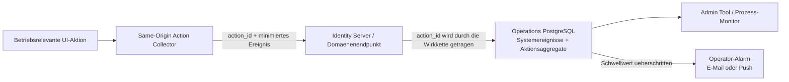

# Operations-Konzept fuer fehlgeschlagene Nutzeraktionen

## Umsetzungsstand

Der verbindliche, laufend gepflegte Ist-Stand steht in
[GerNetiX Operations](operations.md). Seit 2026-08-07 sind Collector,
Same-Origin-Ingest, Operations-Persistenz, Admin-Sicht und read-only
Prozessmonitor lokal implementiert und automatisiert getestet. Die vier
initialen Wirkketten `nexi.flash.usb.start`, `identity.login.passkey`,
`project.settings.save` und `project.build.start` sind durchgaengig
instrumentiert. Die Admin-Sicht kann eine vollstaendige Action-ID suchen und
zeigt deren minimierte Ereignisse chronologisch mit Span-, Phasen-, Release-,
Route- und Reason-Code-Kontext. Alarmierung, Retention-Abnahme, vollstaendige
Schaltflaechen-Inventur und synthetische Kernablaeufe bleiben offen.

Diese Trennung ist absichtlich: Das folgende Dokument beschreibt den
vollstaendigen Zielvertrag; die Statusmatrix behauptet nur nachgewiesene
Umsetzung.

## Ziel

GerNetiX soll erkennen, wenn ein Nutzer eine sichtbare Aktion ausloest, diese
aber nicht erfolgreich abgeschlossen wird. Das gilt insbesondere fuer
Schaltflaechen wie `Flashen`, `Anmelden`, `Speichern`, `Verbinden`, `Bauen`,
`Installieren` oder `Erneut pruefen`.

Der Betreiber soll zeitnah beantworten koennen:

- Welche Nutzeraktion funktioniert nicht?
- Seit welcher Plattform- oder Firmwareversion tritt der Fehler auf?
- Wie viele voneinander getrennte Nutzungssitzungen sind betroffen?
- In welcher Phase bricht der Ablauf ab?
- Handelt es sich um einen Browser-, Plattform-, Abhaengigkeits- oder
  Berechtigungsfehler?

Das Konzept uebertraegt keine lokalen Inhalte. Insbesondere bleiben
USB-Portnamen, Device-Pfade, lokale IP-Adressen, Hostnamen, WLAN-Daten,
Dateipfade, Rohlogs, freie Fehlermeldungen, Sprach- und Bilddaten auf dem
Computer beziehungsweise Board.

## Leitentscheidung

Nicht jeder Klick wird als Produktanalyse aufgezeichnet. Stattdessen erhalten
betriebsrelevante Aktionen einen versionierten Aktionstyp und jeder konkrete
Versuch eine eigene, durch die gesamte Wirkkette getragene Action-ID:

```text
ausgeloest -> gestartet -> erfolgreich
                       \-> fehlgeschlagen
                       \-> Zeitueberschreitung
ausgeloest ------------> ohne Handler
```

Eine Aktion gilt nur dann als erfolgreich, wenn ihr fachliches Ergebnis
bestaetigt wurde. Ein HTTP-200 oder ein geschlossener Dialog allein reichen
nicht aus.

## Erkennbare Fehlerklassen

| Fehlerklasse | Beispiel | Erkennung |
|---|---|---|
| Ohne Handler | Knopf reagiert sichtbar nicht | Globaler, passiver Action-Waechter sieht die Aktivierung, aber innerhalb einer kurzen Frist keinen Start |
| JavaScript-Abbruch | Handler wirft vor der Statusanzeige | Allowlist-validierter globaler Fehlercode und offene Action-Korrelation |
| Abhaengigkeit nicht erreichbar | Release-, Identity- oder Build-Endpunkt antwortet nicht | Normalisierter Dependency- und HTTP-Fehlercode |
| Fachlich abgelehnt | Keine Berechtigung, unpassendes Board, veralteter Helper | Stabiler fachlicher Reason-Code statt freiem Fehlertext |
| Haengender Ablauf | Fortschritt bleibt ohne Abschluss stehen | Aktionsspezifisches Zeitbudget und Heartbeat/Phasenwechsel |
| Falscher Erfolg | UI meldet fertig, Ergebnis fehlt | Abschlusspruefung gegen den fachlichen Zielzustand |
| Seite startet nicht | JavaScript-Bundle oder Route defekt | Serverseitige Fehler, Asset-Monitoring und synthetische Kernablauf-Pruefungen |

Der Action-Waechter erkennt nur Bedienelemente mit einem stabilen
`action_type`. Er darf keine Texte, Eingabewerte oder beliebigen DOM-Inhalte
auslesen.

## Kennungen der Wirkkette

Die Begriffe werden verbindlich getrennt:

- `action_type`: stabiler fachlicher Name der Aktion, zum Beispiel
  `nexi.flash.usb.start`. Er bleibt ueber Sprachen, Beschriftungen und einzelne
  Versuche hinweg gleich.
- `action_id`: zufaellige, eindeutige ID genau eines Nutzerauftrags. Sie wird
  beim Ausloesen erzeugt und durch Browser, Plattformendpunkt, interne
  Serviceaufrufe, Jobs und Ergebnisereignisse derselben Wirkkette getragen.
- `span_id`: eindeutige ID eines einzelnen Schritts innerhalb der Wirkkette.
- `parent_span_id`: verweist auf den unmittelbar ausloesenden Schritt.
- `parent_action_id`: optionaler Verweis, wenn eine abgeschlossene Aktion
  bewusst eine neue fachliche Aktion startet, zum Beispiel Build gefolgt von
  Flashen.

Beispiel:

```text
action_type: nexi.flash.usb.start
action_id:   7c52...

span prepare-release  -> span load-manifest -> span check-helper
                     -> span flash-board    -> span verify-flash
```

Scheitert `check-helper`, tragen der Browserfehler, das minimierte
Operations-Ereignis und die sichtbare Nutzerfehlermeldung dieselbe
`action_id`. Dadurch ist die Wirkkette nachvollziehbar, ohne lokale Details zu
uebertragen.

## Minimales Ereignismodell

Ein Operations-Ereignis enthaelt ausschliesslich:

- `event_id`: serverseitig erzeugte ID,
- `occurred_at`: Serverzeit,
- `release_id`: unveraenderliche Plattformversion,
- `route_id`: stabile Route, keine freie URL oder Queryparameter,
- `action_type`: stabile fachliche Aktion, zum Beispiel
  `nexi.flash.usb.start`,
- `action_id`: zufaellige ID dieses konkreten Aktionsversuchs,
- `span_id` und optional `parent_span_id`: Position in der Wirkkette,
- optional `parent_action_id`: bewusst ausloesende vorherige Aktion,
- `phase`: `triggered`, `started`, `succeeded`, `failed`, `timed_out` oder
  `unhandled`,
- `reason_code`: allowlist-validierter Fehlergrund,
- `dependency_id`: bekannte interne Abhaengigkeit oder `local_dependency`,
- `severity`: `info`, `warning`, `error` oder `critical`,
- `duration_bucket`: grobe Zeitklasse statt exakter Nutzer-Timeline,
- `http_status_class`: optional `4xx` oder `5xx`,
- `browser_family` und grobe Hauptversion,
- `viewport_class`: `phone`, `tablet` oder `desktop`,
- `ui_language`,
- `session_marker`: zufaellig, kurzlebig und nicht konto- oder
  geraeteuebergreifend.

Nicht zulaessig sind freie `message`- oder Stacktrace-Felder vom Browser.
Reason-Codes und Detailfelder werden serverseitig gegen eine versionsgebundene
Allowlist validiert. Unbekannte Werte werden als `unknown_client_failure`
zusammengefasst.

## Lokale Grenze

Bei einem lokalen USB-/Serial-Problem darf die Plattform beispielsweise
melden:

```text
action_type: nexi.flash.usb.start
action_id: 7c52...
phase: failed
reason_code: local_dependency_unreachable
dependency_id: local_dependency
```

Sie darf nicht melden:

- lokalen Port oder Device-Pfad,
- USB-Hersteller-, Produkt- oder Seriennummer,
- installierte lokale Anwendungen und Prozesse,
- lokale Zertifikatsdetails,
- Hostname, Benutzername oder Dateisystempfad,
- Boardinhalt, WLAN-Zugangsdaten oder Rohdaten.

Eine detaillierte lokale Diagnose bleibt im Browser beziehungsweise im
GerNetiX Serial Helper und kann nur bewusst vom Nutzer als redigiertes
Supportpaket exportiert werden. Dieser Export ist nicht Teil der automatischen
Operations-Erfassung.

## Technischer Datenfluss



Es entsteht kein neuer Serverprozess. Der Browser sendet same-origin an den
zuständigen Plattformendpunkt. Dieser validiert, begrenzt und persistiert über
den vorhandenen token-geschuetzten Operations-Ingest. Geraetetelemetrie bleibt
im Telemetry Server und wird nicht mit UI-Betriebsereignissen vermischt.

Die `action_id` wird in einem festen Request-Header, in internen
Serviceaufrufen, Queue-/Job-Metadaten und Operations-Ereignissen weitergegeben.
Jeder Dienst uebernimmt sie nur nach Formatvalidierung und erzeugt fuer seinen
eigenen Arbeitsschritt eine neue `span_id`. Antworten geben die `action_id`
zurueck, damit Browseranzeige und Serverergebnis dieselbe Wirkkette benennen.
Freie Client-IDs duerfen keine Autorisierungs- oder Besitzentscheidung
beeinflussen.

Der lokale Serial Helper darf die `action_id` innerhalb des lokalen
Auftrags erhalten. Er kommuniziert sie nicht selbst an GerNetiX. Nur der
Browser meldet bei Bedarf das minimierte Ergebnis derselben Aktion an den
Same-Origin-Endpunkt.

## Implementierte Wirkketten

| Action-Typ | Durchgetragene Schritte | Fachlicher Erfolg |
|---|---|---|
| `nexi.flash.usb.start` | Release, Helper, Ports, Board-Probe, Manifest, Download, Flash, Verifikation | Flash wurde auf dem Board verifiziert |
| `identity.login.passkey` | Optionsanforderung, Browser-WebAuthn, serverseitige Verifikation, Sitzung | Sitzung wurde serverseitig erstellt |
| `project.settings.save` | lokale Typpruefung, revisionsgeschuetzte Persistenz im Project Server, UI-Refresh | gespeicherte Revision wurde zurueckgegeben und dargestellt |
| `project.build.start` | Quellspeicherung, Auftrag im Project Server, Build-Dienst, Statusabfragen, Ergebnispruefung | alle angeforderten Software-Einheiten sind erfolgreich |

Bei Passkey, Projekteinstellungen und Build werden die beiden validierten
Header `X-GerNetiX-Action-Id` und `X-GerNetiX-Action-Type` an beteiligte
interne Dienste weitergereicht. Die Header dienen ausschliesslich der
Korrelation und niemals Authentisierung, Autorisierung oder Besitzpruefung.

Wenn der Browser offline ist oder bereits der Plattformendpunkt nicht
erreichbar ist, wird kein lokaler dauerhafter Ereignisspeicher aufgebaut. Die
Luecke wird durch serverseitige Schnittstellenmessung und synthetische
Kernablauf-Pruefungen abgedeckt.

## Admin-Sicht

Der erste lokale Durchstich zeigt Kennzahlen und letzte Versuche. Ein Operator
kann eine vollstaendige validierte Action-ID suchen, einen Versuch direkt aus
der Liste oeffnen, die ID kopieren und die chronologische Action-/Span-Timeline
mit Release, Route, Dauerklasse und normalisiertem Reason-Code lesen. Die
Suche liefert ausschliesslich den bereits minimierten Ereignisvertrag; sie
oeffnet weder lokale Diagnosedaten noch eine ungebundene Rohlog-Sicht.

Die weiterfuehrende Zielansicht soll keine Ereignisrohdatei sein, sondern eine
handlungsorientierte Uebersicht:

1. **Gerade gestoerte Kernablaeufe** mit Aktion, Fehlerquote, betroffenen
   Sitzungen, erster und letzter Beobachtung.
2. **Neue Regressionen seit Release** im Vergleich zur vorherigen
   Plattformversion.
3. **Haengende Aktionen** mit Phase und Zeitbudget.
4. **Top-Reason-Codes** nach Route, Browserfamilie und Release.
5. **Einzelereignisse** nur fuer die Diagnose, weiterhin ohne lokale oder freie
   Nutzerdaten.

Ein Eintrag muss direkt zeigen:

- Nutzerwirkung,
- betroffene Version,
- bekannte Abhaengigkeit,
- normalisierten Grund,
- vorhandenen Runbook-Link,
- Status `neu`, `untersucht`, `behoben` oder `ignoriert`,
- Version, in der die Korrektur ausgeliefert wurde.

## Alarmierung und SLO

Nicht jeder einzelne Fehler erzeugt eine Nachricht. Empfohlene Startwerte:

- **Critical:** Ein Kernablauf ist fuer mindestens 5 getrennte Sitzungen in
  5 Minuten zu mehr als 20 Prozent fehlgeschlagen.
- **Warning:** Eine Aktion ist bei mindestens 10 Versuchen in 15 Minuten zu
  mehr als 5 Prozent fehlgeschlagen.
- **Regression:** Die Fehlerquote einer Aktion verdoppelt sich nach einem
  Release und liegt zugleich ueber 2 Prozent.
- **Hang:** Mindestens 3 Sitzungen erreichen fuer dieselbe Action-Phase das
  definierte Zeitbudget nicht.

Gleiche Alarme werden ueber `action_type`, `reason_code` und `release_id`
gruppiert und fuer 30 Minuten zusammengefasst. Die eindeutige `action_id`
bleibt fuer die Diagnose eines einzelnen Versuchs erhalten. Ein einzelner Nutzerfehler
loest standardmaessig keinen Operator-Alarm aus, bleibt aber in der
aggregierten Sicht sichtbar.

Als erste Serviceziele gelten:

- Kernaktionen: mindestens 99,5 Prozent fachlich erfolgreicher Abschluesse,
- sonstige instrumentierte Aktionen: mindestens 99,0 Prozent,
- Erkennungszeit fuer eine breite Regression: hoechstens 10 Minuten.

Die Werte werden nach einer vierwoechigen Baseline ueberprueft.

## Aufbewahrung und Zugriff

- Einzelereignisse: vorgeschlagen 30 Tage.
- Stunden-/Tagesaggregate ohne Session-Marker: vorgeschlagen 13 Monate.
- Session-Marker: Rotation spaetestens nach 24 Stunden.
- Zugriff: ausschliesslich Admin-/Operations-Capability.
- Jeder Export und jede Statusaenderung wird als Admin-Audit erfasst.
- Keine Nutzung fuer Werbung, Nutzerprofiling oder Lernbewertung.

Die konkreten Fristen werden vor Umsetzung als versionierte Operations-Policy
festgelegt. Datenschutzinformation und Rechtsgrundlage sind vor dem
Produktivbetrieb zu pruefen.

## Einfuehrung in vier Stufen

### 1. Gemeinsamer Vertrag

- `action_type`, durchgaengige `action_id`, Span-Modell, Phasen,
  Reason-Code-Katalog und Zeitbudgets definieren.
- Gemeinsamen Browser-Collector und serverseitige Validierung bauen.
- Nexi-Flashen, Login, Speichern und Build als erste Kernaktionen anbinden.

### 2. Sichtbarkeit

- Operations-Schema und Aggregate ergaenzen.
- Admin-Sicht fuer Fehlerquote, Sitzungen, Release und Reason-Code bauen.
- Direkte Links zu Runbooks und betroffener Route anbieten.

### 3. Alarmierung

- Schwellwerte, Korrelation und Alarm-Outbox aktivieren.
- Release-Vergleich und automatische Regressionserkennung ergaenzen.

### 4. Abdeckung und Nachweis

- Alle betriebsrelevanten Schaltflaechen inventarisieren.
- Contract-Test: Jede registrierte Action besitzt Erfolg, Fehler und Timeout.
- Browser-E2E: Handler fehlt, Dependency-Fehler und Haenger werden erkannt.
- Datenschutz-Negativtest: lokale Pfade, Eingaben und freie Meldungen werden
  abgewiesen.
- Synthetische Kernablaeufe fuer Fehler vor Start des Collectors einfuehren.

## Abnahmekriterien

Das Konzept gilt als umgesetzt, wenn:

1. ein absichtlich entfernter Button-Handler als `unhandled` sichtbar wird,
2. ein serverseitiger 5xx-Fehler mit derselben `action_id` vom Browser bis
   Operations nachvollziehbar ist,
3. ein haengender Flash-/Build-Ablauf innerhalb seines Zeitbudgets erscheint,
4. das Dashboard Release, Action, Reason-Code, Anzahl Versuche und betroffene
   Sitzungen zeigt,
5. die Alarm-Deduplizierung nachweislich keine Meldungsflut erzeugt,
6. Negativtests lokale Identifikatoren, freie Fehlermeldungen, Eingaben und
   Geheimnisse vollständig abweisen,
7. bei ausgeschalteter Operations-Erfassung die Nutzerfunktion selbst weiter
   arbeitet.

## Offene Entscheidungen

- Welche Aktionen gelten zum Start verbindlich als Kernaktionen?
- Soll die Prozessmonitor-Desktop-App dieselbe Sicht wie das Admin Tool oder
  nur aktive Warnungen anzeigen?
- Welche produktiven Aufbewahrungsfristen werden rechtlich und betrieblich
  bestaetigt?
- Ab welcher Nutzerzahl werden die vorgeschlagenen absoluten Alarmschwellen
  angepasst?
