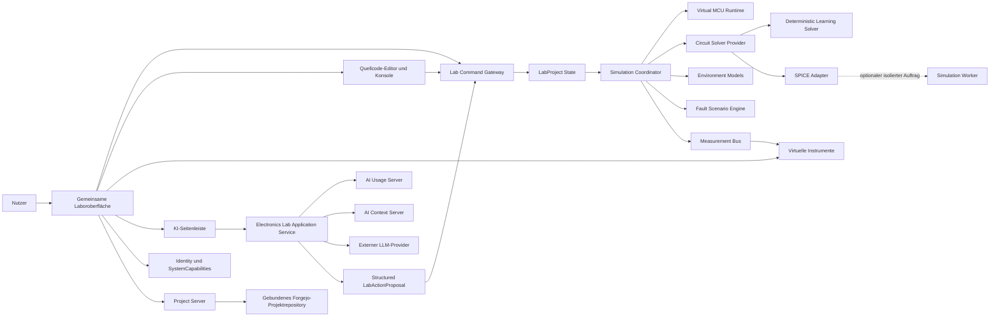

# Zielarchitektur-Entwurf: GerNetiX Elektroniklabor

Stand: 2026-08-16  
Status: Arbeitsentwurf, noch nicht fachlich beschlossen

Dieser Architekturentwurf konkretisiert den
[Lastenheft-Entwurf](virtual-electronics-lab-requirements-draft.md). Er ändert
noch keine bestehende Runtime- oder Prozessarchitektur. Bestätigte
Architekturentscheidungen und Requirements werden vor ihrer Umsetzung in den
SQLite-Graphen übernommen; erst implementierte neue Prozesse werden in die
zentrale Prozess-UML und das SVG-Bildartefakt eingetragen.

Die aktuelle öffentliche Implementierung und ihre bewusst enge Grenze bleiben
bis zu einer bestätigten Migration in
[Virtuelles Elektroniklabor](virtual-electronics-lab.md) dokumentiert.

## 1. Architekturziele

Die Zielarchitektur muss folgende Eigenschaften gleichzeitig ermöglichen:

- eine gemeinsame Laboroberfläche statt getrennter Instrumentenprogramme,
- dieselbe technische Grundlage für Messübungen, Grundschaltungen,
  Fehlersuche und freie Simulation,
- eine nachvollziehbare Ursache-Wirkungs-Kette von Code über
  Mikrocontroller-Peripherie und Schaltung bis zum Messgerät,
- deterministische, reproduzierbare Analog-, Digital- und
  Mikrocontroller-Simulation,
- eine klare Erweiterungsgrenze für SPICE,
- kontextbezogene KI ohne direkte oder ungeprüfte Zustandsmutation,
- öffentliche flüchtige Nutzung und optional accountgebundene Projekte,
- Berechtigungen über SystemCapabilities und KI-Verbrauch über Credits,
- eine kleine Distanz zwischen virtuellem und realem Labor.

## 2. Architekturprinzipien

### 2.1 Ein fachliches Labormodell

Schaltung, Mikrocontroller, Code, Instrumente, Umwelt und Messpunkte werden in
einem gemeinsamen, versionierten `LabProject` beschrieben. UI, Simulation,
Vorlagen, KI und Persistenz verwenden dasselbe Modell.

Es darf kein zweites, nur für die UI oder nur für die KI gepflegtes
Schaltungsmodell geben.

### 2.2 Instrumente beobachten denselben Versuchsaufbau

Oszilloskop, Multimeter und Logikanalysator besitzen keine eigenen versteckten
Schaltungen oder Signalwahrheiten. Sie greifen über definierte Messpunkte auf
denselben Simulationszustand zu.

Instrumente dürfen den Aufbau nur dort beeinflussen, wo dies auch real der
Fall wäre, beispielsweise durch die Eingangsimpedanz eines Messgeräts oder das
Schließen einer vorbereiteten Strommesslücke.

### 2.3 Keine magischen Bedienelemente

Interne Mikrocontroller-Peripherie wird durch Code, Registerlogik oder
angeschlossene Bedienelemente verändert. Ein freier PWM-Regler außerhalb des
Mikrocontrollers ist im Elektroniklabor nicht zulässig.

Direkte Regler gehören nur zu realen Bedienkonzepten wie Labornetzteil,
Signalgenerator, Potentiometer, Drehgeber oder Umweltgröße.

### 2.4 Funktionale statt herstellerspezifische Komponenten

GerNetiX bildet elektrische Funktionen und Lernmodelle ab. Reale
Herstellerbauteile, Footprints, Bestellinformationen und professionelle
Modellbibliotheken bleiben Aufgabe von KiCad und spezialisierten
Simulationswerkzeugen.

Ein reales Gerät darf seine bekannten elektrischen Anforderungen liefern. Die
Simulation verwendet dafür ein transparent gekennzeichnetes funktionales
Ersatzmodell.

### 2.5 Determinismus vor Realzeit

Der fachliche Ablauf verwendet eine virtuelle Zeit. Gleicher Startzustand,
gleiche Eingaben und gleiche Modellversion müssen zu denselben Ergebnissen
führen. Die sichtbare Wiedergabegeschwindigkeit darf verändert werden, ohne
den fachlichen Zeitablauf zu verändern.

### 2.6 Ein Command-Pfad für Mensch, Vorlage und KI

Nutzeraktionen, Vorlagenaktionen und bestätigte KI-Vorschläge werden als
dieselben validierten Laborbefehle ausgeführt. Die KI erhält keinen direkten
Schreibzugriff auf Browserzustand, Projektdateien, Solver oder Datenbanken.

### 2.7 Versionierte Grenzen

Mindestens folgende Verträge sind explizit zu versionieren:

- `LabProjectSchema`
- `ComponentModelSchema`
- `LabTemplateSchema`
- `ProgramRuntimeApi`
- `SimulationProviderContract`
- `LabContextSnapshot`
- `LabActionProposal`
- `MeasurementTraceSchema`

## 3. Zielbild



Das Diagramm beschreibt logische Komponenten. Ob der
`Electronics Lab Application Service` und der SPICE-Adapter eigene Prozesse
werden, bleibt bis zur Prozessentscheidung offen. Eine Implementierung darf
aus diesem Entwurf nicht still einen neuen Serverprozess ableiten.

## 4. Fachliche Kernobjekte

### 4.1 LabTemplate

Eine `LabTemplate` ist ein wiederverwendbarer Startzustand. Sie enthält:

- Metadaten und Lern- beziehungsweise Anwendungsziel,
- erforderliche SystemCapabilities,
- initiales `LabProject`,
- erlaubte Variationen,
- empfohlene Messgeräte und Messpunkte,
- Modellgrenzen und Realitätsbrücke,
- optional referenzierte Fehlerszenarien,
- optionalen Startcode.

Eine Vorlage ist keine unveränderliche Lektion. Derselbe Versuchsaufbau kann
als Messübung, Grundschaltung, Fehlersuchfall oder freie Vorlage erscheinen.

### 4.2 LabProject

`LabProject` ist die versionierbare fachliche Beschreibung eines
Versuchsaufbaus:

```text
LabProject
|- schemaVersion
|- metadata
|- circuit
|  |- components
|  |- pins
|  |- nets
|  `- parameters
|- controller
|  |- virtualMcuProfile
|  |- pinAssignments
|  |- peripheralConfiguration
|  `- sourceFiles
|- instruments
|  |- instances
|  `- probeConnections
|- environment
|  |- variables
|  `- timelines
|- scenario
|  |- templateReference
|  `- publicScenarioState
`- simulation
   |- providerSelection
   |- analysisConfiguration
   `- modelVersions
```

Tarif, Credit-Kontostand, Identity und versteckte Fehlerlösung gehören nicht
in `LabProject`.

### 4.3 LabSession

`LabSession` ist der flüchtige Laufzeitzustand:

- virtuelle Uhr,
- Ereigniswarteschlange,
- aktuelle Knotenwerte,
- Mikrocontrollerzustand,
- Instrumentenpuffer,
- Breakpoints und Pausenzustand,
- temporäre Warnungen und Solverdiagnosen.

Ein `LabSession` ist keine dauerhafte fachliche Wahrheit. Ein Reset erzeugt sie
reproduzierbar aus `LabProject` und expliziten Eingaben neu.

### 4.4 FaultScenario

Ein `FaultScenario` beschreibt kontrollierte Abweichungen, zum Beispiel:

- offene oder kurzgeschlossene Verbindung,
- falscher Bauteilwert,
- verpolte Komponente,
- fehlender Pull-up,
- fehlerhafte Pin- oder Buskonfiguration,
- temperatur- oder lastabhängiger Fehler.

Die Lösung eines geschützten Fehlerszenarios bleibt serverseitig und wird
weder an den Browser noch an die KI übergeben. Die Runtime erhält nur die für
das Verhalten erforderliche, opake Fehlervariante. Öffentliche lokale
Demofälle besitzen keine Geheimhaltungszusage.

### 4.5 MeasurementTrace

Eine `MeasurementTrace` enthält zeitbezogene, abgeleitete Messdaten. Kleine
Messungen bleiben flüchtig. Eine spätere dauerhafte Speicherung großer Traces
muss als eigenes Artefakt- und Retentionskonzept entschieden werden; sie darf
nicht beiläufig in Projekt-PostgreSQL oder `localStorage` entstehen.

## 5. Browseranwendung

### 5.1 Gemeinsame Shell

Die gemeinsame Shell enthält:

- Einstieg beziehungsweise Vorlagenauswahl,
- Schaltungsfläche,
- Komponentenbibliothek,
- Instrumenten-Dock,
- Quellcode-Editor und serielle Konsole,
- Umweltbedienung,
- Simulation Start, Pause, Reset und Geschwindigkeit,
- Warnungen und Ergebnisansicht,
- kontextbezogene KI-Seitenleiste.

Die Einstiege werden aus Metadaten aufgebaut und nicht als vier technische
Anwendungen implementiert.

### 5.2 Öffentliche und angemeldete Nutzung

Die Zielarchitektur verwendet denselben UI- und Runtime-Kern in zwei
Schutzklassen:

- Öffentlich: statische, flüchtige Nutzung freigegebener Modelle und Vorlagen
  ohne fachliche Persistenz.
- Angemeldet: serverseitig autorisierte Vorlagen, Projektpersistenz, KI und
  optionale Simulation Jobs.

Geschützte Vorlagen und Lösungen dürfen nicht im öffentlichen Bundle
ausgeliefert werden. Eine Browseranzeige von `premium` oder `basic` ist keine
Autorisierung.

Die heutige Route `/technik-labs/` bleibt bis zu einer bestätigten Migration
unverändert. Zielroute, Bundlegrenze und Übergangszeitpunkt sind offene
Entscheidungen.

## 6. Lab Command Gateway

Alle Zustandsänderungen laufen über typisierte Befehle, beispielsweise:

- `AddComponent`
- `RemoveComponent`
- `ConnectPins`
- `DisconnectNet`
- `SetComponentParameter`
- `SetEnvironmentValue`
- `UpdateSourceFile`
- `AttachProbe`
- `StartSimulation`
- `PauseSimulation`
- `ResetSimulation`
- `ApplyConfirmedProposal`

Jeder Befehl wird gegen Schema, Modellgrenzen, Zugriffsrechte und aktuellen
Zustand validiert. Ungültige Befehle erzeugen stabile Fehlercodes. UI-Texte
werden erst im Browser lokalisiert.

Undo/Redo und spätere kollaborative Funktionen sollen auf demselben
Befehlsmodell aufbauen können, werden aber nicht im ersten Durchstich
implementiert.

## 7. Simulation Coordinator

Der `Simulation Coordinator` ist die einzige Instanz, die den gemeinsamen
Zeitfortschritt steuert.

Ein vereinfachter Zyklus lautet:

1. nächsten Zeitpunkt aus der Ereigniswarteschlange bestimmen,
2. fällige MCU-, Umwelt- und Bedienereignisse anwenden,
3. digitale Ausgänge und Quellen an den Circuit Solver übergeben,
4. analogen Schaltungszustand berechnen,
5. GPIO-, ADC- und Komparatoreingänge abtasten,
6. resultierende Interrupts und Programmereignisse einplanen,
7. Instrumente über den Measurement Bus abtasten lassen,
8. Warnungen und sichtbare Zustandsänderungen veröffentlichen.

Die UI rendert Snapshots und Messpuffer, steuert aber nicht selbst die
fachliche Simulationszeit.

## 8. Circuit Solver Provider

Die elektrische Berechnung wird hinter einem Providervertrag gekapselt.

### 8.1 Deterministic Learning Solver

Der erste Provider deckt nur die jeweils bestätigten Funktionsmodelle ab. Er
ist für kleine, kontrollierbare Durchstiche geeignet und darf keine
unbelegbare Genauigkeit vortäuschen.

### 8.2 SPICE Adapter

Der SPICE-Adapter übersetzt ausschließlich validierte `LabProject`-Modelle in
eine Netlist. Freie Raw-SPICE-Direktiven werden nicht ausgeführt.

Der Vertrag muss mindestens unterstützen:

- DC-Arbeitspunkt,
- Transientenanalyse,
- einfache AC-Analyse,
- explizite Messvektoren,
- harte Zeit-, Speicher- und Ergebnisgrenzen,
- Abbruch und verständliche Solverdiagnosen,
- versionierte Modellzuordnung.

Die erzeugte Netlist darf als Export sichtbar sein. Ihre Ausführung erfolgt in
einem Web Worker, einer isolierten WASM-Runtime oder einem getrennten
Simulation Worker. Die endgültige Platzierung wird erst nach einem
Machbarkeits- und Sicherheitsnachweis entschieden.

## 9. Virtual MCU Runtime

Die erste Runtime ist ein generischer, deterministischer Mikrocontroller und
keine Emulation eines realen Binärprogramms.

### 9.1 Peripheriegrenze

Schrittweise vorgesehene Peripherie:

- GPIO,
- Timer und PWM,
- ADC und DAC,
- Interrupts,
- UART,
- SPI,
- I²C,
- Watchdog und Reset.

Jede Peripherie besitzt elektrische Pins, Laufzeitzustand und eine klar
begrenzte Programmierschnittstelle.

### 9.2 Programmausführung

Der Quelltext wird geparst und in einer kontrollierten Runtime interpretiert.
Verboten sind `eval`, `new Function`, frei geladene Module, Browser- oder
Dateisystemzugriff, Netzwerkanfragen und native Benutzerprogramme.

Die erste API darf nur ausdrücklich freigegebene Funktionen anbieten, zum
Beispiel `pinMode`, `digitalRead`, `digitalWrite`, Zeitfunktionen und später
peripheriespezifische Aufrufe.

Laufzeit, Instruktionszahl, Speicher und Ereignisrate werden begrenzt. Eine
Endlosschleife muss kontrolliert angehalten und verständlich gemeldet werden.

### 9.3 Debugsicht

Die Debugsicht darf Variablen, Pinzustände, Timer, ADC-Werte, Interrupts und
Program Position beobachten. Direkte Register- oder Zustandsänderungen sind
ein ausdrücklich gekennzeichneter Debug-Eingriff und kein normaler
Laborbedienweg.

## 10. Komponenten und Modelle

Ein `ComponentModel` trennt:

- fachliche Funktion,
- Pins und elektrische Domänen,
- Parameter und Einheiten,
- Simulationsmodell je Provider,
- Grenzwerte und Warnregeln,
- sichtbare Darstellung,
- Modellgüte und bekannte Grenzen.

Komponentenklassen umfassen schrittweise:

- passive Grundbauteile und Quellen,
- Dioden, LEDs, Transistoren und MOSFETs,
- Taster, Schalter und Potentiometer,
- Sensoren und Umweltmodelle,
- Logikgatter, Buffer, Latches und Zähler,
- Watchdog, Reset und Spannungsüberwachung,
- Pegelübersetzer und Bus-Buffer,
- Gate Driver und funktionale Leistungselektronik,
- vereinfachte virtuelle Displays und Busgeräte.

Ein Komponentenmodell darf nicht still ein reales Herstellerbauteil
versprechen. Modellgüte und Grenzbereich sind in UI und KI-Kontext sichtbar.

## 11. Messinstrumente und Measurement Bus

Der Measurement Bus veröffentlicht typisierte Messgrößen:

- analoge Knotenspannung,
- Zweipunktspannung,
- Zweigstrom,
- digitaler Pegel und Flankenereignis,
- Protokollereignis,
- Frequenz, Phase und Spektrum,
- Solver- und Modellwarnung.

Instrumente abonnieren ausschließlich benötigte Messpunkte und Abtastraten.
Sie erzeugen keine unabhängige fachliche Wahrheit.

Bestehende Instrumentendarstellungen werden nur übernommen, wenn ihre
Signalquelle über diesen Vertrag austauschbar ist und ihre bisherigen
öffentlichen Übungen als Adapter weiter funktionieren.

## 12. Umweltmodelle

Umweltmodelle wandeln physikalische Größen in Komponentenparameter oder
Ereignisse um. Beispiele sind Temperatur, Licht, Druck, Feuchte, Entfernung,
Magnetfeld und Bewegung.

Ein PT1000-Modell bildet beispielsweise ab:

```text
Temperatur -> Widerstand -> Schaltung -> ADC -> Programmlogik
```

Der Nutzer verändert primär die physikalische Umweltgröße. Eine direkte
Manipulation des Ersatzwerts ist nur in einer ausdrücklich gekennzeichneten
Experten- oder Fehlersicht erlaubt.

## 13. KI-Architektur

### 13.1 Kontext

Die KI erhält einen minimierten `LabContextSnapshot` mit:

- Nutzerziel und aktuellem Unterstützungsmodus,
- relevanten Schaltungsausschnitten,
- sichtbarem Codeausschnitt,
- ausgewählten Messwerten und Warnungen,
- freigegebenen Modellbeschreibungen,
- ausdrücklichen Annahmen und offenen Fragen.

Nicht übergeben werden versteckte Fehlerlösung, fremde Projekte, Provider Keys,
vollständige unnötige Messreihen oder nicht freigegebener Kontext.

Fachliche Prompt-Grundlagen und freigegebene Kontexte kommen aus dem AI Context
Server. Der Browser konstruiert keinen autoritativen Systemprompt.

### 13.2 Credit- und Providerpfad

Jeder echte Provideraufruf folgt dem bestehenden GerNetiX-Vertrag:

1. Identity und SystemCapability serverseitig ableiten,
2. AI-Usage-Preflight und Creditreservierung,
3. minimierten Kontext mit `store: false` senden,
4. Structured Output validieren,
5. tatsächliche Nutzung oder Fehler verbuchen,
6. Ergebnis als Erklärung oder `LabActionProposal` zurückgeben.

Deterministische Berechnungen, lokale Simulation und vorformulierte
Erklärungen dürfen keinen KI-Aufruf und keine Credits benötigen.

### 13.3 Aktionen

Die KI darf nur strukturierte Vorschläge erzeugen. Ein Vorschlag enthält:

- fachliche Begründung,
- Annahmen,
- betroffene Objekte,
- typisierte Laborbefehle,
- erwartete Wirkung,
- Prüfplan und bekannte Grenzen.

Ändernde Vorschläge werden in der UI als Diff angezeigt. Erst die
Nutzerbestätigung übergibt sie an das Lab Command Gateway. Der Gateway
validiert sie genauso wie manuelle Aktionen.

## 14. Persistenz und Projekte

### 14.1 Öffentliche Nutzung

Der öffentliche Laborzustand bleibt flüchtig. Browser State und optionaler
lokaler UI-Komfort sind keine fachliche Quelle und besitzen keine
Synchronisationszusage.

### 14.2 Accountgebundene Nutzung

Ein Nutzer arbeitet zunächst in einem flüchtigen Entwurf. Erst eine
ausdrückliche Aktion wie `Laborprojekt speichern` materialisiert ein Projekt.

Dabei gelten die vorhandenen Projektgrenzen:

- Project Server ist Wahrheit für Projektidentität, Besitz, Rechte und
  Repository-Bindung.
- Versionierte `LabProject`- und Quellcodedateien liegen im gebundenen privaten
  Forgejo-Repository.
- Der Browser schreibt weder direkt in Forgejo noch in PostgreSQL.
- Große oder erzeugte Binär- und Messergebnisartefakte gehören bei dauerhafter
  Speicherung in den Artifact Store und benötigen eine Retentionsregel.
- Lose JSON-Dateien, `localStorage` und Prozessspeicher sind keine dauerhafte
  Projektwahrheit.

Das genaue Projektdateischema wird erst nach Bestätigung des
`LabProjectSchema` in den Project-Server-Vertrag aufgenommen.

## 15. Zugriff und Produktsteuerung

Tarifnamen werden nicht in der Laborlogik ausgewertet. Vorlagen und Funktionen
referenzieren konkrete SystemCapabilities, beispielsweise konzeptionell:

- öffentlicher Laborzugang,
- Basic-Simulation,
- freie Laborprojekte,
- erweiterte Vorlagen,
- Fehlersuchkatalog,
- Projektpersistenz,
- KI-Assistent.

Die endgültigen Capability-IDs werden erst im SQLite-Graphen beschlossen.

SPICE-Grundsimulation gehört zum vorgesehenen Basic-Umfang. Premium wird nicht
über professionelle Hersteller-SPICE-Modelle definiert. KI-Zugriff und
KI-Credits bleiben orthogonal zu Basic und Premium.

## 16. Sicherheitsgrenzen

Vor jeder Implementierung von Codeausführung, KI, Persistenz oder SPICE sind
mindestens folgende Regeln nachzuweisen:

- keine Browserdirektverbindung zu LLM-Providern und keine Provider Keys im
  Browser,
- keine freie native Codeausführung,
- keine `eval`-basierte Programm Runtime,
- keine Raw-SPICE-Ausführung aus unvalidiertem Nutzereingang,
- harte CPU-, Zeit-, Speicher-, Ereignis- und Ergebnisgrenzen,
- kein Dateisystem, freies Netzwerk, Datenbankzugriff oder System-Secret in
  Kunden-Workern,
- serverseitige Identity-, Ownership- und Capability-Prüfung,
- AI-Usage-Preflight und Abschlussbuchung,
- minimierter AI-Context mit Audit und Grants,
- verständlicher Abbruch bei Endlosschleife, Konvergenzfehler oder Quota,
- keine Darstellung einer Simulation als Sicherheits- oder
  Zertifizierungsnachweis.

Neue Sicherheitsmaßnahmen und ihr Nachweisstatus werden bei der Umsetzung in
`docs/security-posture.md` gepflegt.

## 17. Testarchitektur

Jede Fähigkeit benötigt Nachweise auf ihrer tatsächlichen Grenze:

- Schema- und Command-Unit-Tests,
- Golden Tests für kleine Schaltungen,
- deterministische Replay-Tests,
- MCU-Runtime- und Ressourcenlimit-Tests,
- Analog-/Digital-Kopplungstests,
- Instrumenten- und Abtastraten-Tests,
- Fehlerszenario- und Lösungsschutztests,
- AI-Structured-Output- und Bestätigungs-Gate-Tests ohne Live-LLM,
- Identity-, Capability-, Credit- und Ownership-Contract-Tests,
- Projektdatei- und Repository-Vertragstests,
- responsive Browsernachweise für Desktop und mobile Breiten,
- Regressionstests für die weiter betriebenen öffentlichen Bestandslabs.

Live-LLM-Aufrufe und echte SPICE-Langläufe ersetzen keine deterministischen
Contract-Tests.

## 18. Vorgeschlagene Modulgrenzen

Die endgültigen Dateipfade werden erst im ersten genehmigten Arbeitspaket
festgelegt. Logisch werden mindestens folgende Module benötigt:

```text
electronics-lab-shell
electronics-lab-domain
electronics-lab-command-gateway
electronics-lab-simulation-coordinator
electronics-lab-learning-solver
electronics-lab-spice-adapter
electronics-lab-virtual-mcu
electronics-lab-program-runtime
electronics-lab-instruments
electronics-lab-components
electronics-lab-templates
electronics-lab-fault-scenarios
electronics-lab-ai-adapter
electronics-lab-project-adapter
```

Diese Namen sind Verantwortungsgrenzen und noch keine Aufforderung, sofort
entsprechend viele Packages oder Services anzulegen. Ein neues Modul entsteht
erst, wenn ein genehmigter Durchstich die Grenze benötigt.

## 19. Migrationsstrategie

Die bestehende Anwendung wird nicht als Zielarchitektur fortgeschrieben und
nicht vorsorglich entfernt.

1. Neue Domain- und Runtime-Verträge werden neben der Bestandslogik aufgebaut.
2. Der erste Durchstich verwendet ausschließlich die neue gemeinsame
   Laborarchitektur.
3. Bestehende Instrumente werden einzeln über Adapter angeschlossen.
4. Eine Bestandsübung wird erst migriert, wenn ihr Verhalten durch Tests
   abgesichert ist.
5. Getrennte Instrumenten-Labs verschwinden erst aus der Navigation, wenn ihre
   relevanten Fähigkeiten in der gemeinsamen Oberfläche verfügbar sind.
6. Die öffentliche Route wird erst nach Browser-, Sicherheits- und
   Regressionstest umgestellt.

Neue Funktionen dürfen nicht in ein bestehendes Einzellabor eingebaut werden,
wenn sie fachlich zum gemeinsamen Zielmodell gehören.

## 20. Erster vertikaler Architekturnachweis

Der kontrollierbare Arbeitsumfang ist in
[ELAB-DS-001: Durchstich Quellcode bis LED-Strom](virtual-electronics-lab-gpio-led-vertical-slice-spec.md)
präzisiert. Diese Spezifikation ist noch kein Implementierungsnachweis.

Der erste vollständige Durchstich lautet:

```text
Quellcode
-> Virtual MCU Runtime
-> GPIO-Ausgang
-> gemeinsames Schaltungsmodell
-> Vorwiderstand und LED
-> sichtbarer Strom und Warnungen
```

Der Durchstich enthält noch kein PWM, ADC, SPICE, KI, freie Verdrahtung oder
Bestandsinstrument. Er weist nach, dass Code, Mikrocontroller und Schaltung
über die neue gemeinsame Architektur gekoppelt sind.

## 21. Offene Architekturentscheidungen

- endgültige Route und Bundlegrenze zwischen öffentlicher und angemeldeter UI
- Prozessgrenze des Electronics Lab Application Service
- Browser-WASM oder isolierter Server Worker für SPICE
- Sprache, Parser und AST der kontrollierten Program Runtime
- initiales Dateiformat und Repositorypfad für `LabProject`
- Speicherung und Retention großer Measurement Traces
- anonyme KI-Verfügbarkeit und Missbrauchsschutz
- endgültige SystemCapabilities
- Umfang der KiCad- beziehungsweise Netlist-Übergabe
- Zeitpunkt und Form der Bestandsmigration

Keine dieser offenen Entscheidungen darf in einem Implementierungsarbeitspaket
stillschweigend getroffen werden.
